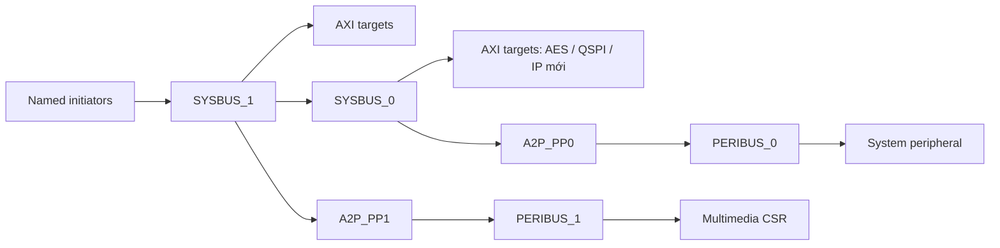

# FX1 Bus System — SystemC 2.3.4 / TLM-2.0

Thư viện bus hành vi độc lập cho VP. IP thật thuộc top platform; `BusSystem` chỉ tạo router, bridge và socket. `tests/support/` chứa fixture và model giả, không được link vào thư viện production.

## Kiến trúc và phạm vi

Topology SYSBUS/PERIBUS và sơ đồ FX1 trong [Bus Config.xlsx](Bus%20Config.xlsx) được kết hợp thành cấu trúc dưới đây. Số initiator, tên target và số output của từng router được sinh từ cấu hình trước elaboration, không cố định 5+3.



Chỉ tạo nhánh có target enabled. Ví dụ cấu hình FX1 mặc định chưa bật multimedia CSR nên chưa tạo PERIBUS_1. Cấu trúc liên kết trên là cố định; thêm IP vào bốn đường có sẵn không cần sửa core, nhưng thêm tầng router hoặc vòng kết nối mới cần thiết kế thêm.

Data width AXI/APB và socket được chốt **32 bit**. `axi_data_width` phải bằng 32, giá trị khác bị từ chối. `axi_address_width` mặc định 32, có thể đặt 1..64 để giới hạn map (địa chỉ payload là `uint64_t`). Address width không đổi data width. AXI payload có thể chứa nhiều byte liên tiếp; payload dài không đồng nghĩa với socket 64/128 bit hay AXI burst theo từng beat.

## Cấu hình FX1

Tạo bằng `BusConfig::fx1()`. `BusConfig{}` là cấu hình rỗng để platform tự điền, không phải mặc định FX1.

Initiator: `CPU1`, `CPU2`, `SYS_DMA`, `ISP_IDMA`, `ISP_ODMA`, `NPU_DMA`, `H264_H265_DMA`, `ETH_DMA`. ISP có hai master; MIPI chỉ có CSR target.

Ảnh FX1 cập nhật ngày 2026-10-06 dùng nhãn H264/H265 và lấy nhánh dữ liệu tới NPU từ ISP. Các kết nối dữ liệu MIPI/ISP/NPU/video/ETH do platform ghép giữa IP; bus này cung cấp đường truy cập memory-mapped. Xem [đối chiếu workbook](docs/WORKBOOK_MAPPING.md) để phân biệt phần đã xác nhận và phần sơ đồ chưa mô tả chi tiết.

| Target | Base | Size | Đường |
|---|---|---|---|
| BootROM | `0x00000000` | 2 MiB | `SysBus1Axi` |
| CLINT | `0x02000000` | 64 KiB | `Peribus0Apb` |
| PLIC | `0x0C000000` | 16 MiB | `Peribus0Apb` |
| UART | `0x10000000` | 64 KiB | `Peribus0Apb` |
| MEMCTL_DDR | `0x80000000` | 512 MiB | `SysBus1Axi` |

`SRAM`, `CPU1_IRAM`, `CPU2_IRAM`, `ISP_CSR`, `NPU_CSR`, `H264_H265_CSR`, `ETH_CSR`, `MIPI_CSR`, `SYS_DMA_CSR` còn TBD và mặc định disabled. Disabled target không có socket hoặc route. Multimedia CSR được dự kiến ở PERIBUS_1; SYS_DMA_CSR ở PERIBUS_0. AES/QSPI có thể khai báo thêm trên `SysBus0Axi`, không tự gán map production cho hai IP này.

```cpp
#include <bus/bus_system.h>

auto cfg = bus::BusConfig::fx1();
cfg.initiators.push_back({"NEW_MASTER"});
// base/size phải do platform chốt; không dùng địa chỉ giả trong production.
cfg.targets.push_back({"NEW_IP", ip_base, ip_size,
                       bus::TargetPath::SysBus0Axi, true});
bus::BusSystem fabric{"fabric", cfg};
cpu1.socket.bind(fabric.initiator("CPU1"));
new_master.socket.bind(fabric.initiator("NEW_MASTER"));
fabric.target("NEW_IP").bind(new_ip.target);
// Bind thêm TẤT CẢ target enabled trong cfg, gồm năm target FX1 mặc định.
```

Tên là khóa tra cứu chính xác, không phụ thuộc thứ tự descriptor. Target enabled bắt buộc bind trước `sc_start`; initiator chưa dùng có thể để trống. Cấu hình được copy khi tạo module; sửa bản cfg bên ngoài sau đó không reconfigure bus.

Validation kiểm tra tên trùng/rỗng, range rỗng/overflow/overlap, giới hạn address width, path/policy không hỗ trợ và APB base căn chỉnh 4 byte. Vùng dùng `[base, base+size)`. IP cuối nhận offset cục bộ; các tầng trung gian giữ địa chỉ global, kể cả khi có nhiều vùng rời rạc đi cùng một output.

## Giao dịch, arbitration và lỗi

- `b_transport` gọi từ `SC_THREAD`, có thể `wait`. Delay đầu vào và downstream được tiêu thụ một lần; trả delay bằng 0. Target dùng `wait()` hoặc annotated delay cho mỗi latency.
- Mỗi output có FIFO theo thứ tự request tới arbiter sau khi tiêu thụ delay đầu vào. Request cùng thời điểm theo thứ tự scheduler; không cam kết round-robin theo master.
- Quyền phục vụ được tự giải phóng khi hoàn tất hoặc có exception. Địa chỉ cũng được khôi phục trước khi exception truyền về caller. Bus không tự retry hoặc rollback tác động của IP.
- FIFO không cho request mới vượt request đã đợi. Bảo đảm tiến triển yêu cầu target hiện tại hoàn tất hoặc ném exception. Target treo không bị bus tự timeout.
- Output độc lập có thể tiến triển song song. Hai target dùng chung đường SYSBUS_0/APB vẫn chia sẻ output phía trên và bị tuần tự hóa tại đó.
- APB functional hỗ trợ 1/2/4 byte căn chỉnh tự nhiên và byte enable; chưa chia payload dài thành nhiều APB transfer.
- `transport_dbg` không chờ/FIFO/timing và bỏ giới hạn beat APB; vẫn kiểm tra route/vượt biên. Backdoor ROM và quyền read-only do IP quyết định.
- Byte enable được chuyển xuống IP; IP phải thực hiện đúng strobes. Bus không sửa IP vốn không hỗ trợ byte enable.
- DMI bị tắt. Chưa có `nb_transport`, temporal decoupling, AXI ID/QoS/atomic, reset, clock domain hoặc handshake theo chu kỳ.

| Trường hợp | Response |
|---|---|
| Không map, vượt biên, APB misalignment | `TLM_ADDRESS_ERROR_RESPONSE` |
| Command không hỗ trợ | `TLM_COMMAND_ERROR_RESPONSE` |
| Streaming width nhỏ hơn length; APB length không hỗ trợ | `TLM_BURST_ERROR_RESPONSE` |
| Byte enable không hợp lệ | `TLM_BYTE_ENABLE_ERROR_RESPONSE` |
| Data null hoặc length bằng 0 | `TLM_GENERIC_ERROR_RESPONSE` |

Response từ IP được giữ nguyên. Giao dịch vượt biên bị từ chối trước khi forward, không ghi một phần sang target tiếp theo. Timing mặc định router 2 ns, APB setup+access 2×10 ns; đây là giả định hành vi, không phải timing RTL.

## Build và kiểm thử

C++17, SystemC 2.3.4 với package `SystemCLanguage`, CMake >=3.16 (harness integration/consumer >=3.21). Dùng cùng compiler/C++ ABI với SystemC.

```bash
cmake -S . -B build -DCMAKE_PREFIX_PATH="$SYSTEMC_HOME" -DBUS_SYSTEM_BUILD_TESTS=ON
cmake --build build --parallel 4
ctest --test-dir build --output-on-failure
./build/bus_behavior_tests --trace
```

WSL có thể dùng `scripts/build.sh` hoặc PowerShell `scripts/build.ps1 -SystemCHome '/path/to/linux-systemc'`. Windows native dùng CMake với SystemC native, build directory khác WSL và `--config Debug`/`ctest -C Debug` nếu dùng multi-config generator.

| Suite | Phạm vi |
|---|---|
| `bus_config` | Width 32, names, overflow/overlap, TBD, invalid path/policy, số port mở rộng |
| `bus_behavior` | FX1, topology cũ, thêm/reorder IP/master, bốn đường riêng, byte enable, biên, APB lỗi, debug, timing và DMI |
| `bus_arbitration` | 8 master phát liên tục, thứ tự FIFO, output độc lập, exception rồi tiếp tục qua cả bốn đường |
| `cdc_bus_integration` | ELF loader và memory_tlm thật, bốn đường, annotated delay, ROM, debug và downstream error |
| `installed_bus_consumer` | Dùng header/library đã install để tạo bus và chạy giao dịch SYSBUS_0 |

Ba suite đầu thuộc build mặc định; hai harness cuối được build riêng. Mọi executable dùng `sc_main`. Test target sparse kiểm tra cuối aperture DDR mà không cấp phát 512 MiB. Test không chứng minh CPU boot, DMA engine hay thuật toán IP thật.

## File và mở rộng

| File | Trách nhiệm |
|---|---|
| `config.h`, `src/config.cpp` | Descriptor, default FX1, validation |
| `bus_system.h`, `src/bus_system.cpp` | Sinh route/socket và named binding |
| `router.h`, `src/router.cpp` | Decode, local offset, FIFO per-output |
| `apb_bridge.h`, `src/apb_bridge.cpp` | Giới hạn APB và timing |
| `target_port.h`, `transaction.h` | Adapter TLM, kiểm tra payload, delay và RAII địa chỉ |
| `tests/support/` | Model/fixture chỉ dùng cho test |

Header public nằm trong `include/bus/`. Khi thêm path hoặc thay hợp đồng giao dịch, cập nhật validation, builder, behavior/arbitration tests và tài liệu cùng lúc.

Xem [tích hợp CDC-VP](docs/CDC_VP_INTEGRATION.md), [đối chiếu workbook](docs/WORKBOOK_MAPPING.md) và [bàn giao](docs/REPOSITORY_HANDOFF.md).

Kết quả kiểm thử và các giới hạn trước khi thay component cũ: [đánh giá mức sẵn sàng](docs/READINESS_REVIEW.md).
