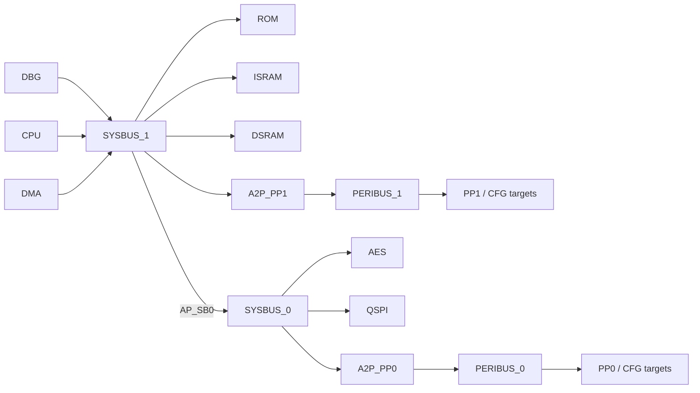

# Bus System — SystemC 2.3.4 + TLM-2.0

Component bus hành vi độc lập cho CDC-VP, triển khai topology trong [Bus Config.xlsx](docs/Bus%20Config.xlsx). Component chỉ chứa router, bridge AXI–APB hành vi và các cổng TLM để top-level gắn IP thật. ROM, ISRAM, DSRAM, AES, QSPI và peripheral giả lập chỉ tồn tại trong `tests/`.

Đây là mô hình functional/timing mức TLM để phát triển VP. Nó không phải RTL và không dùng để kết luận tuân thủ AXI/APB theo từng chu kỳ.

## Topology hiện tại



SYSBUS_1 nhận nhiều initiator qua `BusSystem::target`. SYSBUS_0 được truy cập từ SYSBUS_1 qua vùng AP_SB0. Mọi IP đích do top-level của VP sở hữu và bind vào các cổng public của `BusSystem`.

## Phạm vi triển khai

Đã triển khai:

- Decode theo vùng địa chỉ `[begin, end)` và kiểm tra giao dịch vượt biên.
- Chuyển tiếp read/write bằng `tlm_generic_payload` và `b_transport`.
- Chuyển địa chỉ toàn cục thành offset cục bộ tại leaf target rồi khôi phục địa chỉ gốc.
- Contention đơn giản bằng một `sc_mutex` cho mỗi output port; các output khác nhau hoạt động độc lập.
- Bridge APB hành vi cho truy cập 1, 2 hoặc 4 byte, căn chỉnh tự nhiên và byte enable hợp lệ.
- `transport_dbg` không tính thời gian để nạp firmware và debug.
- Kiểm tra cấu hình: vùng chồng lấn, port không tồn tại và đường đi liên-bus không hợp lệ.
- Cấu hình address map và số cổng peripheral bằng `BusConfig` khi tạo module.

Chưa triển khai:

- `nb_transport`, DMI, temporal decoupling, reset và clock domain.
- AXI burst splitting, outstanding transaction, ordering/reordering theo ID, QoS và arbitration policy.
- Mô phỏng riêng các kênh AW/W/B/AR/R hay tín hiệu handshake từng chu kỳ.
- APB signal phases, waveform protocol và chuyển một AXI burst thành nhiều APB transfer.
- Firewall/config controller cho các nhãn AP/CFG trong diagram.

Response ở mức TLM:

| Trường hợp | Response |
|---|---|
| Truy cập hợp lệ | `TLM_OK_RESPONSE` |
| Không map, vượt biên hoặc APB không căn chỉnh | `TLM_ADDRESS_ERROR_RESPONSE` |
| Command không hỗ trợ | `TLM_COMMAND_ERROR_RESPONSE` |
| Streaming/wrap hoặc APB burst | `TLM_BURST_ERROR_RESPONSE` |
| Byte enable không hợp lệ | `TLM_BYTE_ENABLE_ERROR_RESPONSE` |
| Payload hoặc data pointer không hợp lệ | `TLM_GENERIC_ERROR_RESPONSE` |

Quyền read-only của ROM thuộc model ROM, không thuộc bus. Bus không tự tạo IP dự phòng và không áp chính sách thiết bị.

## Cấu trúc thư mục

| File/thư mục | Vai trò |
|---|---|
| `include/bus/config.h` | `Region`, address map/timing mẫu và `BusConfig` do platform truyền vào |
| `include/bus/router.h`, `src/router.cpp` | Decode, routing, local-address translation, contention và lỗi truy cập |
| `include/bus/apb_bridge.h`, `src/apb_bridge.cpp` | Bridge AXI–APB hành vi và giới hạn APB |
| `include/bus/target_port.h` | Adapter socket public để bind IP ngoài |
| `include/bus/transaction.h` | Hàm dùng chung để kiểm tra payload, delay và địa chỉ |
| `include/bus/bus_system.h`, `src/bus_system.cpp` | Ghép topology và công bố các cổng tích hợp |
| `src/config.cpp` | Kiểm tra tính hợp lệ của `BusConfig` |
| `tests/support/` | Memory và mock targets chỉ phục vụ test, không thuộc thư viện production |
| `tests/bus_behavior_tests.cpp` | Regression routing, data, error, timing và contention |
| `tests/bus_config_tests.cpp` | Regression validation của cấu hình |
| `tests/cdc_integration/` | Test riêng với `memory_tlm` và ELF loader của CDC-VP |
| `tests/installed_consumer/` | Kiểm tra target sau khi install/export |
| `cmake/bus-system-config.cmake` | Package config khi build/install component độc lập |
| `docs/Bus Config.xlsx` | Đặc tả interface và sơ đồ bus đầu vào |

Mã production chỉ gồm `include/` và `src/`. Không được đưa model từ `tests/support/` vào implementation của bus.

## Build và chạy regression

Yêu cầu C++17, CMake và SystemC 2.3.4 có CMake package `SystemCLanguage`. Compiler dùng cho component phải tương thích với compiler đã build SystemC.

Linux/WSL:

```bash
cmake -S . -B build \
  -DCMAKE_PREFIX_PATH="$SYSTEMC_HOME" \
  -DBUS_SYSTEM_BUILD_TESTS=ON
cmake --build build --parallel 2
ctest --test-dir build --output-on-failure
```

Windows native với SystemC được build bằng cùng toolchain:

```powershell
cmake -S . -B build-native `
  -DCMAKE_PREFIX_PATH=C:/path/to/systemc-install `
  -DBUS_SYSTEM_BUILD_TESTS=ON
cmake --build build-native --config Debug
ctest --test-dir build-native -C Debug --output-on-failure
```

Chạy trace routing sau khi build:

```bash
./build/bus_behavior_tests --trace
```

Build riêng thư viện production:

```bash
cmake -S . -B build-library \
  -DCMAKE_PREFIX_PATH="$SYSTEMC_HOME" \
  -DBUS_SYSTEM_BUILD_TESTS=OFF
cmake --build build-library --target bus_system --parallel 2
```

## Tích hợp vào CDC-VP

File CMake ở cấp cha của CDC-VP cần thêm component. Việc sửa file cấp cha thuộc người tích hợp platform:

```cmake
add_subdirectory(FX1_Components/bus)
target_link_libraries(your_vp PRIVATE cdc::components::bus_system)
```

Khi được nhúng trong CDC-VP, component dùng target `SystemC::systemc` đã có. `BUS_SYSTEM_BUILD_TESTS` mặc định theo `CDC_BUILD_TESTS`. Có thể đặt `BUS_SYSTEM_BUILD_TESTS=OFF` nếu platform không chạy regression riêng của bus.

Top-level tạo bus và IP, sau đó bind trước `sc_start()`:

```cpp
bus::BusConfig cfg;
// Platform thay address map và số port tại đây nếu cần.
bus::BusSystem fabric{"fabric", cfg};

dbg.socket.bind(fabric.target);
cpu.socket.bind(fabric.target);
dma.socket.bind(fabric.target);

fabric.rom.socket.bind(rom_ip.target);
fabric.isram.socket.bind(isram_ip.target);
fabric.dsram.socket.bind(dsram_ip.target);
fabric.aes.socket.bind(aes_ip.target);
fabric.qspi.socket.bind(qspi_ip.target);

for (std::size_t i = 0; i < fabric.pp1.size(); ++i)
    fabric.pp1[i].socket.bind(pp1_ip[i].target);
for (std::size_t i = 0; i < fabric.pp0.size(); ++i)
    fabric.pp0[i].socket.bind(pp0_ip[i].target);
```

`pp1_ports` và `pp0_ports` độc lập; số model trong mỗi mảng IP phải khớp `fabric.pp1.size()` và `fabric.pp0.size()`. Mọi output phải được bind. Nếu IP chưa có, top-level phải cung cấp một target stub trả response lỗi rõ ràng.

IP nhận địa chỉ cục bộ tính từ đầu `Region` khi `translate=true`. IP phải đặt `response_status` và chỉ dùng một cách tính latency: gọi `wait()` hoặc cộng annotated delay. Bus hiện tiêu thụ delay trước khi trả về và trả annotated delay bằng 0.

Thứ tự bind DBG, CPU, DMA chỉ ảnh hưởng source index trong trace, không tạo chính sách ưu tiên.

## Address map và timing mẫu

Workbook không cung cấp địa chỉ số, số APB peripheral hoặc latency. Các giá trị dưới đây là mặc định phục vụ regression, không phải map cố định của chip:

| Đích | Khoảng địa chỉ mẫu | Đường đi |
|---|---|---|
| ROM | `0x00000000–0x0000FFFF` | SYSBUS_1 |
| ISRAM | `0x10000000–0x1001FFFF` | SYSBUS_1 |
| DSRAM | `0x20000000–0x2001FFFF` | SYSBUS_1 |
| PP1 window | `0x40000000–0x4000FFFF` | SYSBUS_1 → A2P_PP1 → PERIBUS_1 |
| SYSBUS_0 window | `0x50000000–0x5FFFFFFF` | SYSBUS_1 → SYSBUS_0 |
| AES | `0x50000000–0x5000FFFF` | SYSBUS_0 |
| QSPI | `0x51000000–0x51FFFFFF` | SYSBUS_0 |
| PP0 window | `0x52000000–0x5200FFFF` | SYSBUS_0 → A2P_PP0 → PERIBUS_0 |

Mặc định mỗi PERIBUS có 4 target, mỗi target 4 KiB. Platform thay các vector `sysbus1`, `sysbus0`, `peribus1`, `peribus0`, `pp1_ports` và `pp0_ports` trong `BusConfig`; không cần sửa header thư viện. `BusConfig::validate()` sẽ từ chối map chồng lấn, port ngoài phạm vi và đường đi không thể đạt tới.

Latency mẫu gồm router 2 ns, APB cycle 10 ns và latency target do test model cung cấp. Các số này chỉ kiểm tra tính nhất quán của mô hình, không dự đoán timing RTL.

## Regression hiện có

`bus_behavior_tests` kiểm tra:

- Read/write trên ROM, ISRAM, DSRAM, AES, QSPI, PP0 và PP1.
- Byte enable, payload nhiều byte và địa chỉ cuối vùng.
- Unmapped address, vượt biên, invalid command, streaming và payload lỗi.
- APB alignment, kích thước transfer và burst bị từ chối.
- Local-address translation và khôi phục địa chỉ gốc.
- Timing, ba initiator cùng tranh chấp một output và các output độc lập.
- `transport_dbg` qua các tầng bus.

`bus_config_tests` kiểm tra cấu hình hợp lệ và các trường hợp map sai. Khi thay topology, address map hoặc hợp đồng giao dịch, cần cập nhật cả hai bộ test tương ứng.

## Đối chiếu workbook

Sheet Bus Diagram xác định topology SYSBUS_1, SYSBUS_0, hai bridge và hai PERIBUS. Sheet AXI CROSSBAR Diagram mô tả crossbar tổng quát; `Router` dùng multi-passthrough sockets thay vì cố định số cổng 4×4.

Sheet Bus Parameter mô tả đủ AW/W/B/AR/R, gồm B channel phía slave, direction của `AWSIZE`, width `AWID` và `ARPROT`. Mô hình hiện tại ánh xạ giao dịch ở mức TLM, nên write response dùng `response_status`; các tín hiệu BID/BRESP/BUSER/BVALID/BREADY và handshake riêng chưa được mô phỏng.

## Hướng phát triển tiếp theo

Ưu tiên khi mở rộng component:

1. Chốt address map, số peripheral và latency thật từ platform rồi tạo `BusConfig` ở top-level.
2. Bind model ROM/ISRAM/DSRAM/AES/QSPI/peripheral thật và giữ mock IP trong `tests/`.
3. Bổ sung extension cho AXI ID, privilege/security hoặc QoS nếu software model cần các thuộc tính đó.
4. Chọn `nb_transport`/temporal decoupling nếu VP cần hiệu năng mô phỏng cao hơn.
5. Chỉ bổ sung mô hình cycle-accurate AXI/APB khi mục tiêu xác minh yêu cầu handshake hoặc protocol timing.
6. Thêm regression cho mọi route, response và policy mới trước khi thay đổi hợp đồng public.

Nếu thêm một output vào router hiện có, cập nhật `BusConfig`, binding trong `BusSystem` và regression. Nếu thay đổi topology SYSBUS, cần sửa cấu trúc `BusSystem` và sơ đồ trong tài liệu này. Giữ public header trong `include/bus/`, implementation trong `src/`, còn mọi fixture/model giả lập trong `tests/`.