# FlooNoC SystemC/TLM Model — Tài liệu kiến trúc

| | |
|---|---|
| Frozen RTL | FlooNoC `9a6972a` (`v0.8.4-10-g9a6972a`), upstream `github.com/pulp-platform/FlooNoC` |
| Dependency | `common_cells 1.39.0 @ 9ca8a76`, `axi 0.39.9 @ a256a3b` |
| Môi trường | SystemC 2.3.4, C++17, GCC 11.5.0 |
| Platform | `platforms/noc_soc`, mesh 4x4, network clock 1 ns/cycle |
| Ngày | 2026-08-24 |
| Trạng thái | **Technical sign-off v1.5: PASS** cho kiến trúc v0 + D1/D26 và evidence gate 42/42 + 57/57 + 12/12 |
| Phạm vi accuracy | Detailed backend; các block RTL-derived được cross-check riêng lẻ, TLM adapter không có RTL counterpart |

File này là bản canonical. Bản web đã publish
(https://claude.ai/code/artifact/885b90e6-bd94-497b-9efd-311701748fc3) là bản
render lại của chính nó; khi model đổi thì sửa file này trước.

### Lịch sử revision của tài liệu

| Revision | Ngày | Nội dung |
|---|---|---|
| v1.0 | 2026-08-06 | Chốt kiến trúc v0, floorplan, micro-architecture và baseline FreeRTOS level 128 |
| v1.1 | 2026-08-07 | Làm rõ accuracy boundary; bổ sung node diagram, timing/measurement contract, verification matrix và phân loại finding |
| v1.2 | 2026-08-07 | Bổ sung address map, destination decode, đường tín hiệu out-of-band, bản đồ file model↔RTL, payload width từng kênh, license/provenance và cách tái tạo; sửa phát biểu "12 cross-check đều theo cycle" thành 9 cycle + 3 nội dung |
| v1.3 | 2026-08-07 | Vẽ lại floorplan và cấu trúc một node; làm rõ payload width không gồm header; sửa inventory 19 header, caption quadrant, version Word và flow tái tạo đủ 12 RTL cross-check |
| v1.4 | 2026-08-07 | Đóng technical sign-off trên working-tree snapshot có manifest SHA-256: 41/41 SystemC test, 51/51 mutation control và 12/12 RTL cross-check đều PASS; bổ sung scope, exclusion và evidence record |
| v1.5 | 2026-08-24 | Ký D1 owner-aware local bypass và D26 admission-slot lifetime/idle split trên manifest 133 file: 42/42 SystemC test, 57/57 mutation control và 12/12 RTL cross-check đều PASS |

### Hồ sơ sign-off v1.5

| Hạng mục | Giá trị chốt |
|---|---|
| Quyết định kỹ thuật | **PASS — signed v1.5 ngày 2026-08-24** |
| Phạm vi | Kiến trúc v0 đã frozen, D1 owner-aware local bypass, D26 admission-slot/idle semantics, SystemC component và 12 block-level SystemC↔RTL cross-check |
| Evidence gate vừa chạy | 42/42 component test; 57/57 mutation detected, 0 missed; 12/12 RTL cross-check |
| CDC-VP snapshot | Base HEAD `963466e1f09b9bb17061a45228df232eaf921a37`, tree dirty; 133 file được khóa bằng manifest SHA-256 `ccfc12dc...e94c43` |
| RTL reference | FlooNoC `9a6972a5f9b8117506d1df8a6505ce1da2bc9084`, tree clean; `Bender.lock` SHA-256 `73eb4c72...7d86bc` |
| Evidence record | `docs/signoff/v1.5/SIGNOFF.md`; kèm raw log, source manifest và artifact manifest |
| Người duyệt | **Duy, SoC Design Engineer**, phê duyệt D1/D26 và chọn baseline v1.5 trong phiên review ngày 2026-08-24 |

Sign-off này ràng buộc vào **snapshot**, không chỉ vào base commit vì CDC-VP
working tree đang có thay đổi chưa commit. Bất kỳ thay đổi nào trong 133 file
được liệt kê bởi manifest, RTL revision hoặc dependency lock đều làm evidence
hết hiệu lực và phải chạy lại gate bị ảnh hưởng.

Bản `NOC_MODEL_ARCHITECTURE.vi.docx` hiện vẫn là render lịch sử v1.4; nó không
được tự động đổi nhãn thành v1.5. Muốn phát hành DOCX/PDF v1.5 phải regenerate
và validation artifact riêng.

Boundary vẫn được giữ chặt: PASS không có nghĩa là toàn đường manager AXI ->
mesh -> subordinate AXI đã monolithic RTL-equivalent. TLM-to-AXI wrapper không
có RTL counterpart, còn feature deferred và silicon timing/PPA nằm ngoài phạm
vi ký. Chi tiết exclusion, tool version, hash đầy đủ và transcript nằm trong
sign-off record.

### Tóm tắt điều hành

Model thay `cdc::components::bus_router` bằng một fabric FlooNoC 4x4 có hai
physical mesh độc lập cho request và response. Mỗi node chứa một cặp router và
một AXI chimney; `noc_interconnect` chuyển TLM generic payload thành các kênh
AXI được drive theo cycle ở detailed backend. Cấu hình v0 chỉ bao phủ
deterministic XY unicast, một physical/virtual channel, FIFO vào/ra depth 2,
`NoRoB` và `MaxUniqueIds = 1`.

Phát biểu accuracy của tài liệu luôn có qualification: các block signal-level
được chọn từ RTL frozen đã khớp riêng lẻ với RTL qua 12 cross-check; lớp
TLM-to-AXI được kiểm bằng integration test, stress, watchdog và mutation
control vì không có RTL counterpart. Chưa có một monolithic RTL harness cho
toàn đường manager AXI -> mesh -> subordinate AXI. Fast backend chỉ là mô hình
approximately-timed no-contention đã calibration, không phải cycle-accurate.

---

## 1. Tổng quan về NoC đã model

### 1.1 Model này là gì

Đây là model SystemC/TLM của FlooNoC — network-on-chip của PULP platform. Ở
**detailed backend**, datapath signal-level của phạm vi v0 chạy theo cycle và
các block RTL-derived đã được so sánh riêng lẻ từng cycle với RTL frozen. Cách
gọi ngắn gọn "cycle-accurate" trong tài liệu chỉ áp dụng cho phạm vi đã ký đó;
nó không bao gồm fast backend, không biến TLM adapter thành RTL, và không thay
thế một full-path RTL equivalence harness.

Điểm phân biệt quan trọng nhất: đây không phải một fabric tự nghĩ ra rồi đặt
tên FlooNoC. Mọi quyết định hành vi đều truy được về một file cụ thể trong
FlooNoC RTL tại revision đã frozen.

Thứ tự source of truth khi có bất đồng:

1. FlooNoC RTL tại revision frozen
2. FlooGen configuration và generated topology
3. FlooNoC RTL testbench và assertion
4. FlooNoC documentation

SystemC model đứng cuối — nó là thứ **đang được verify**, không phải thứ để
tham chiếu.

### 1.2 Vai trò trong CDC-VP

FlooNoC thay thế `cdc::components::bus_router` ở vị trí fabric, **không** được
gắn vào như một MMIO peripheral. `noc_interconnect` giữ nguyên interface của
`bus_router` (`target_socket`, `cpu_port(i)`, `add_target()`) và thêm đúng một
thứ mà flat bus không có khái niệm tương ứng: **placement**.

Đó chính là lý do tồn tại của cả dự án. Trên flat bus mọi peripheral cách CPU
như nhau. Trên mesh, vị trí quyết định latency, nên vị trí trở thành một design
input phải cân nhắc chứ không phải chi tiết implementation.

### 1.3 Vì sao chọn Direction-2 (cycle-level detailed model)

Hành vi đáng quan tâm của một interconnect vốn phụ thuộc timing: contention,
arbitration, back-pressure, buffering, routing, traffic mix. Một functional
model (Direction-1) chạy nhanh hơn nhiều nhưng không trả lời được câu hỏi
"đặt block này ở đâu thì tốn bao nhiêu, và khi nào thì nghẽn".

Model vẫn có một fast backend, nhưng nó được **hiệu chuẩn từ** detailed model
chứ không thay thế.

### 1.4 Phạm vi vertical slice v0

Các tham số đã chốt, lấy từ RTL và FlooGen template chứ không phải giả định:

| Tham số | Giá trị locked | Nguồn |
|---|---|---|
| Network class | single-AXI | `floo_axi_chimney.sv` |
| Routing | deterministic XY | `RouteAlgo = XYRouting` |
| Traffic | unicast | `CollectiveCfg` all-zero |
| Physical channel | `req` và `rsp`, **hai mesh riêng biệt** | `floo_axi_router.sv` |
| Flow control | ready/valid | — |
| Virtual channel | không (`NumVirtChannels = NumPhysChannels = 1`) | `VcImpl = VcNaive` |
| Router port | North, East, South, West, Eject | `route_direction_e` |
| `InFifoDepth` | 2 → chọn nhánh spill register của RTL wrap | `floo_router.sv` |
| `OutFifoDepth` | **2** | mọi FlooGen router template hardcode |
| `MaxUniqueIds` | 1 → metadata là plain in-order FIFO | `ChimneyDefaultCfg` |
| `MaxTxns` | 32 | `ChimneyDefaultCfg` |
| RoB type | `NoRoB` | `floo_rob_wrapper.sv` |
| `NoLoopback` | 1 | `floo_router.sv` default |
| `XYRouteOpt` | 1 | `floo_router.sv` default |
| Topology | rectangular 2-D mesh | FlooGen |

`OutFifoDepth = 2` **không phải tùy chọn**. Trong 5 step đầu model bị xây thiếu
output FIFO vì một revision cũ của tài liệu ghi nhầm là "disabled" — con số đó
đến từ lựa chọn trong router testbench, không phải từ IP. Mọi FlooGen template
đều hardcode `.OutFifoDepth (2)`. Hậu quả: thiếu đúng một cycle mỗi hop, và
latency trong abstraction/test ở giai đoạn đó từng bị ghi nhận thấp hơn (7 và
16 cycle thay vì 11 và 30 ở chính harness cũ). Sau A-3, production TLM
integration được calibration lại và dùng contract 10/30 trình bày ở mục 3.9;
không trộn hai boundary đo này.

**Deferred** — chưa model, và không được suy ra là đã hỗ trợ: narrow-wide AXI và
kênh `wide`; YX / source / table-based routing; virtual channel và credit flow
control; multicast, synchronization, reduction; AXI ATOP; các RoB mode khác;
`MaxUniqueIds > 1`; CDC link và asynchronous clock domain; nhiều local Eject
port; topology bất quy tắc; explicit link pipeline.

#### Hợp đồng interface và cấu hình platform

| Hạng mục | Hợp đồng v0 |
|---|---|
| TLM upstream | Tối đa 8 tagged initiator port; mỗi port có bounded outstanding queue 1..32 |
| TLM downstream | Address region `[base, base + size)`, không zero-size, wrap hoặc overlap |
| AXI manager identity | ID rộng 3 bit; production adapter giữ one-ID-per-manager policy phù hợp `MaxUniqueIds = 1` |
| Placement | Manager và target chỉ được cùng node khi target khai báo đúng manager đó là `local_owner`; owner đi qua D1 bypass, còn co-location không owner/sai owner bị từ chối lúc elaboration |
| Clock/reset | NoC period mặc định 1 ns; reset xoá FIFO/state; detailed clock chỉ gate khi wrapper, chimney và cả hai mesh quiescent |
| Target delay | Được target trả về qua TLM delay; không được tính vào `latency_cycles` của riêng NoC |
| Error mapping | Unmapped/range-crossing và target failure được ánh xạ thành AXI/TLM response tương ứng, không biến thành timeout im lặng |

### 1.5 Hai timing backend

Chọn lúc construct, cùng một class, cùng address map và socket:

| | `detailed` | `fast` |
|---|---|---|
| Mesh | chạy từng cycle | bypass hoàn toàn |
| `b_transport` | tiêu thời gian, trả `delay = 0` | giữ nguyên annotation, cộng estimate |
| Contention | có model | **không** |
| Dùng cho | calibration, đo utilisation/stall/occupancy, DSE | firmware run dài |

Công thức no-contention của fast mode:

```
read  cycles = 4 * Manhattan_hops + 6 + (beats - 1)
write cycles = 4 * Manhattan_hops + 6 + beats
```

Được hiệu chuẩn theo baseline detailed 10 cycle một hop và 30 cycle sáu hop.
Sai số kiểm tra với tolerance cứng một cycle.

Điểm dễ vấp: hai mode có **hợp đồng đồng bộ khác nhau**. Detailed tiêu thời gian
và trả về 0, nên caller nào yêu cầu quantum keeper annotation không giảm (như
Bremen RISC-V ISS) thì không dùng được detailed. Firmware chạy fast là vì lý do
này, không phải vì tốc độ.

### 1.6 Mức độ tin cậy — cái gì đã signed, cái gì không

**12/12 RTL cross-check đã được chạy lại và signed** giữa SystemC snapshot v1.5
và RTL gốc không sửa đổi; aggregate kết thúc lúc 2026-08-24 10:12:55 +07:00
với exit code 0. Chín
cái so sánh **từng cycle**; ba cái so sánh **nội dung** vì compile của chúng
không có clock edge để sample — sizing là hàm thuần, còn hai cross-check chimney
content so danh sách flit phát ra theo thứ tự. Phân biệt này là của chính rule
9b trong `AI_HANDOFF_CONTEXT.md`, không phải chú thích thêm:

| Block | Kiểu so sánh | Bằng chứng |
|---|---|---|
| XY route selector | cycle | 12 cycle exact, pre-edge và post-edge |
| Input FIFO wrap | cycle | 133 cycle, depth 2 và 4 |
| Wormhole arbiter | cycle | 152 cycle, `NumRoutes` = 5, 4, 2 |
| Five-port router | cycle | 214 cycle, `OutFifoDepth` = 2 và 0 |
| `NoRoB` ordering rule | cycle | 127 cycle |
| Chimney request timing | cycle | 141 cycle |
| Chimney subordinate side | cycle | 221 cycle |
| Chimney manager response | cycle | 78 cycle |
| Inter-node mesh timing | cycle | 1872 node-cycle |
| AXI flit sizing | nội dung | 8 configuration, hàm thuần |
| Chimney request content | nội dung | 16 flit, đúng thứ tự |
| Chimney response content | nội dung | 8 flit, đúng thứ tự |

Ba cross-check nội dung vẫn phải chứng minh được là bắt lỗi: mỗi cái có
negative control ghi trong `docs/STATUS.md`.

**Cái không signed trực tiếp với RTL**: lớp TLM-to-AXI adapter trong
`noc_interconnect`. Nó không có RTL counterpart — nó là driver và collector nằm
phía trên các boundary AXI đã signed. Lớp này được phủ bằng model-level
integration test, stress ba manager và mutation control, nhưng không được gọi là
RTL equivalence.

Cũng chưa có: một harness RTL duy nhất cho toàn bộ đường composed từ manager AXI
port tới subordinate AXI port. Từng block trên đường đó đã signed riêng lẻ.

---

## 2. Block diagram của NoC đã model

### 2.1 Phân lớp

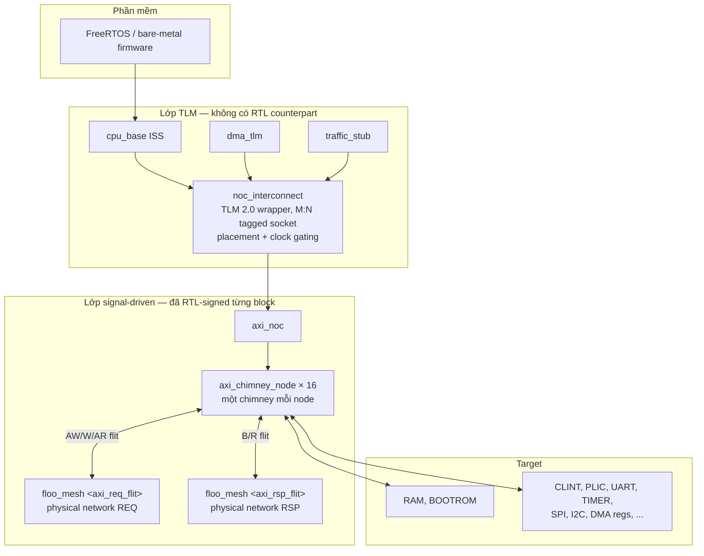

Ranh giới đáng chú ý nhất nằm giữa `noc_interconnect` và `axi_noc`. Phía trên là
code không có RTL tương ứng; phía dưới là các block đã so sánh từng cycle với
RTL. Mọi phát biểu về độ chính xác timing đều phải nói rõ nó thuộc phía nào.

#### Tín hiệu không đi qua NoC

Đây là câu hỏi đầu tiên khi nhìn sơ đồ trên, và câu trả lời ảnh hưởng trực tiếp
tới cách đọc số liệu interrupt latency.

| Đường | Đi qua NoC? | Cơ chế trong model |
|---|---|---|
| Truy cập thanh ghi PLIC (claim/complete) | **có** | AXI transaction tới target PLIC ở node (3,0) |
| Truy cập thanh ghi CLINT (`mtime`, `mtimecmp`) | **có** | AXI transaction tới target CLINT ở node (1,0) |
| Dây IRQ từ peripheral tới PLIC | không | `sc_signal` nối thẳng, ví dụ `plic.irq_in[3](timer0_irq)` |
| PLIC báo external interrupt cho CPU | không | `plic_tlm` nhận `cpu_base&` và assert trực tiếp |
| CLINT báo timer/software interrupt cho CPU | không | `clint_tlm` nhận `cpu_base&` và assert trực tiếp |
| Clock và reset của mesh | không | `sc_signal` do wrapper drive |

Hệ quả khi đọc metrics: interrupt latency mà firmware cảm nhận **không** nằm
trọn trong NoC. Phần đi qua fabric chỉ là read claim và write complete; việc
dây IRQ nhấc lên tốn 0 cycle NoC. Vì thế `[3] LATENCY DASHBOARD` tách riêng
`PLIC claim` và `PLIC complete` — đó là toàn bộ phần interrupt mà NoC chịu
trách nhiệm.

Đây là lựa chọn của platform chứ không phải giới hạn của FlooNoC: FlooNoC
truyền AXI, còn interrupt trong SoC này là dây riêng, đúng như phần lớn thiết
kế RISC-V dùng PLIC/CLINT.

### 2.2 Floorplan `noc_soc` 4x4

Ô `*` là AXI manager port. Floorplan `noc_soc` hiện tại không đặt target nào
chung node với manager, nhưng đó không còn là cấm đoán tổng quát. Với
`NoLoopback = 1`, self-addressed flit không thể được giao; D1 cho phép một
target co-located khi nó khai báo đúng manager đó là `local_owner`, rồi wrapper
bypass mesh cho riêng owner. Co-location không có owner hoặc khai báo owner sai
vẫn bị từ chối ngay lúc elaboration.

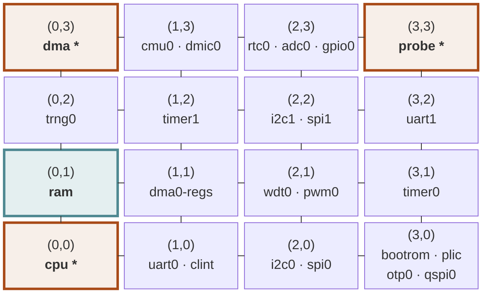

Chú giải màu trong hình:

| Màu | Ý nghĩa |
|---|---|
| Viền cam, chữ đậm, có dấu `*` | AXI manager port: `cpu` (0,0), `dma` (0,3), `probe` (3,3) |
| Viền teal | `ram` (0,1) — target mang 98,5 % traffic trong workload đã đo ở mục 4.3 |
| Viền xám | Target thường |

Nguyên tắc đặt: CPU ở gốc; RAM cách CPU 1 hop vì mang nhiều traffic nhất;
peripheral tần suất cao ở gần; block cấu hình một lần đẩy ra góc xa. CLINT nằm
cạnh CPU vì tick path và tick hook của firmware truy cập `mtime`/`mtimecmp`
thường xuyên; không suy rộng điều này thành mọi trap đều truy cập CLINT.

Thứ tự port của mỗi router, xác nhận bằng cách đọc netlist FlooGen sinh ra:

| Index | Hướng | Neighbour |
|---|---|---|
| 0 | North | `y+1` |
| 1 | East | `x+1` |
| 2 | South | `y-1` |
| 3 | West | `x-1` |
| 4 | Eject | local endpoint |

Các đường nối trong hình biểu diễn adjacency của topology. Mỗi adjacency tồn
tại độc lập trên cả mesh REQ và mesh RSP; hình không có nghĩa hai physical
network dùng chung link hoặc arbiter.

### 2.3 Address map

Address map là thứ nối mục 2.2 với mục 3: nó quyết định một địa chỉ thuộc node
nào, và từ đó quyết định hop count. Trên flat bus bảng này chỉ là chuyện decode;
trên mesh nó là một phần của floorplan.

23 target được đăng ký qua `add_target(base, size, node)`:

| Block | Base | Size | Node | Hops từ CPU (0,0) |
|---|---|---:|---|---:|
| `bootrom` | `0x0000_0000` | 64 KiB | (3,0) | 3 |
| `clint` | `0x0200_0000` | 64 KiB | (1,0) | 1 |
| `plic` | `0x0C00_0000` | 4 MiB | (3,0) | 3 |
| `uart0` | `0x1000_0000` | 4 KiB | (1,0) | 1 |
| `i2c0` | `0x1001_0000` | 4 KiB | (2,0) | 2 |
| `spi0` | `0x1002_0000` | 4 KiB | (2,0) | 2 |
| `timer0` | `0x1003_0000` | 4 KiB | (3,1) | 4 |
| `wdt0` | `0x1004_0000` | 4 KiB | (2,1) | 3 |
| `pwm0` | `0x1005_0000` | 4 KiB | (2,1) | 3 |
| `dma0` regs | `0x1006_0000` | 4 KiB | (1,1) | 2 |
| `trng0` | `0x1007_0000` | 4 KiB | (0,2) | 2 |
| `cmu0` | `0x1008_0000` | 4 KiB | (1,3) | 4 |
| `dmic0` | `0x100A_0000` | 4 KiB | (1,3) | 4 |
| `otp0` | `0x100B_0000` | 4 KiB | (3,0) | 3 |
| `qspi0` | `0x100C_0000` | 4 KiB | (3,0) | 3 |
| `uart1` | `0x1010_0000` | 4 KiB | (3,2) | 5 |
| `i2c1` | `0x1011_0000` | 4 KiB | (2,2) | 4 |
| `spi1` | `0x1012_0000` | 4 KiB | (2,2) | 4 |
| `timer1` | `0x1013_0000` | 4 KiB | (1,2) | 3 |
| `rtc0` | `0x1014_0000` | 4 KiB | (2,3) | 5 |
| `adc0` | `0x1015_0000` | 4 KiB | (2,3) | 5 |
| `gpio0` | `0x1016_0000` | 4 KiB | (2,3) | 5 |
| `ram` | `0x8000_0000` | 16 MiB | (0,1) | 1 |

Ba điểm dễ hiểu sai:

- **Window 4 KiB nhưng đặt cách nhau 64 KiB.** Peripheral nằm trên biên
  `0x…_0000` trong khi region mapped chỉ rộng `kMmio = 4 KiB`, nên giữa hai
  block có 60 KiB **không** được map. Truy cập vào khoảng đó là unmapped, trả
  `DECERR`, không phải rơi sang block kế bên.
- **`0x1009_0000` và `0x100D_0000` không có target.** `0x100D_0000` (ISP0) là
  reserved và được survey dùng có chủ đích để chứng minh địa chỉ unmapped bị báo
  lỗi chứ không bị route đi đâu đó.
- **Hop count trong bảng tính từ CPU.** Cùng một block có hop khác khi nhìn từ
  `dma` (0,3) hoặc `probe` (3,3). Xem cảnh báo ở mục 3.11 về việc không so hop
  của manager này với latency đo từ manager khác.

Cột hop này là toàn bộ lý do address map thuộc về tài liệu kiến trúc: đổi một
dòng trong bảng đặt block chính là đổi latency của mọi truy cập tới nó.

### 2.4 Cấu trúc một node

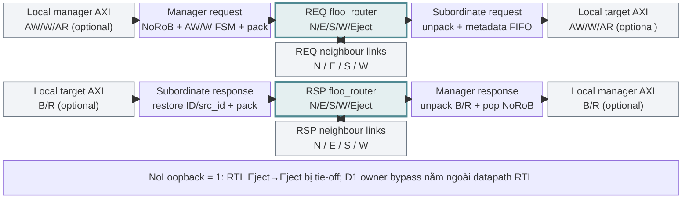

Đây là cấu trúc **một node**, không phải đường composed giữa hai node. Cùng một
`axi_chimney_node` luôn chứa hai router và bốn quadrant chimney; local manager
và local target là hai interface độc lập, có thể không được bind. Datapath RTL
vẫn tie-off đường Eject→Eject khi `NoLoopback = 1`, nên routed transaction phải
rời node qua REQ mesh và response quay lại qua RSP mesh. D1 không sửa RTL:
`noc_interconnect` short-circuit access của đúng `local_owner` sang target TLM
trước khi tạo flit; mọi manager khác vẫn đi qua mesh.

### 2.5 Vòng đời một transaction

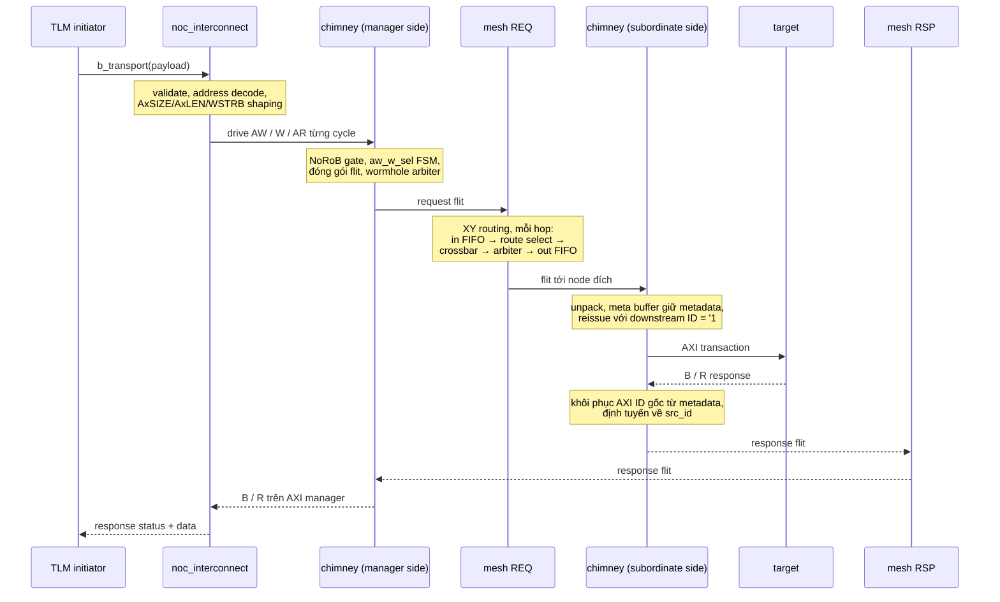

### 2.6 Hai physical network

`req` và `rsp` là **hai mesh hoàn toàn riêng biệt**, không phải hai virtual
channel trên cùng một mesh. Đây là tính chất của IP chứ không phải lựa chọn
model: `floo_axi_router.sv` đúng nghĩa đen là hai instance `floo_router` với
tham số giống hệt nhau, mỗi cái mang một flit type.

Hệ quả: không có arbitration chung, không có buffer chung, và **không có ràng
buộc thứ tự nào giữa request và response**. Một response không thể bị chặn sau
một request trên cùng một link.

| | mesh REQ | mesh RSP |
|---|---|---|
| Flit type | `axi_req_flit` | `axi_rsp_flit` |
| Kênh AXI mang theo | AW, W, AR | B, R |
| Router | `i_req_floo_router` | `i_rsp_floo_router` |

---

## 3. Micro-architecture vẽ lại từ RTL

Toàn bộ mục này đọc trực tiếp từ RTL tại `9a6972a`, không chép lại từ tài liệu.
Tên module và tên signal giữ nguyên như trong RTL để tra cứu chéo được.

**Bản đồ file: model ↔ RTL.** Bảng này để đọc song song hai cây source. Các dòng
ghi "không có RTL counterpart" chính là ranh giới accuracy ở mục 1.6; chúng
phải nhìn thấy được ngay trong bản đồ file chứ không chỉ trong phần văn xuôi.

| File model | RTL / thư viện tương ứng |
|---|---|
| `floo_types.hpp` | `floo_pkg.sv`, `include/floo_noc/typedef.svh` |
| `stream_fifo.hpp` | `stream_fifo_optimal_wrap`, `spill_register_flushable`, `stream_fifo`, `fifo_v3` |
| `xy_route_select.hpp` | `floo_route_select.sv` |
| `reference_model.hpp` | **không có RTL counterpart 1:1** — reference address map và XY path cho model/test |
| `rr_arb_tree.hpp` | `rr_arb_tree`, `lzc`, `cf_math_pkg` |
| `wormhole_arbiter.hpp` | `floo_wormhole_arbiter.sv` |
| `floo_router.hpp` | `floo_router.sv`, `floo_output_arbiter.sv` |
| `floo_mesh.hpp` | topology `floo_*_noc.sv` do FlooGen sinh |
| `axi_types.hpp` | hàm sizing của `floo_pkg.sv` trên `axi_pkg.sv` |
| `axi_chimney_pack.hpp` | khối `always_comb` của `floo_axi_chimney.sv`, `floo_id_translation.sv` |
| `meta_buffer.hpp` | `floo_meta_buffer.sv`, nhánh `MaxUniqueIds = 1` |
| `rob_order_gate.hpp` | `floo_rob_wrapper.sv` nhánh `NoRoB` trên `axi_demux_id_counters` |
| `axi_chimney.hpp` | `floo_axi_chimney.sv`, bản có timing |
| `axi_noc.hpp` | `floo_axi_mesh_noc.sv` + một `floo_axi_chimney.sv` mỗi node |
| `noc_counters.hpp` | **không có** — chỉ quan sát thụ động boundary của `floo_router.sv` |
| `noc_metrics.hpp` | **không có RTL counterpart** — histogram, traffic bucket và schema measurement của VP |
| `axi_lanes.hpp` | **không có** — đây là ánh xạ TLM sang AXI, không phải khối phần cứng |
| `noc_interconnect.h/.cpp` | **không có** — lớp tích hợp CDC-VP |
| `axi_endpoint.hpp` | **không có** — transactor tham chiếu cũ, không còn trong production datapath sau A-3 |

`reference_model.hpp`, `noc_metrics.hpp`, `axi_lanes.hpp` và
`noc_interconnect.h/.cpp` là code CDC-VP gốc dưới Apache-2.0. Việc một file
không có RTL counterpart không làm nó kém quan trọng; nó chỉ giới hạn claim
được phép ở mức model-level verification thay vì RTL equivalence.

### 3.0 RTL suy biến thành gì ở tham số frozen

`floo_router.sv` là module rất tổng quát. Ở tham số v0 phần lớn generate block
biến mất. Bảng này đọc từ chính các generate branch:

| RTL element | Hành vi ở tham số frozen |
|---|---|
| `CollectiveSupportDefaultCfg` | all-zero → `EnMultiCast`, `EnSequentialReduction`, `EnParallelReduction` đều 0 |
| Reduction demux | nhánh `gen_no_red_offload`: `cross_valid = in_valid`, `in_ready = cross_ready` |
| `floo_output_arbiter` | `NumParallelRedRoutes = 0` → suy biến thành đúng một `floo_wormhole_arbiter` |
| `OutFifoDepth = 2` | nhánh `gen_out_fifo`: một `stream_fifo_optimal_wrap` mỗi output |
| `floo_vc_arbiter` | `NumVirtChannels == NumPhysChannels` → nhánh `gen_virt_eq_phys`, pass-through thuần |
| `VcImpl = VcNaive` | nhánh `gen_no_credit`: `credit_o` tie high, credit path không dùng |
| `NumPhysChannels = 1` | nhánh `gen_single_phys`: `in_p = '0` |
| `ChimneyCfg.Cut*` | `CutAx = CutOup = CutRsp = 0` → mọi cut được instantiate với `Bypass = 1` |

Kết quả là datapath còn lại đúng bằng cấu trúc model.

### 3.1 `floo_axi_router` — hai router song song

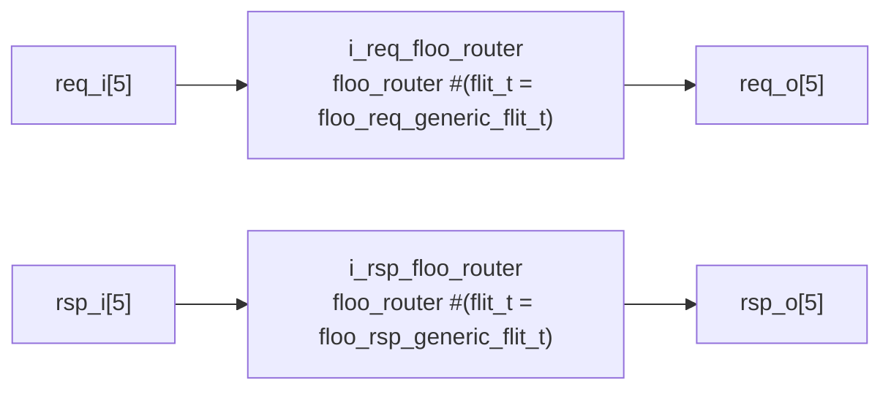

Hai instance chỉ chia sẻ `clk_i`, `rst_ni` và `xy_id_i`. Không có gì khác nối
giữa chúng.

### 3.2 `floo_router` — năm cổng

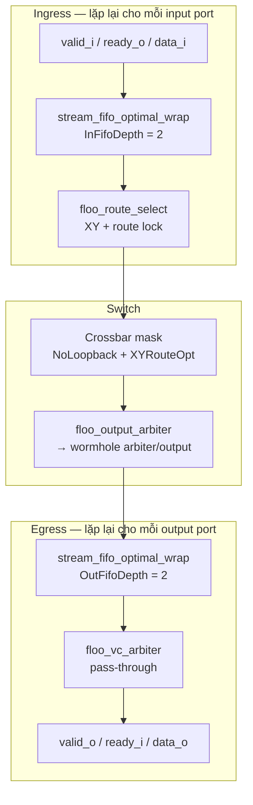

Mỗi input port có **một** input FIFO và **một** route selector riêng. Mỗi output
port có **một** arbiter và **một** output FIFO riêng.

**Crossbar tie-off** là chi tiết dễ model sai. RTL tie xuống 0 cả handshake
**và data** cho mọi cặp input/output không hợp lệ:

```systemverilog
if ((NoLoopback && (in == out)) ||
    ((RouteAlgo == XYRouting) && XYRouteOpt &&
     (in == South || in == North) && (out == East || out == West)))
begin : gen_no_conn
  assign masked_ready_transposed[in][v][out] = '0;
  assign masked_valid[out][v][in]            = '0;
  assign masked_data[out][v][in]             = '0;   // ← chỗ model từng thiếu
end
```

Quan sát được, vì `floo_wormhole_arbiter` drive `data_o` từ index đã chọn **kể
cả khi index đó không valid**. Output nào có arbiter chọn trúng một leg bất hợp
lệ sẽ thấy `'0` ở RTL nhưng thấy flit cũ còn sót ở model thiếu tie-off.

Hai tie-off này ứng với hai tham số thật:

- `NoLoopback` (default `1'b1`): cấm `in == out`. Flit gửi cho chính node mình
  không có đường ra.
- `XYRouteOpt` (default `1'b1`): cấm South/North → East/West. Đây chính là ràng
  buộc XY routing được đưa xuống mức wiring: đã rẽ theo Y thì không quay lại X.

Router giữ nguyên assertion `StableValidIn` / `StableValidOut` của chính nó khi
cross-check, nên vi phạm handshake contract bị báo là lỗi stimulus chứ không bị
bỏ qua im lặng.

### 3.3 `floo_route_select`

Tính next hop theo XY và giữ **route lock** cho suốt một packet. Logic chọn
hướng, đọc từ nhánh `gen_xy_routing`:

- `id_in.x == xy_id_i.x && id_in.y == xy_id_i.y` → `Eject + hdr.dst_id.port_id`
- `id_in.x == xy_id_i.x` (chỉ khác Y) → `South` nếu `id_in.y < xy_id_i.y`, ngược
  lại `North`
- còn lại (khác X) → `West` nếu `id_in.x < xy_id_i.x`, ngược lại `East`

Tức là trục X được giải quyết trước; chỉ khi X đã khớp mới đi theo Y. Đây chính
là ràng buộc mà `XYRouteOpt` đưa xuống mức wiring ở crossbar.

Route lock cập nhật **trên handshake**, không phải mỗi cycle:

```systemverilog
if (ready_i && valid_i) begin
  locked_route_d = ~channel_i.hdr.last;
end

assign route_sel_o    = locked_route_q ? route_sel_q    : route_sel;
assign route_sel_id_o = locked_route_q ? route_sel_id_q : route_sel_id;

`FF(locked_route_q, locked_route_d, '0)
`FFL(route_sel_q,    route_sel,    ~locked_route_q, '0)
`FFL(route_sel_id_q, route_sel_id, ~locked_route_q, '0)
```

Chi tiết đáng nhớ: cả mask và index đều latch bằng `FFL` với **cùng một** enable
`~locked_route_q`, nên chúng không thể lệch nhau. RTL còn tự kiểm tra điều đó —
ngoài `TARGET_SYNTHESIS` có một `$warning("Mismatch in route selection!")` bắn ra
nếu route đang khoá khác với route vừa tính.

Với unicast, `route_sel_o == 1 << route_sel_id_o` ở cả trạng thái locked và
unlocked, vì `route_sel_unicast[route_sel_id] = 1'b1` và lock latch mask cùng
index bằng cùng một enable. Đây là lý do model dùng encoded index vẫn tương
đương one-hot mask của RTL trong phạm vi v0.

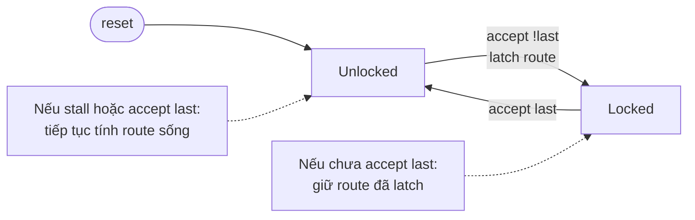

Back-pressure tự nó không làm mất flit: producer phải giữ `valid` và toàn bộ
payload ổn định cho tới khi `ready && valid`. Route chỉ được acquire hoặc
release trên handshake thành công.

### 3.4 `floo_wormhole_arbiter` trên `rr_arb_tree`

Đây là block dễ model sai nhất, và bốn sai lệch dưới đây đều là lỗi thật đã
phải sửa:

| Khía cạnh | Cách hiểu trực giác (SAI) | RTL frozen |
|---|---|---|
| Round-robin advance | `selected + 1` | `FairArb`: index **có request** kế tiếp trên `rr_q`, qua hai `lzc` trên masked request |
| Tập request được arbitrate | `valid_i` sống | snapshot `valid_q`, giữ bởi `LockIn` của tree |
| `ready_o` | chỉ assert nếu input được chọn tự nó valid | assert trên index đã chọn khi **bất kỳ** input nào valid |
| `data_o` khi không valid | zero | luôn drive từ `data_i[valid_selected_idx]` |

Ba dòng RTL quyết định toàn bộ khối bên phải:

```systemverilog
assign valid_selected_idx = (|valid_i) ? selected_idx : '0;
assign valid_o = valid_i[valid_selected_idx];
assign data_o  = data_i [valid_selected_idx];
ready_o[valid_selected_idx] = (|valid_i) ? ready_i : '0;
```

`valid_selected_idx` là `selected_idx` khi có input valid, ngược lại là 0 — nên
`data_o` **luôn** được drive, kể cả khi không input nào valid.

Tham số instantiate: `LockIn = 1`, `FairArb = 1`, `AxiVldRdy = 1`,
`ExtPrio = 0`, `rr_i = '0`, và grant chỉ xảy ra khi
`gnt_i = ready_i & last_out` với `last_out = data_o.hdr.last & valid_o`. Packet
lock chính là ở đó: arbiter không đổi người thắng cho tới khi flit `last` được
nhận.

`FairArb` trong `rr_arb_tree` được xác nhận đúng như mô tả: hai `lzc` trên
`upper_mask[i] = (i > rr_q)` và `lower_mask[i] = (i <= rr_q)`; khi upper rỗng thì
lower cung cấp index, tức là con trỏ wrap vòng về requester thấp nhất.

Tree được instantiate với `data_i = '0`, còn `gnt_o`, `req_o` và `data_o` của nó
để **không nối**. Đó là lý do model chỉ tái tạo phần chọn index của tree, không
tái tạo data multiplexer và grant decode — chúng không quan sát được ở cấu hình
này.

Có một điểm dư thừa trong RTL đáng ghi lại: snapshot `valid_q` của wrapper và
`LockIn` của tree cài đặt **cùng một** cơ chế giữ packet. Bỏ riêng lẻ cái nào
cũng không đổi hành vi; bỏ cả hai thì đổi. Đã xác nhận bằng negative control chứ
không chỉ bằng lập luận.

### 3.5 `floo_axi_chimney` — bốn quadrant

Chimney là nơi toàn bộ độ phức tạp protocol được đẩy về. Router chỉ chuyển flit;
chimney mới là chỗ AXI trở thành flit và ngược lại.

#### Quadrant 1 — manager phát request

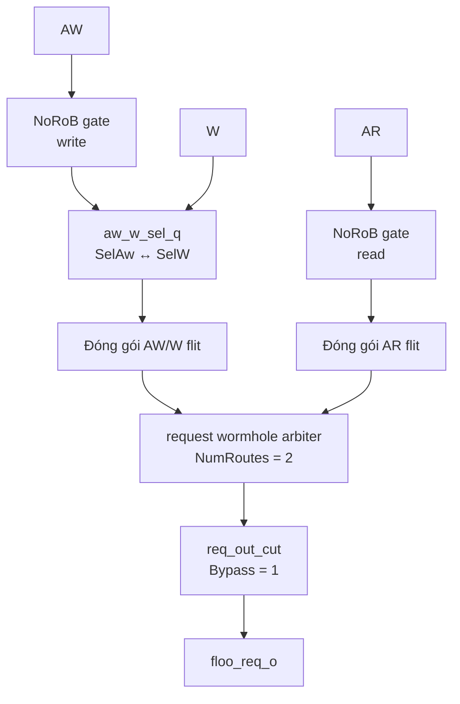

`AW` đi qua write ordering gate rồi mở
một packet gồm AW và toàn bộ W beat; `AR` cạnh tranh với packet write tại
request arbiter. `CutAx = CutOup = 0`, nên các cut tương ứng ở đường này bypass.

#### Quadrant 2/3 — subordinate nhận request và phát response

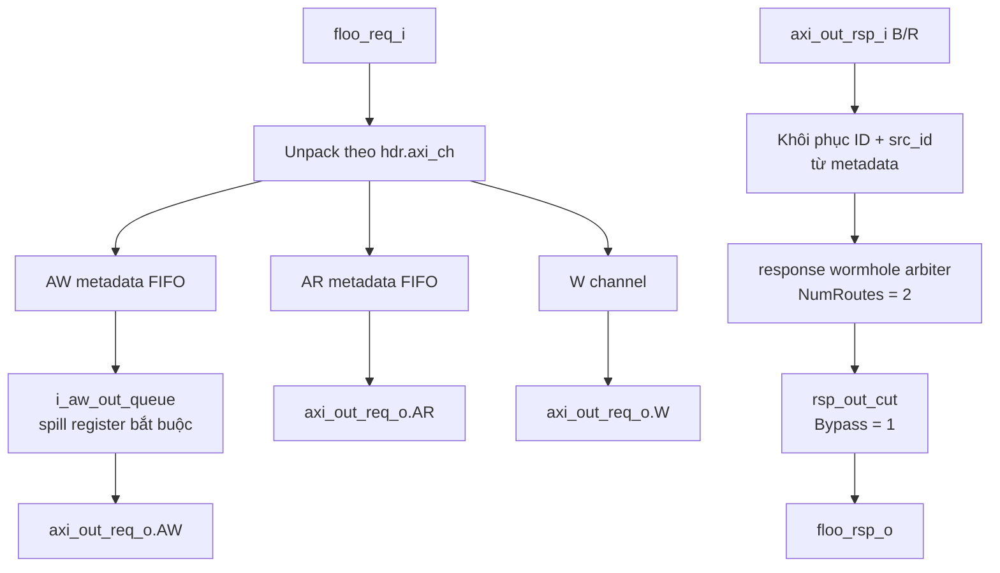

Metadata của AW và AR đi vào hai FIFO in-order riêng; downstream transaction
dùng ID reissue hằng, response khôi phục source/AXI ID trước khi thành B/R flit.

#### Quadrant 4 — manager nhận response

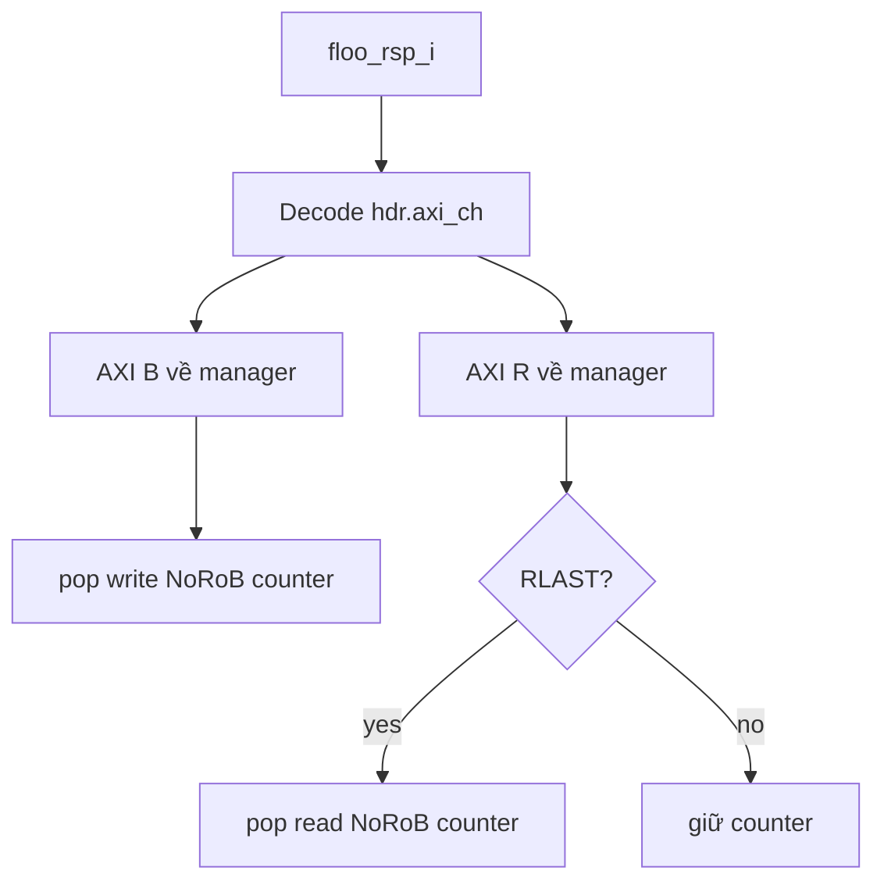

`floo_rsp_o.ready` được chọn theo kênh
B/R đang được decode; read outstanding chỉ được giải phóng tại beat `RLAST`.

Các quy tắc đóng gói flit, lấy trực tiếp từ `always_comb` của RTL:

| Quy tắc | Vì sao quan trọng |
|---|---|
| AW mang `hdr.last = 0`, W mang `hdr.last = w.last` | AW và burst W của nó là **một** wormhole packet, giữ chung một route |
| W mang reorder tag của **AW**, không phải của chính nó | W thuộc về transaction của AW |
| AR, B, R đều mang `hdr.last = 1` | mỗi cái là packet một flit; R burst cố ý **không** wormhole |
| `hdr.atop` = `aw.atop != ATOP_NONE` | là một flag, không phải mã ATOP |
| B và R khôi phục AXI ID gốc từ metadata | downstream ID chỉ là ID reissue nội bộ chimney |
| Đích của W là ID latch lúc AW được chấp nhận | W không bao giờ tự decode address |

#### FSM AW/W — packetization

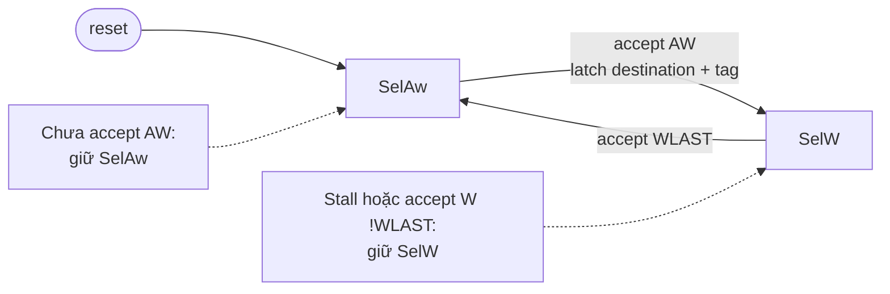

FSM này buộc một AW và toàn bộ W beat của nó thành đúng một wormhole packet.
`W` không được tự decode địa chỉ hoặc tự chọn destination.

**`i_aw_out_queue` không bị bypass**, khác với mọi cut khác. Nó là
`spill_register` vô điều kiện, không có tham số `Cut*` nào tắt được. Comment
trong RTL nói rõ lý do: AW và W dùng chung một link, nên module downstream có
thể từ chối AW cho tới khi W của nó valid.

Một chi tiết nữa: `floo_req_out_ready = axi_ready_out[unpack_req_generic.hdr.axi_ch]`.
Tín hiệu `ready` của link vào được **chọn theo đúng kênh mà flit đang đến khai
báo**, không phải một tín hiệu gộp.

#### Destination decode — address trở thành `dst_id`

Mục 3.3 mô tả router định tuyến theo `hdr.dst_id`, nhưng `dst_id` từ đâu ra thì
nằm ở chimney, không ở router. Router không bao giờ nhìn thấy address.

FlooNoC có hai mode, và model hiện thực **cả hai** trong `chimney_destination`:

| Mode | Cách hoạt động | Ai chọn |
|---|---|---|
| `UseIdTable = 1` | Tra system address map: địa chỉ thuộc region nào thì lấy node của region đó | `floogen/examples/axi_mesh_xy.yml` |
| `UseIdTable = 0` | Bóc trực tiếp toạ độ `x`/`y` từ các bit-field của address | `hw/test/floo_test_pkg.sv` |

**Production `noc_interconnect` dùng mode tra bảng.** `decode()` duyệt các region
đã đăng ký qua `add_target(base, size, node)` và trả về node tương ứng; không có
bit-field nào của address được hiểu là toạ độ. Đây là lý do bảng ở mục 2.3 vừa
là address map vừa là bảng routing.

Hai chi tiết trong `decode()` đáng giữ nguyên:

- So bằng **phép trừ** `addr - base < size`, không phải `addr < base + size`.
  Phép cộng bị wrap với region có byte cuối là `UINT64_MAX`, làm một mapping
  hoàn toàn hợp lệ trở nên không tới được. Có mutation control
  `region-decode-addition` canh đúng chỗ này.
- Địa chỉ không thuộc region nào trả `DECERR` chứ **không** được route đi đâu
  cả. Đây là điều tách một địa chỉ sai khỏi một flit tự địa chỉ ở mục 4.1 A5:
  cái trước bị báo lỗi ngay, cái sau treo node vĩnh viễn.

Và như bảng quy tắc đóng gói ở trên đã nêu: **W không bao giờ tự decode
address**. Nó dùng destination đã latch lúc AW được chấp nhận, nên toàn bộ một
burst write chắc chắn tới cùng một node.

### 3.6 `floo_meta_buffer` ở `MaxUniqueIds = 1`

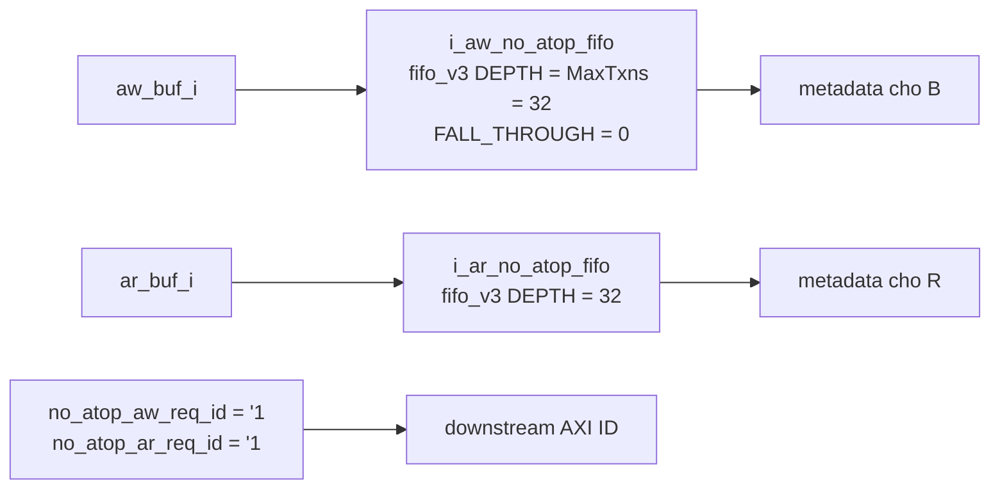

Ở nhánh này metadata là **FIFO in-order thuần, không match theo ID**. Mọi
transaction non-atomic được reissue xuống dưới với **cùng một** AXI ID hằng số
`'1` (bằng 7 khi `OutIdWidth = 3`).

Đây là ràng buộc sử dụng quan trọng nhất của toàn bộ cấu hình frozen — xem mục
4.2.

### 3.7 `floo_rob_wrapper` nhánh `NoRoB`

`NoRoB` **không** có nghĩa là "không có logic ordering". Nó là một **admission
rule**:

```systemverilog
assign push = ax_valid_i && (!in_flight || ax_dest_i == prev_dest) && !counter_full;
assign ax_rob_req_o = 1'b1;
```

Nghĩa là: một transaction tái sử dụng một AXI ID nhưng đi tới **destination
khác** sẽ bị stall cho tới khi các transaction trước đó hoàn tất.

Bên dưới là `axi_demux_id_counters` (từ package `axi`), và nó có ba quy tắc mà
cách đọc trực giác đều sai:

| Quy tắc thật | Cách đọc trực giác (SAI) |
|---|---|
| `full_o = \|cnt_full` là **OR toàn cục** trên toàn bộ `2**AxiIdBits` counter → một ID bão hòa làm stall **mọi** ID | full theo từng ID |
| `cnt_full[i] = overflow \| (&in_flight)` bão hòa ở `2**$clog2(MaxRoTxnsPerId) - 1`, nên `MaxRoTxnsPerId = 32` chỉ nhận **31** | capacity đúng bằng `MaxRoTxnsPerId` |
| Counter pop theo `rsp_i.id`, tức ID mang bởi **response** | pop theo ID của request |

### 3.8 Flit header

Thứ tự field lấy đúng theo macro `FLOO_TYPEDEF_HDR_T` trong
`hw/include/floo_noc/typedef.svh`:

```
rob_req, rob_idx, dst_id, collective_mask, src_id, last, atop, axi_ch, collective_op
```

`collective_mask` và `collective_op` tồn tại nhưng **trơ** trong v0:
`floo_route_select.sv` chỉ đọc `hdr.collective_op` khi `EnMultiCast = 1`.

#### Representation và packed width

| Thành phần | Representation trong model | Mức chứng minh |
|---|---|---|
| Thứ tự field header | `rob_req`, `rob_idx`, `dst_id`, `collective_mask`, `src_id`, `last`, `atop`, `axi_ch`, `collective_op` | Khớp macro RTL |
| `axi_ch` | 3 bit, AW/W/AR/B/R = 0..4 | Khớp exact `floo_pkg::axi_ch_e` |
| Coordinate | `x:16`, `y:16`, `port_id:8` trong C++ | Model representation; chưa claim packed-width equivalence với mọi FlooGen configuration |
| `rob_idx`, collective fields | Storage đủ rộng trong C++ | Field content của v0 đã cross-check; packed layout tổng thể chưa phải contract |
| AXI configuration của cross-check | Addr 32, Data 64, User 1, InId 3, OutId 3 | Frozen harness configuration |
| REQ AXI payload region trong flit | 75 bit: `max(AW=71, W=74, AR=65) + 1` | Sizing function cross-check với `floo_pkg` |
| RSP AXI payload region trong flit | 72 bit: `max(B=6, R=71) + 1` | Sizing function cross-check với `floo_pkg` |

Chi tiết hai con số 75 và 72, ở configuration đã cross-check
(Addr 32, Data 64, User 1, InId 3, OutId 3):

| Kênh AXI | Shared payload region | Payload width | Reserved/padding bit |
|---|---|---:|---:|
| AW | REQ | 71 | 4 |
| W | REQ | 74 | 1 |
| AR | REQ | 65 | 10 |
| B | RSP | 6 | 66 |
| R | RSP | 71 | 1 |

Bề rộng **AXI payload region dùng chung bên trong flit** là
`max(payload của các kênh dùng chung nó) + 1`: REQ =
`max(71, 74, 65) + 1` = **75 bit**, RSP = `max(6, 71) + 1` = **72 bit**.
Reserved/padding bit là phần đệm của mỗi kênh cho đủ bề rộng chung. Hai con số
này **không phải tổng packed flit/link width**: flit trên link còn mang header.
Tổng `header + payload` chưa được claim bit-exact vì packed width của coordinate,
RoB và collective fields phụ thuộc FlooGen configuration, trong khi C++ dùng
representation rộng để trace.

Hai điều dễ transcribe sai và đã được negative control xác nhận: **bit dự phòng
`+1` là bắt buộc** — shared payload region luôn rộng hơn payload lớn nhất ít
nhất một bit; và các bề rộng kênh dùng `cfg.InIdWidth`, **không bao giờ** dùng
`OutIdWidth`.

Hai nguồn bằng chứng cho bảng trên là khác nhau và không nên gộp:

- Config 32/64/1/3/3 chính là `floo_test_pkg::AxiCfg`, tức config mà các
  cross-check chimney content và timing chạy. Nội dung flit ở chính config này
  đã so với RTL.
- Sizing cross-check thì kiểm **số học** của hàm sizing trên 8 configuration
  khác, không có config này trong đó. Nó chứng minh công thức đúng, không phải
  chứng minh riêng bảng số ở trên.

`axi_req_flit` và `axi_rsp_flit` dùng C++ struct chứa mọi union member để dễ
trace và phát hiện stale field; chúng không tuyên bố có cùng ABI/packed memory
layout với SystemVerilog. Equivalence hiện tại nằm ở field content, channel
selection và sizing arithmetic.

### 3.9 Ready/valid và cycle accounting

Mọi link dùng cùng một quy tắc: transfer chỉ xảy ra khi `valid && ready` trong
cycle đang xét. Khi `valid = 1` nhưng `ready = 0`, producer phải giữ `valid` và
toàn bộ payload ổn định. Các route/arbiter lock, FIFO push/pop và counter chỉ
được cập nhật theo handshake hoặc state transition được RTL định nghĩa.

| Thành phần latency | Giá trị trong hợp đồng hiện tại | Ý nghĩa |
|---|---:|---|
| Fixed composed endpoint cost | 6 cycle | Chimney/adaptation overhead đã pin bằng detailed calibration; không phải hằng số chung cho mọi FlooNoC config |
| Spatial cost | `4 * Manhattan_hops` | Tổng phần tăng theo khoảng cách của đường REQ và RSP trong cấu hình có input/output FIFO depth 2 |
| Read burst serialization | `beats - 1` | Beat đầu đã nằm trong fixed/spatial term |
| Write burst serialization | `beats` | AW mở packet, sau đó W beat đi trên cùng route |

Do đó fast backend dùng:

```
read  cycles = 4 * Manhattan_hops + 6 + (beats - 1)
write cycles = 4 * Manhattan_hops + 6 + beats
```

Đây là **calibration contract của cấu hình v0**, không phải công thức kiến trúc
tổng quát cho FlooNoC. Baseline TLM integration hiện pin 10 cycle ở một hop và
30 cycle ở sáu hop cho phép đo tương ứng, với tolerance một cycle. Con số
11/30 từng ghi trong test ở lớp abstraction cũ thuộc giai đoạn trước A-3 và
không được dùng thay cho contract production 10/30 hiện tại.

### 3.10 Reset và clock gating

Reset xoá route/arbiter state và nội dung FIFO. Vì flit đang in-flight có thể bị
discard, conservation không được kiểm qua một reset boundary. Một measurement
window hợp lệ cho conservation phải reset-free, dừng injection và drain hoàn
toàn trước khi so accepted/ejected flit.

Detailed clock chỉ được gate khi **toàn mạng quiescent**:

- không còn TLM waiter hoặc request slot đang sở hữu transaction;
- manager/subordinate ingress và completion queue rỗng;
- metadata FIFO và outstanding B/R state rỗng;
- route/arbiter lock đã release;
- input/output FIFO của mọi router trên cả REQ và RSP mesh đều rỗng.

Trạng thái `mesh idle` nhưng wrapper còn giữ target delay hoặc completion owner
là hợp lệ và **chưa đủ** để gate clock. Điều kiện này được kiểm bằng stress test
và negative control, không chỉ dựa trên suy luận.

### 3.11 Hợp đồng measurement

| Đại lượng | Nguồn/denominator | Điều không được suy diễn |
|---|---|---|
| `latency_cycles` | Completion observer tại interconnect boundary | Không gồm target access delay |
| `Survey net` | Directed survey transaction, chỉ phần NoC | Không so trực tiếp với hop tính từ CPU nếu survey phát từ probe |
| `Survey total` | NoC + target access delay | Không có ở firmware-only traffic nếu không merge baseline |
| Throughput/link utilisation | Toàn bộ modeled cycles trong measurement window | Không chia cho mesh-active cycle |
| FIFO mean/clock-active ratio | Router `counted_cycles`, tức cycle clock mesh thực sự chạy | Không dùng làm throughput denominator |
| Flit conservation | Reset-free, stop-injection, fully drained window | Firmware snapshot `drained=false` không đủ điều kiện |

Firmware dashboard là diagnostic snapshot của workload thật và luôn
`drained=false` ở fixed end time. Chỉ row detailed, complete và drained của
`noc_benchmark` mới được phép thắng một DSE sweep.

---

## 4. Bug và các điểm cần cải thiện

Không phải mọi mục dưới đây đều là "bug RTL". Phân loại đúng quyết định hành
động đúng: defect của model phải sửa và giữ regression; configuration hazard
phải có guard; architectural limitation cần quyết định ở mức SoC; measurement
finding chỉ có hiệu lực trong workload đã đo.

| Nhóm | Phân loại | Ví dụ | Hành động |
|---|---|---|---|
| A | RTL semantic/lint finding hoặc model defect đã sửa khi đối chiếu RTL | ascending range, `rob_req`, global `full_o`, output FIFO | Giữ RTL cross-check và mutation control |
| B | Architectural/configuration limitation của frozen v0 | `MaxUniqueIds=1`, no VC, `NoLoopback`, không link pipeline | Enforce contract hoặc mở scope kèm RTL evidence mới |
| C | Measurement-driven observation | utilisation, placement latency, contention delta | Chỉ áp dụng cho workload/provenance đã ghi |

### 4.1 Nhóm A — Phát hiện từ RTL FlooNoC

Các mục này mô tả hành vi thật của RTL hoặc điểm dễ hiểu sai khi port sang
model. Một số không phải lỗi chức năng của FlooNoC nhưng đã từng tạo defect
trong model; trạng thái đó được ghi rõ thay vì gom tất cả dưới nhãn "RTL bug".

**A1. Ascending packed range làm đảo index của arbiter.**

```systemverilog
floo_req_chan_t [AxiW:AxiAr] floo_req_arb_in;   // AxiW = 1, AxiAr = 2
```

Range `[1:2]` là **ascending**. Trong ascending packed range, index đầu tiên là
phần tử **có trọng số cao nhất**. Nối nó vào `data_i[NumRoutes-1:0]` của arbiter
đặt slot `AxiW` lên bit 1 và slot `AxiAr` lên bit **0** — ngược với cách đọc từ
trái sang phải của khai báo.

Vì index quyết định thứ tự ưu tiên round-robin, sai lệch này **quan sát được**
mỗi khi AW và AR tranh nhau. Gợi ý duy nhất mà RTL đưa ra là warning `ASCRANGE`
của Verilator. Cùng một bẫy lặp lại ở `floo_rsp_arb_in [AxiB:AxiR]`, nơi index 0
là slot **R** chứ không phải B.

*Mức độ:* cao. Đây là loại lỗi im lặng, chỉ lộ ra dưới contention.
*Khuyến nghị:* bật `ASCRANGE` như lỗi trong lint flow, hoặc đề nghị upstream đổi
sang descending range.
*Phân loại/trạng thái:* SystemVerilog hợp lệ nhưng là interpretation hazard;
model defect đã sửa và đã có timing cross-check.

**A2. `NoRoB` vẫn drive `rob_req = 1`.**

"Reorder buffer disabled" **không** có nghĩa `rob_req = 0` trên dây. Mọi request
flit vẫn mang `rob_req = 1` với index 0. Model từng giả định theo cách đọc trực
giác và đã sai.

*Mức độ:* trung bình. Không gây lỗi chức năng nhưng làm sai mọi giả định về nội
dung flit.
*Phân loại/trạng thái:* RTL semantic trap; model defect đã sửa.

**A3. `full_o` của counter bank là OR toàn cục.**

Một AXI ID bão hòa sẽ stall **mọi** ID khác, kể cả ID hoàn toàn rảnh. Với một
model có counter đúng theo từng ID nhưng full theo từng ID, hai bên vẫn khớp ở
boundary cho tới khi có counter bão hòa — nên mismatch loại này rất khó lộ.

*Mức độ:* trung bình đến cao tùy traffic. Là một điểm nghẽn thật khi nhiều
manager dùng nhiều ID.
*Khuyến nghị:* nếu SoC tiến tới nhiều ID, cần đo lại điểm này chứ không giả định
độc lập giữa các ID.
*Phân loại/trạng thái:* RTL architectural behavior; model đã sửa để khớp,
performance risk vẫn mở nếu traffic nhiều ID tăng.

**A4. Capacity thực là 31, không phải 32.**

`cnt_full[i] = overflow | (&in_flight)` bão hòa ở `2**$clog2(MaxRoTxnsPerId) - 1`.
Tham số `MaxRoTxnsPerId = 32` cho phép **31** transaction outstanding.

*Mức độ:* thấp, nhưng là off-by-one dễ vào spec sai.
Con số này không mâu thuẫn với `MaxTxns = 32`: `MaxTxns` là depth của metadata
FIFO, còn 31 là ngưỡng nhận của `axi_demux_id_counters` trong NoRoB gate.

**A5. Self-addressed flit với `NoLoopback` làm treo node thay vì báo lỗi.**

Một flit gửi tới chính node phát ra nó là không thể giao, và nó làm kẹt input
FIFO của node đó **vĩnh viễn**. Không có error, không có timeout, không có
diagnostic — mô phỏng chỉ đơn giản đứng im.

Đã gặp thật hai lần: một lần khi đặt boot ROM lên node của CPU, một lần khi
random stimulus sinh flit tự địa chỉ.

*Mức độ:* cao về mặt debug cost. Triệu chứng (treo im lặng) cách rất xa nguyên
nhân (một dòng cấu hình placement).
*Đã xử lý:* D1 bypass access của đúng `local_owner` trước khi tạo flit.
`noc_interconnect` vẫn từ chối co-location không owner, owner không tồn tại,
owner nằm sai node hoặc một mapping khiến owner không còn đường hợp lệ tới
target. Đừng bỏ các elaboration guard đó.
*Phân loại/trạng thái:* configuration hazard; guarded trong production wrapper.

**A6. Malformed hoặc truncated wormhole packet có thể giữ route vĩnh viễn.**

Back-pressure bình thường **không** làm mất flit: khi `ready = 0`, source đúng
protocol phải giữ `valid`, `last` và payload ổn định cho tới khi transfer được
accept. Nguy cơ xảy ra nếu source vi phạm hợp đồng đó, bỏ flit `last` trước
handshake, reset/cắt packet giữa chừng hoặc không bao giờ phát flit kết thúc.
Khi đó route lock ở mọi router packet đang chiếm không có timeout để tự hồi
phục.

*Mức độ:* cao trong thiết kế thật. Một manager lỗi có thể khóa cả một đường
ngang qua mesh.
*Khuyến nghị:* giữ `StableValid*` assertions ở verification boundary; nếu đưa
vào silicon, cân nhắc watchdog/error recovery cho packet đang mở.
*Phân loại/trạng thái:* protocol/configuration resilience gap, không phải lỗi do
một cycle back-pressure hợp lệ.

**A7. `WIDTHEXPAND` ở biểu thức chọn local port.**

Verilator báo `WIDTHEXPAND` tại `Eject + channel_i.hdr.dst_id.port_id` trong
route selector. Không ảnh hưởng cấu hình một Eject port đang dùng
(`port_id == 0`), nhưng multi-local-port **chưa được sign off** và nằm ngoài
phạm vi v0.

**A8. Tài liệu IP và testbench không khớp về `OutFifoDepth`.**

`hw/test/floo_test_pkg.sv` không định nghĩa router FIFO depth nào cả, trong khi
mọi FlooGen template hardcode `.OutFifoDepth (2)`. Ai lấy tham số từ testbench sẽ
model thiếu một buffer trên mỗi output — đúng một cycle mỗi hop. Đây chính là
điều đã xảy ra và chỉ lộ ra sau mesh cross-check.

*Khuyến nghị:* luôn lấy tham số từ FlooGen template, không lấy từ testbench.
*Phân loại/trạng thái:* provenance/documentation mismatch; model defect thiếu
output FIFO đã sửa và cả depth 2/depth 0 đều có trace evidence.

### 4.2 Nhóm B — Hạn chế kiến trúc cho SoC này

**B1. `MaxUniqueIds = 1` áp một ràng buộc thứ tự lên toàn hệ thống.**

Đây là hạn chế nghiêm trọng nhất, và nó là **ràng buộc sử dụng** chứ không phải
bug.

Ở nhánh `MaxUniqueIds = 1`, metadata là FIFO in-order không match theo ID, nên
chimney **giả định response quay về đúng thứ tự request, theo từng hướng**.

- Một destination duy nhất thì thỏa mãn, vì mọi transaction downstream reissue
  cùng ID `'1` và AXI ordering đảm bảo phần còn lại.
- **Hai destination khác nhau thì không.** `NoRoB` chỉ serialize *cùng một* AXI
  ID đi tới destination khác. Các ID khác nhau tới endpoint khác nhau có thể
  outstanding đồng thời và quay về không đúng thứ tự — FIFO in-order sẽ gán sai
  metadata.

*Hệ quả thực tế:* hoặc mỗi manager chỉ dùng một AXI ID, hoặc phải nâng
`MaxUniqueIds`.

Production TLM adapter hiện enforce lựa chọn thứ nhất bằng one-ID-per-manager
policy. Bounded concurrency trên cùng upstream port là nhiều transaction slot,
không có nghĩa adapter phát nhiều downstream AXI ID.

*Trạng thái:* ràng buộc này suy ra từ đọc RTL, **chưa** được chứng minh bằng RTL
simulation ở mức hệ thống. `test_axi_noc` tuân thủ nó bằng cách drain giữa các
destination chứ không dựa vào nó.

*Khuyến nghị:* trước khi thêm manager thứ tư hoặc cho DMA dùng nhiều ID, phải
quyết định dứt điểm mục này. Bật `MaxUniqueIds > 1` cần bằng chứng RTL mới cho
nhánh `id_queue` (allocation, matching, back-pressure) — nhánh đó hiện chưa
model và chưa verify.

**B2. Không có virtual channel → head-of-line blocking.**

`NumVirtChannels = 1` nghĩa là mỗi input port có đúng một hàng đợi. Một flit bị
chặn ở đầu hàng sẽ chặn mọi flit phía sau, **kể cả những flit đi hướng khác và
hướng đó đang rảnh**.

Việc tách `req` và `rsp` thành hai mesh đã loại bỏ trường hợp tệ nhất (response
kẹt sau request). Nhưng trong cùng một mesh thì head-of-line blocking vẫn còn
nguyên.

*Khi nào thành vấn đề:* khi có nhiều luồng traffic độc lập chia sẻ link. Ở
workload hiện tại chưa thấy (mục 4.3), nhưng thêm ISP/VPU/NPU sẽ đổi bức tranh.

**B3. XY routing tạo hotspot có thể dự đoán trước.**

XY routing là deterministic: mọi traffic đi hết trục X rồi mới tới trục Y.
Không có adaptive routing, không có cân bằng tải. Trên regular mesh và với
packet hợp lệ, dimension-order XY loại bỏ cycle trong routing-channel
dependency; điều này **không** đồng nghĩa toàn hệ thống không thể
protocol-deadlock hoặc bị treo bởi endpoint, malformed packet hay permanent
back-pressure.

Đo được trên run thật: hai link nặng nhất đều nằm ở cột `x=0`, đúng tuyến
CPU(0,0) ↔ RAM(0,1). Đây không phải trùng hợp mà là hệ quả trực tiếp của XY
routing cộng với floorplan.

*Điểm mạnh:* routing-deadlock-free trong các giả định trên, dễ suy luận.
*Điểm yếu:* không thể tự tránh điểm nghẽn. Muốn giảm tải phải đổi **placement**,
không đổi được routing.

**B4. Không có explicit link pipeline.**

Trong model, link giữa các router là kết nối tổ hợp; toàn bộ storage nằm trong
input/output FIFO của router. Cấu hình frozen không dùng link cut nào, nên mesh
timing vẫn sign off được.

*Hạn chế:* không được phát biểu rằng model đã implement link pipelining của
FlooNoC. Với mesh vật lý lớn hơn, timing closure nhiều khả năng cần cut — và
lúc đó model phải mở rộng.

**B5. Số manager port bị giới hạn 1..8.**

Manager ID rộng 3 bit trong cấu hình frozen, nên tối đa 8 initiator port. Đây là
trần cứng, được constructor từ chối trước khi instantiate mesh.

**B6. Chưa có RTL harness cho đường composed.**

Từng block đã signed riêng lẻ, nhưng chưa có một harness so sánh toàn bộ đường
manager-AXI → mesh → subordinate-AXI với RTL trong một lần. Composed timing hiện
được bảo đảm bằng lập luận "đi qua các block đã signed", chứ không phải bằng đo.

### 4.3 Nhóm C — Đề xuất rút từ số liệu đo thật

Số liệu từ run FreeRTOS level 128, detailed mode, cửa sổ 73.729.334 cycle,
835.149 transaction. Snapshot kết thúc khi firmware còn chạy
(`drained = false`), nên dùng để phân tích workload/floorplan chứ không được đưa
vào tập ứng viên thắng DSE. Link utilisation dưới đây dùng toàn bộ modeled
measurement cycles làm denominator, không dùng riêng mesh-active cycles.

**C1. Mesh 4x4 có mức sử dụng rất thấp trong workload hiện tại.**

| Chỉ số | Đo được |
|---|---|
| Link utilisation cao nhất | **1,295 %** |
| Stall ratio | **0,000 %** |
| FIFO high-water | 1 trên 2 |

Trong cửa sổ này NoC **không phải** bottleneck. Workload là CPU-bound: 3,9 byte
trung bình mỗi transaction, chủ yếu instruction fetch và MMIO 4 byte. Kết luận
này không được suy rộng sang workload streaming hoặc platform có thêm
ISP/VPU/NPU.

*Đề xuất:* chạy sweep 2x2 và 3x3 bằng `noc_benchmark` trước khi chốt topology.
Router count thấp hơn là một chỉ báo cấu trúc, chưa phải số area saving: area,
power và energy vẫn `unavailable` cho tới khi có RTL synthesis/power flow đã
calibration. Nếu định thêm ISP/VPU/NPU, phải bổ sung workload tương ứng trước
khi thay đổi floorplan.

**C2. Latency đang bị chi phối bởi placement, không phải contention.**

Latency đo được bám sát floor lý thuyết `4 × hops + 6`:

| Block | Hops từ CPU | Floor | Đo được |
|---|---|---|---|
| ram | 1 | 10 | 10,388 |
| uart0 | 1 | 10 | 10,496 |
| dma0 | 2 | 14 | 14,441 |
| plic | 3 | 18 | 18,323 |
| timer0 | 4 | 22 | 22,519 |

Chênh lệch so với floor đều dưới 0,6 cycle. Nghĩa là **muốn giảm latency thì
đổi placement, không phải tăng buffer hay đổi arbitration**.

**C3. Contention có thật, đo được, và hiện rất nhỏ.**

Cặp so sánh có kiểm soát — cùng target, cùng quãng đường, chỉ khác việc DMA có
đang chiếm link hay không:

| | Mean latency |
|---|---|
| CPU → RAM khi DMA idle | 10,304 cycle |
| CPU → RAM khi DMA active | 11,456 cycle |
| **Chênh lệch** | **1,152 cycle** |

Đây chính là con số mà flat bus không sinh ra được, vì flat bus không có link để
chia sẻ. Nó cũng là thước đo trực tiếp nhất cho câu hỏi "NoC này có đang nghẽn
không".

**C4. Floorplan hiện tại hợp lý, nhưng lý do cần được ghi lại.**

- RAM cách CPU 1 hop trong khi mang **98,5 %** toàn bộ traffic → đặt đúng.
- `timer0` nằm xa 4 hops nhưng chỉ 243 transaction. Tổng chi phí thêm khoảng
  3.000 cycle trên 73,7 triệu cycle — không đáng để đổi chỗ.
- 17/23 block không có traffic nào từ firmware này.

*Đề xuất:* nếu workload đổi (ví dụ firmware bắt đầu polling `timer0` liên tục),
kết luận về `timer0` sẽ đảo chiều. Nên chạy lại dashboard sau mỗi thay đổi lớn
về firmware, chứ đừng coi floorplan là đã chốt vĩnh viễn.

**C5. Fast mode không dùng được cho câu hỏi contention.**

Cùng workload chạy fast mode để lại bucket "RAM khi DMA active" **rỗng**. Đây là
minh chứng chứ không phải khẳng định suông: fast mode không model contention nên
không có gì để phân loại.

*Quy tắc:* fast mode cho functional run dài; detailed mode cho mọi câu hỏi về
utilisation, stall, occupancy, contention và DSE.

### 4.4 Thứ tự cải thiện đề xuất

| Ưu tiên | Hành động | Điều kiện hoàn thành |
|---|---|---|
| P0 | Giữ one-ID-per-manager contract, D1 owner-aware bypass + invalid-placement guard và whole-network quiescence gate | Các bad-config, local-bypass, concurrency, stress và clock-gating mutation vẫn bị bắt |
| P0 | Không mở `MaxUniqueIds > 1` bằng thay đổi tham số đơn thuần | Phải model/cross-check nhánh `id_queue`, allocation, matching và back-pressure trước |
| P1 | Dựng một composed RTL harness manager-AXI -> chimney -> mesh -> chimney -> subordinate-AXI | So sánh boundary/state theo cycle; không dùng behavioral RTL replacement |
| P1 | Chạy workload/DSE đã drain cho topology 2x2, 3x3 và 4x4 | Mọi candidate complete, conserved, cùng workload/seed và qua constraints |
| P1 | Đánh giá recovery cho malformed wormhole packet | Assertion ở verification; quyết định watchdog/error recovery nếu hướng tới silicon |
| P2 | Mở explicit link pipeline hoặc topology khác | Frozen config mới, generated topology mới và RTL cross-check tương ứng |
| P2 | Bổ sung area/power/energy | Có tên RTL revision, synthesis tool, library/corner và calibration provenance |

---

## 5. Verification và traceability

| Phạm vi | Reference | Evidence hiện có | Claim được phép |
|---|---|---|---|
| FIFO, route selector, arbiter, router | RTL frozen + `common_cells` pinned | Pre/post-edge trace exact; state nội bộ khi truy cập được | Cycle-matched trong parameter set đã test |
| AXI sizing và flit content | `floo_pkg`, `axi_pkg`, chimney RTL | Sizing configuration table và emitted-flit comparison | Field content/channel mapping/sizing exact trong config đã ký |
| Bốn chimney quadrant | `floo_axi_chimney.sv`, `floo_rob_wrapper.sv` | 127/141/221/78-cycle traces và content traces | Block-level RTL timing/content match |
| Inter-node REQ/RSP mesh | Grid của `floo_axi_router.sv`, wiring từ FlooGen | 1872 node-cycle trên mesh 3x3 | Wiring và timing của selected mesh structure match |
| TLM-to-AXI adapter | Không có RTL counterpart | Scoreboard, three-manager stress, same-port concurrency, watchdog và mutation | Model integration verified; **không** gọi RTL equivalence |
| Fast backend | Detailed backend | 1..6-hop calibration, width/burst sweep, tolerance 1 cycle | No-contention estimate; không có contention/back-pressure metrics |
| Metrics/dashboard | Passive production signals + schema v1 | Router/mesh tests, conservation/drain controls, dashboard/sweep mutations | Measured/derived values đúng source contract; area/power vẫn unavailable |
| `noc_soc` + FreeRTOS | Platform/firmware contract | Levels 121/122/123/124/128, packaging và 11/11 platform controls | SoC software bring-up complete; không phải full RTL SoC sign-off |

Gate bắt buộc cho technical sign-off v1.5 đã được chạy lại trên cùng snapshot:
42/42 component tests, 12/12 RTL cross-check và 57/57 component mutation
controls, tất cả exit code 0. Raw transcript, hash và tested-source manifest nằm
tại `docs/signoff/v1.5/`; xem `SIGNOFF.md` trong thư mục đó để audit. Các baseline
10/10 D3-D6 metrics controls và 11/11 FreeRTOS/platform controls đã được report
từ milestone trước nhưng **không chạy lại** trong lần đóng tài liệu này, nên
không được nhập nhằng với evidence gate v1.5. Con số mutation pass chỉ có ý
nghĩa khi runner xác nhận mutation build được và test thất bại vì đúng
diagnostic dự kiến.

## 6. Thuật ngữ

| Thuật ngữ | Nghĩa trong tài liệu này |
|---|---|
| Detailed | Backend chạy signal-level mesh theo từng cycle và tiêu SystemC time |
| Fast | Backend approximately timed, bypass mesh và cộng no-contention delay estimate |
| RTL-signed | Đã so trực tiếp với RTL frozen bằng trace/content cross-check và có mutation chứng minh sensitivity |
| Model-level verified | Được test/stress trong SystemC nhưng không có RTL counterpart trực tiếp |
| Chimney | Network interface chuyển AXI channel thành flit và ngược lại |
| REQ/RSP | Hai physical mesh riêng cho AW/W/AR và B/R |
| Drained | Đã dừng injection và mọi wrapper/chimney/router/link state đều quiescent |
| `[M]/[D]/[A]/[S]` | Measured / Derived / Analytic / Static-or-spec source label |

## 7. Giấy phép, provenance và cách tái tạo

### 7.1 Giấy phép

Tài liệu này trích nguyên văn nhiều đoạn RTL của FlooNoC, nên phần license cần
nói rõ:

| Thành phần | Giấy phép | Ghi chú |
|---|---|---|
| FlooNoC RTL | SHL-0.51 | Không copy vào component; chỉ đọc từ cây frozen |
| Header model dẫn xuất từ RTL | SHL-0.51 | 15 trên 19 installed header |
| Code tích hợp CDC-VP gốc | Apache-2.0 | 4 header còn lại (`axi_lanes`, `noc_interconnect`, `noc_metrics`, `reference_model`) và platform |
| `common_cells`, `axi` | Theo license riêng của chúng | Dependency hành vi, không copy vào component |
| CPU Bremen RISC-V VP | MIT | Link tĩnh vào `noc_soc`, có trong binary package |

Development package cài kèm cả hai text SHL-0.51 và Apache-2.0, file NOTICE và
`PROVENANCE.md` dưới `share/licenses/cdc-components/floo_noc_model`.
`noc_soc_packaging_regression` là bản kiểm tự động cho mục này — nó byte-compare
từng record, nên đừng thay bằng sign-off thủ công.

### 7.2 Provenance của các con số

Mọi số liệu ở mục 4.3 đến từ một run cụ thể, không phải giá trị danh nghĩa:

| Hạng mục | Giá trị |
|---|---|
| Firmware | `fw/freertos_noc_soc`, build level 128 |
| Backend | detailed, network clock 1 ns |
| Cửa sổ đo | 73.729.334 cycle, 835.149 transaction |
| Trạng thái drain | `drained = false` — snapshot khi firmware còn chạy |
| Topology | 4x4, floorplan ở mục 2.2 và address map ở mục 2.3 |

Một số đo không kèm năm dòng trên thì không so sánh được với số đo khác.

### 7.3 Tái tạo

Môi trường build bắt buộc — trên host này có một compiler wrapper của Synopsys
đứng trước trong `PATH` và nó hỏng:

```bash
export CC=/usr/bin/gcc
export CXX=/usr/bin/g++
export PATH=/usr/bin:/bin:$PATH
$CC -dumpfullversion
$CXX --version | head -n 1
```

Regression của component và RTL cross-check:

```bash
repo_root="$(git rev-parse --show-toplevel)"
export FLOONOC_RTL_ROOT=/home/duyptt_HW/Documents/work/Study_FlooNoC/FlooNoC

command -v verilator
command -v bender
test "$(git -C "$FLOONOC_RTL_ROOT" rev-parse HEAD)" = \
  9a6972a5f9b8117506d1df8a6505ce1da2bc9084

cd "$repo_root/components/floo_noc_model"
make test                                    # 41 SystemC test
bash rtl_crosscheck/run_all_crosschecks.sh   # đủ 12 RTL cross-check
bash rtl_crosscheck/run_negative_controls.sh # 51 model mutation control
```

Dựng lại số liệu mục 4.3 và dashboard:

```bash
cd "$repo_root"
source tools/third_party/setup_env.sh
make -C fw/freertos_noc_soc NOC_STEP=128 check

cmake -S . -B build -DCMAKE_BUILD_TYPE=Release \
  -DCDC_BUILD_NOC_SOC=ON -DSYSTEMC_HOME=/opt/systemc-2.3.4
cmake --build build --target noc_soc noc_benchmark --parallel

# baseline floorplan cho cột survey, chạy một lần
./build/platforms/noc_soc/noc_soc --mode survey \
  --noc-timing detailed --sim-us 200 --noc-metrics /tmp/noc_survey.json

# workload thật
./build/platforms/noc_soc/noc_soc --mode firmware \
  --noc-timing detailed --fw fw/freertos_noc_soc/freertos_noc_soc.elf \
  --sim-us 10000000 --noc-metrics /tmp/noc_fw.json

python3 tools/noc_dashboard.py /tmp/noc_fw.json \
  --peripheral-baseline /tmp/noc_survey.json
```

Sinh lại chính tài liệu này:

```bash
# chỉ khi sửa sơ đồ mermaid trong file .md
cd "$repo_root"
command -v google-chrome || command -v chromium || command -v chromium-browser
npm install mermaid@11
python3 components/floo_noc_model/docs/render_diagrams.py \
    components/floo_noc_model/docs/NOC_MODEL_ARCHITECTURE.vi.md \
    components/floo_noc_model/docs/diagrams \
    --mermaid-root "$repo_root"

python3 -c 'import docx; from PIL import Image'
python3 components/floo_noc_model/docs/make_docx.py
```

## 8. Tham chiếu

| Nội dung | File |
|---|---|
| Scope và tham số frozen | `docs/P0_SCOPE.md` |
| Ánh xạ RTL ↔ SystemC | `docs/RTL_MAPPING.md` |
| Bằng chứng verification và negative control | `docs/STATUS.md` |
| Technical sign-off v1.5, raw log và source manifest | `docs/signoff/v1.5/SIGNOFF.md` |
| Context handoff đầy đủ | `docs/AI_HANDOFF_CONTEXT.md` |
| Metrics và dashboard | `docs/NOC_METRICS_DASHBOARD_IMPLEMENTATION.md` |
| Đọc hiểu dashboard | `docs/NOC_DASHBOARD_REPORT.vi.txt` |
| FreeRTOS bring-up | `docs/NOC_SOC_FREERTOS_ROADMAP.md` |
| Platform | `platforms/noc_soc/README.md` |
