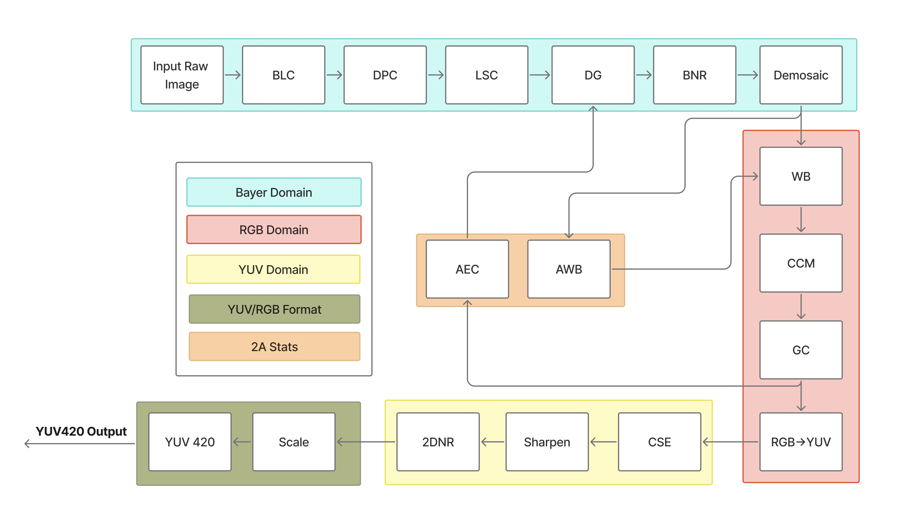

# ISP TLM Component

A 3-tier Transaction-Level Model (TLM) of an Image Signal Processor (ISP) for the CDC-VP virtual platform.

---

## Architecture Overview



---

## Processing Pipeline Order

1. **BLC** - Black Level Correction
2. **DPC** - Defective Pixel Correction
3. **LSC** - Lens Shading Correction
4. **DG** - Digital Gain
5. **BNR** - Bayer Noise Reduction
6. **Demosaic** - CFA to RGB conversion
7. **AWB** - Auto White Balance (computes gains, feeds WB)
8. **WB** - White Balance (on RGB data)
9. **CCM** - Color Correction Matrix
10. **GC** - Gamma Correction
11. **CSC** - RGB to YUV Color Space Conversion
12. **CSE** - Color Saturation Enhancement
13. **Sharpen** - Image Sharpening
14. **2DNR** - 2D Noise Reduction
15. **Scale** - Image Scaling (optional)
16. **YUV420** - YUV420 format conversion (optional)

---

## TLM Register Map

Firmware can access ISP tuning parameters via memory-mapped registers through the TLM-2.0 socket. All registers are 32-bit aligned.

### Global Registers
| Address | Name | Description |
|---------|------|-------------|
| 0x0000 | `REG_CTRL` | Control register (bit 0: ENABLE, bit 1: START) |
| 0x0004 | `REG_STATUS` | Status register (bit 0: DONE, bit 1: IDLE) |
| 0x0008 | `REG_IRQ_ENABLE` | Interrupt Enable register |
| 0x000C | `REG_IRQ_STATUS` | Interrupt Status register |
| 0x0024 | `REG_WIDTH` | Image width |
| 0x0028 | `REG_HEIGHT` | Image height |
| 0x002C | `REG_STRIDE` | Line stride in bytes |
| 0x0030 | `REG_FORMAT` | Image format |
| 0x0034 | `REG_OP_MODE` | Operating mode |
| 0x0040 | `REG_BIT_DEPTH` | Input bit depth (8, 10, 12, 14) |
| 0x0044 | `REG_BAYER_PATTERN` | Bayer pattern (0=RGGB, 1=GRBG, 2=BGGR, 3=GBRG) |

### Buffer Descriptors
| Address | Name | Description |
|---------|------|-------------|
| 0x0100 | `REG_SRC_ADDR` | DRAM source address of input RAW frame |
| 0x0104 | `REG_DST_ADDR` | DRAM destination address of output YUV frame |
| 0x0108 | `REG_SCRATCH_ADDR` | DRAM scratch buffer address |
| 0x010C | `REG_SRC_SIZE_BYTES` | Source frame size in bytes |
| 0x0110 | `REG_DST_SIZE_BYTES` | Destination frame size in bytes |
| 0x0114 | `REG_WEIGHTS_ADDR` | DRAM weights buffer address |
| 0x0118 | `REG_PARAM_ADDR` | DRAM LSC parameters buffer address |

### Processing Block Registers
The configuration offsets of each processing block are mapped sequentially:

* **BLC (0x1000 - 0x107F)**: `REG_BLC_ENABLE` (0x1000), `REG_BLC_LINEAR` (0x1004), offsets for R/GR/GB/B channels (0x1008 - 0x1014), and saturation limits for R/GR/GB/B channels (0x1018 - 0x1024).
* **DPC (0x1080 - 0x10FF)**: `REG_DPC_ENABLE` (0x1080), `REG_DPC_THRESH` (0x1084).
* **LSC (0x1100 - 0x117F)**: `REG_LSC_ENABLE` (0x1100), `REG_LSC_GRID_W` (0x1104), `REG_LSC_GRID_H` (0x1108).
* **DG (0x1180 - 0x11FF)**: `REG_DG_ENABLE` (0x1180), `REG_DG_GAIN` (0x1184), `REG_DG_AUTO` (0x1188).
* **BNR (0x1200 - 0x127F)**: `REG_BNR_ENABLE` (0x1200), `REG_BNR_WINDOW` (0x1204).
* **Demosaic (0x1280 - 0x12FF)**: `REG_DEMOSAIC_ENABLE` (0x1280).
* **AWB (0x1300 - 0x137F)**: `REG_AWB_ENABLE` (0x1300), `REG_AWB_ALGORITHM` (0x1304), computed R/B gains (0x1308, 0x130C), threshold percentages (0x1310 - 0x1318).
* **WB (0x1380 - 0x13FF)**: `REG_WB_ENABLE` (0x1380), manual R/B gains (0x1384, 0x1388).
* **CCM (0x1400 - 0x147F)**: `REG_CCM_ENABLE` (0x1400), 3x3 floating point correction matrix (0x1404 - 0x1424).
* **GC (0x1480 - 0x14FF)**: `REG_GC_ENABLE` (0x1480), `REG_GC_GAMMA` (0x1484), indirect LUT address and data ports (`REG_GC_LUT_ADDR` 0x1488, `REG_GC_LUT_DATA` 0x148C).
* **AEC (0x1500 - 0x157F)**: `REG_AEC_ENABLE` (0x1500), `REG_AEC_FEEDBACK` (0x1504), tuning parameters (0x1508, 0x150C).
* **CSC (0x1580 - 0x15FF)**: `REG_CSC_ENABLE` (0x1580), `REG_CSC_STANDARD` (0x1584).
* **CSE (0x1600 - 0x167F)**: `REG_CSE_ENABLE` (0x1600), `REG_CSE_SAT_GAIN` (0x1604).
* **Sharpen (0x1680 - 0x16FF)**: `REG_SHARPEN_ENABLE` (0x1680), `REG_SHARPEN_SIGMA` (0x1684), `REG_SHARPEN_STRENGTH` (0x1688).
* **2DNR (0x1700 - 0x177F)**: `REG_2DNR_ENABLE` (0x1700), search window (0x1704), patch size (0x1708), filtering weight (0x170C).
* **Scale (0x1780 - 0x17FF)**: `REG_SCALE_ENABLE` (0x1780), output width (0x1784), output height (0x1788).
* **YUV420 (0x1800 - 0x187F)**: `REG_YUV420_ENABLE` (0x1800).

---

## C++ Public APIs

The `isp_tlm` SystemC module exposes a minimal public C++ interface:

* **`std::uint16_t* get_raw_buffer()`**: Returns a pointer to the internal raw input buffer. Lazily allocates/resizes the buffer if the register configuration (`REG_WIDTH`, `REG_HEIGHT`) changes.
* **`std::uint8_t* get_yuv_buffer()`**: Returns a pointer to the internal YUV output buffer. Lazily allocates/resizes the buffer.
* **`std::size_t get_raw_buffer_size()`**: Returns the current raw input buffer size in bytes.
* **`std::size_t get_yuv_buffer_size()`**: Returns the current YUV output buffer size in bytes.

*Note: All hardware configurations, control triggers, and status queries must go through the standard TLM-2.0 register access socket (`socket`).*

## Interrupt Condition and Reset

### Interrupt Flow
1. **Enable**: Firmware enables interrupts by writing `1` to `REG_IRQ_ENABLE` (`0x0008`).
2. **Completion**: When the ISP finishes processing a frame, it:
   * Sets the `STATUS_DONE` bit (bit 0) in `REG_STATUS` (`0x0004`).
   * Sets the interrupt status bit in `REG_IRQ_STATUS` (`0x000C`).
   * Asserts the physical `irq` pin high.
3. **Clearing**: To clear the interrupt and deassert the `irq` pin, firmware must either trigger a new transaction (which starts the next run) or perform a reset.

### Reset Behavior
When the physical hardware `reset_n` pin goes low, the TLM wrapper invokes `pipeline_.reset()`. This:
* Resets all internal MMIO registers to default values.
* Clears the `processing_done_` flag (clearing the `DONE` status bit).
* Deasserts the `irq` pin.
* Clears all internal buffer vectors.

---

## TLM Tuning Parameters Reference

### RGB Domain Parameters

#### Auto White Balance (AWB) — `awb_config`

| Parameter | Type | Default | Description |
|-----------|------|---------|-------------|
| `is_enable` | `bool` | `false` | Enable/disable auto white balance |
| `algorithm` | `std::uint8_t` | `0` | Algorithm selection (0=Gray World) |
| `underexposed_percentage` | `float` | `0.01` | Threshold for underexposed pixels |
| `overexposed_percentage` | `float` | `0.01` | Threshold for overexposed pixels |
| `percentage` | `float` | `0.5` | Percentage of pixels to use |
| `r_gain_out` | `float` | `1.0` | Computed red gain (output) |
| `b_gain_out` | `float` | `1.0` | Computed blue gain (output) |

**Note:** AWB operates on Bayer RAW data. It analyzes channel averages (per CFA position) and computes gains using the Gray World algorithm: target = average(R, G, B), r_gain = target / avg_R, b_gain = target / avg_B. Gains are clamped to [0.25, 4.0]. AWB output feeds directly into WB gains.

#### White Balance (WB) — `wb_config`

| Parameter | Type | Default | Description |
|-----------|------|---------|-------------|
| `is_enable` | `bool` | `false` | Enable/disable white balance correction |
| `r_gain` | `float` | `1.0f` | Gain multiplier for red channel |
| `b_gain` | `float` | `1.0f` | Gain multiplier for blue channel |

**Note:** WB operates on interleaved RGB data (after demosaic), not Bayer RAW. It multiplies R and B channels by their respective gains while passing G through unchanged. When AWB is enabled, the pipeline multiplies the WB gains with the AWB-computed gains.

#### Color Correction Matrix (CCM) — `ccm_config`

| Parameter | Type | Default | Description |
|-----------|------|---------|-------------|
| `is_enable` | `bool` | `false` | Enable/disable color correction |
| `bit_depth` | `std::uint8_t` | `12` | Bit depth for normalization/requantization |
| `corrected_red[3]` | `float[3]` | `[1,0,0]` | CCM row for red channel |
| `corrected_green[3]` | `float[3]` | `[0,1,0]` | CCM row for green channel |
| `corrected_blue[3]` | `float[3]` | `[0,0,1]` | CCM row for blue channel |

#### Gamma Correction (GC) — `gc_config`

| Parameter | Type | Default | Description |
|-----------|------|---------|-------------|
| `is_enable` | `bool` | `false` | Enable/disable gamma correction |
| `bit_depth` | `std::uint8_t` | `12` | Selects which LUT to use |
| `gamma_lut_8` | `vector<uint16_t>` | empty | 256-entry LUT for 8-bit |
| `gamma_lut_10` | `vector<uint16_t>` | empty | 1024-entry LUT for 10-bit |
| `gamma_lut_12` | `vector<uint16_t>` | empty | 4096-entry LUT for 12-bit |
| `gamma_lut_14` | `vector<uint16_t>` | empty | 16384-entry LUT for 14-bit |

#### RGB to YUV Color Space Conversion (CSC) — `csc_config`

| Parameter | Type | Default | Description |
|-----------|------|---------|-------------|
| `conv_standard` | `std::uint8_t` | `1` | `0`=BT.601, `1`=BT.709 |
| `bit_depth` | `std::uint8_t` | `12` | Input bit depth |

**BT.709 Coefficients:**
- Y = (54 * R + 183 * G + 18 * B) >> 8
- U = (-29 * R - 99 * G + 128 * B) >> 8
- V = (128 * R - 116 * G - 12 * B) >> 8
- Luma_Offset = 0, Chroma_Offset = 128

### YUV Domain Parameters

#### Color Saturation Enhancement (CSE) — `cse_config`

| Parameter | Type | Default | Description |
|-----------|------|---------|-------------|
| `is_enable` | `bool` | `false` | Enable/disable saturation enhancement |
| `saturation_gain` | `float` | `1.0f` | Gain applied to chroma deviation |

#### Sharpen — `sharpen_config`

| Parameter | Type | Default | Description |
|-----------|------|---------|-------------|
| `is_enable` | `bool` | `false` | Enable/disable sharpening |
| `sharpen_sigma` | `std::uint8_t` | `1` | Gaussian kernel sigma |
| `sharpen_strength` | `std::uint16_t` | `1` | Sharpening strength |

**Note:** Gaussian kernel radius = `ceil(3 * sigma)`. U and V pass through unchanged.

#### 2D Noise Reduction (2DNR) — `twodnr_config`

| Parameter | Type | Default | Description |
|-----------|------|---------|-------------|
| `is_enable` | `bool` | `false` | Enable/disable 2DNR |
| `window_size` | `std::uint8_t` | `5` | Search window size (must be ≥3) |
| `patch_size` | `std::uint8_t` | `3` | Patch size (must be ≥3) |
| `wts` | `std::uint16_t` | `10` | Weight parameter |

**Note:** Weight LUT formula: `weight_lut[d] = exp(-d / wts)`. U and V pass through unchanged.

---

## Build and Run

These commands are for the standalone `isp_tlm` SystemC/TLM component testbench. They follow the same component-level flow used across the CDC-VP workspace. No firmware build step is required for this component test.

**Step 1:** Source environments from the CDC-VP repository root:
```bash
cd <YourPath...>/CDC-VP
./tools/third_party/setup_third_party.sh
source ./tools/third_party/setup_env.sh
```

**Step 2:** Configure CMake with Ninja from the repository root:
```bash
cmake -S . -B build/bremen -G Ninja \
  -DCMAKE_C_COMPILER=/usr/bin/gcc \
  -DCMAKE_CXX_COMPILER=/usr/bin/g++ \
  -DCDC_BUILD_TESTS=ON \
  -DSYSTEMC_INCLUDE_DIR=/opt/systemc-2.3.4/include \
  -DSYSTEMC_LIBRARY=/opt/systemc-2.3.4/lib/libsystemc.so
```

### Building the Pipeline Runner (isp_run)

The `isp_run` tool lives in `components/isp_tlm/tests/isp_run.cpp`. It loads a real RAW file, drives it through the wired SystemC/TLM pipeline, and writes a YUV420 output plus a JSON metadata sidecar.

**Build:**
```bash
cmake --build build/bremen --target isp_run
```

The binary will be at:
```
build/bremen/components/isp_tlm/tests/isp_run
```

### Running the Pipeline

The tool can be invoked from any directory. Output is written to a canonical location inside the `output/` folder:
- If run from `components/isp_tlm/`: output goes to `components/isp_tlm/output/`
- If run from anywhere else: output goes to `components/isp_tlm/output/`

This keeps all generated artifacts in one consistent place.

**Command-line options:**
| Option | Description |
|--------|-------------|
| `-i <path>` | Input RAW file path (required) |
| `-o <path>` | Override output YUV path (default: `components/isp_tlm/output/output.yuv`) |
| `-w <width>` | Image width in pixels (required) |
| `--height <h>` | Image height in pixels (required) |
| `-b <bits>` | Bit depth: 8, 10, 12, 16 (default: 12) |
| `-p <0-3>` | Bayer pattern: 0=RGGB, 1=GRBG, 2=BGGR, 3=GBRG (default: 0) |
| `--help` | Show help message |

**Run with the test images:**

For `ColorChecker_2592x1536_12bits_RGGB.raw` (12-bit, RGGB):
```bash
cd <YourPath...>/CDC-VP
./build/bremen/components/isp_tlm/tests/isp_run \
  -i components/isp_tlm/input/ColorChecker_2592x1536_12bits_RGGB.raw \
  -w 2592 --height 1536 -b 12 -p 0
```

For `A_raw_2688x1520_5376.raw` (16-bit, BGGR):
```bash
cd <YourPath...>/CDC-VP
./build/bremen/components/isp_tlm/tests/isp_run \
  -i components/isp_tlm/input/A_raw_2688x1520_5376.raw \
  -w 2688 --height 1520 -b 16 -p 2
```

**Example output:**
```
========================================
   ISP TLM Pipeline Runner
========================================
Input:  input/A_raw_2688x1520_5376.raw
Output: output/output.yuv
Width:  2688
Height: 1520
Bit depth: 16
Bayer pattern: 2
========================================
Read 8171520 bytes from input/A_raw_2688x1520_5376.raw
Triggering ISP pipeline...
Successfully saved YUV output to output/output.yuv
Output size: 6128640 bytes
Metadata written to: output/output.yuv.json

```


### Output Files

After running `isp_run`, the following files are written to `components/isp_tlm/output/`:

| File | Description |
|------|-------------|
| `output.yuv` | YUV420 output (w * h * 1.5 bytes) |
| `output.yuv.json` | Metadata sidecar: width, height, format, bit depth, source path |

### Running the Visualization

Visualize the before/after comparison of RAW input and ISP-processed output.

**Prerequisites:**
```bash
pip3 install numpy matplotlib
```

**Run:**
```bash
cd components/isp_tlm
python3 visualize.py
```

The script reads dimensions from `output/output.yuv.json`, displays the input RAW alongside the ISP output, and writes:
- `output/output.jpg` - Standalone JPEG of the processed output
- `output/isp_before_after.jpg` - Side-by-side comparison image

If you run `isp_run` with a new image, just re-run `python3 visualize.py` to see the updated result. The visualization script auto-detects the new dimensions from the metadata file.

### File Locations (Canonical)

All ISP-generated output files live in `components/isp_tlm/output/`:
```
components/isp_tlm/
├── output/                  # All generated artifacts
│   ├── .gitkeep
│   ├── output.yuv           # YUV420 output (regenerated on each run)
│   ├── output.yuv.json      # Metadata sidecar (regenerated on each run)
│   ├── output.jpg           # Standalone JPEG (regenerated by visualize.py)
│   └── isp_before_after.jpg # Comparison image (regenerated by visualize.py)
├── visualize.py
├── tests/
│   ├── isp_run.cpp
│   └── CMakeLists.txt
└── input/
    ├── A_raw_2688x1520_5376.raw
    ├── ColorChecker_2592x1536_12bits_RGGB.raw
    └── ...
    
```

---

## Usage Example

```cpp
#include "isp_tlm.h"
#include "tlm_probe.h"

int sc_main(int argc, char* argv[]) {
    cdc::components::isp_tlm isp("isp");
    cdc::test::tlm_probe probe("probe");
    probe.socket.bind(isp.socket);

    // Configure image dimensions
    std::uint32_t val = 640;
    probe.write(0x0024, &val, 4);  // REG_WIDTH
    val = 480;
    probe.write(0x0028, &val, 4);  // REG_HEIGHT

    // Enable demosaic
    val = 1;
    probe.write(0x1280, &val, 4);  // REG_DEMOSAIC_ENABLE

    // Set white balance gains
    float gain = 1.2f;
    probe.write(0x1384, &gain, 4); // REG_WB_R_GAIN
    val = 1;
    probe.write(0x1380, &val, 4);  // REG_WB_ENABLE

    // Set CSC to BT.709
    val = 1;
    probe.write(0x1584, &val, 4);  // REG_CSC_STANDARD
    probe.write(0x1580, &val, 4);  // REG_CSC_ENABLE

    // Copy input frame to ISP buffer (lazily allocates internally)
    std::memcpy(isp.get_raw_buffer(), raw_data, sizeof(raw_data));

    // Enable ISP and Trigger processing
    val = 3;                       // ENABLE | START
    probe.write(0x0000, &val, 4);  // REG_CTRL

    // Wait for processing to complete and read output
    std::memcpy(yuv_data, isp.get_yuv_buffer(), sizeof(yuv_data));

    sc_core::sc_stop();
    return 0;
}
```
