# ISP 3-Tier Architecture Class Diagram (Snake Case)

This document contains the updated class diagram conforming to your requested naming conventions: SystemC wrapper as `isp_tlm`, pipeline coordinator as `isp_pipeline`, configuration structs as `xxx_config`, and functional blocks as `xxx_block` (all lowercase, snake_case).

---

## Class Diagram

```mermaid
%%{init: {
  'theme': 'base',
  'flowchart': { 'useMaxWidth': false, 'htmlLabels': true },
  'themeVariables': { 'fontSize': '22px' }
}}%%
classDiagram
  direction TB

  %% Tier 1: SystemC/TLM Wrapper
  class isp_tlm {
    <<sc_module>>
    +reg_socket : simple_target_socket
    +irq_out : sc_out~bool~
    +pipeline : isp_pipeline
    +active_regs : isp_config
    -b_transport()
    -processing_thread()
  }

  %% Tier 2: Pure C++ Pipeline Controller
  class isp_pipeline {
    <<class>>
    +width : uint32_t
    +height : uint32_t
    -blc_out : std::vector~uint16_t~
    -dpc_out : std::vector~uint16_t~
    -lsc_out : std::vector~uint16_t~
    -blc : blc_block
    -dpc : dpc_block
    -lsc : lsc_block
    -dg : dg_block
    -bnr : bnr_block
    -demosaic : demosaic_block
    -wb : wb_block
    -ccm : ccm_block
    -gc : gc_block
    -csc : csc_block
    -cse : cse_block
    -sharpen : sharpen_block
    -twodnr : twodnr_block
    -fmt : format_block
    -aec : aec_block
    -awb : awb_block
    +set_dimensions(w, h)
    +run(raw_in, yuv_out, cfg)
  }

  %% Tier 3: Pure C++ Block Algorithms
  class blc_block {
    +process(in, out, w, h, cfg, bayer_pattern, bit_depth)
  }
  class dpc_block {
    +process(in, out, w, h, cfg)
  }
  class lsc_block {
    +process(in, out, w, h, cfg, lsc_mem_ptr, bayer_pattern, bit_depth)
  }
  class dg_block {
    +process(in, out, w, h, cfg, bit_depth)
  }
  class bnr_block {
    +process(in, out, w, h, cfg, bayer_pattern, bit_depth)
  }
  class demosaic_block {
    +process(in, out, w, h, cfg, bayer_pattern, bit_depth)
  }
  class wb_block {
    +process(in, out, w, h, cfg)
  }
  class ccm_block {
    +process(in, out, w, h, cfg, bit_depth)
  }
  class gc_block {
    +process(in, out, w, h, gc_mem_ptr, bit_depth)
  }
  class csc_block {
    +process(in, out, w, h, cfg, bit_depth)
  }
  class cse_block {
    +process(in, out, w, h, cfg)
  }
  class sharpen_block {
    +process(in, out, w, h, cfg)
  }
  class twodnr_block {
    +process(in, out, w, h, cfg)
  }
  class format_block {
    +process(in, out, w, h, cfg)
  }
  class aec_block {
    +process(in, w, h, cfg, bit_depth)
  }
  class awb_block {
    +process(in, w, h, cfg, bit_depth)
  }

  %% Shared Types
  class cfa_types {
    <<enum>>
    RGGB
    GRBG
    BGGR
    GBRG
  }

  %% Configuration Structs
  class isp_config {
    <<struct>>
    +global : global_config
    +blc : blc_config
    +dpc : dpc_config
    +lsc : lsc_config
    +dg : dg_config
    +bnr : bnr_config
    +demosaic : demosaic_config
    +wb : wb_config
    +ccm : ccm_config
    +gc : gc_config
    +csc : csc_config
    +cse : cse_config
    +sharpen : sharpen_config
    +twodnr : twodnr_config
    +fmt : format_config
    +aec : aec_config
    +awb : awb_config
  }

  class global_config {
    <<struct>>
    +enable : bool
    +start : bool
    +bayer_pattern : cfa_types
    +bit_depth : uint8_t
  }

  class blc_config {
    <<struct>>
    +is_enable : bool
    +is_linear : bool
    +r_offset : uint16_t
    +gr_offset : uint16_t
    +gb_offset : uint16_t
    +b_offset : uint16_t
    +r_sat : uint16_t
    +gr_sat : uint16_t
    +gb_sat : uint16_t
    +b_sat : uint16_t
  }

  class dpc_config {
    <<struct>>
    +is_enable : bool
    +dp_threshold : uint16_t
  }

  class lsc_config {
    <<struct>>
    +is_enable : bool
    +grid_width : uint16_t
    +grid_height : uint16_t
  }

  class dg_config {
    <<struct>>
    +is_enable : bool
    +is_auto : bool
    +current_gain : uint16_t
    +ae_feedback : int32_t
  }

  class bnr_config {
    <<struct>>
    +is_enable : bool
    +filter_window : uint8_t
    +r_std_dev_s : float
    +r_std_dev_r : float
    +g_std_dev_s : float
    +g_std_dev_r : float
    +b_std_dev_s : float
    +b_std_dev_r : float
  }

  class demosaic_config {
    <<struct>>
    +is_enable : bool
  }

  class wb_config {
    <<struct>>
    +is_enable : bool
    +is_auto : bool
    +r_gain : float
    +b_gain : float
  }

  class ccm_config {
    <<struct>>
    +is_enable : bool
    +matrix : float[3][3]
  }

  class gc_config {
    <<struct>>
    +is_enable : bool
    +lut_select : uint8_t
  }

  class csc_config {
    <<struct>>
    +conv_standard : uint8_t
  }

  class cse_config {
    <<struct>>
    +is_enable : bool
    +saturation_gain : float
  }

  class sharpen_config {
    <<struct>>
    +is_enable : bool
    +sharpen_sigma : uint8_t
    +sharpen_strength : uint16_t
  }

  class twodnr_config {
    <<struct>>
    +is_enable : bool
    +window_size : uint8_t
    +patch_size : uint8_t
    +wts : uint16_t
  }

  class format_config {
    <<struct>>
    +scale_enable : bool
    +yuv420_enable : bool
    +in_width : uint16_t
    +in_height : uint16_t
    +out_width : uint16_t
    +out_height : uint16_t
  }

  class aec_config {
    <<struct>>
    +is_enable : bool
    +center_illuminance : uint8_t
    +histogram_skewness : float
    +ae_feedback : int32_t
  }

  class awb_config {
    <<struct>>
    +is_enable : bool
    +algorithm : uint8_t
    +underexposed_percentage : float
    +overexposed_percentage : float
    +percentage : float
    +r_gain_out : float
    +b_gain_out : float
  }

  %% Relationships
  isp_tlm *-- isp_pipeline
  isp_tlm *-- isp_config

  isp_pipeline *-- blc_block
  isp_pipeline *-- dpc_block
  isp_pipeline *-- lsc_block
  isp_pipeline *-- dg_block
  isp_pipeline *-- bnr_block
  isp_pipeline *-- demosaic_block
  isp_pipeline *-- wb_block
  isp_pipeline *-- ccm_block
  isp_pipeline *-- gc_block
  isp_pipeline *-- csc_block
  isp_pipeline *-- cse_block
  isp_pipeline *-- sharpen_block
  isp_pipeline *-- twodnr_block
  isp_pipeline *-- format_block
  isp_pipeline *-- aec_block
  isp_pipeline *-- awb_block

  isp_config *-- global_config
  isp_config *-- blc_config
  isp_config *-- dpc_config
  isp_config *-- lsc_config
  isp_config *-- dg_config
  isp_config *-- bnr_config
  isp_config *-- demosaic_config
  isp_config *-- wb_config
  isp_config *-- ccm_config
  isp_config *-- gc_config
  isp_config *-- csc_config
  isp_config *-- cse_config
  isp_config *-- sharpen_config
  isp_config *-- twodnr_config
  isp_config *-- format_config
  isp_config *-- aec_config
  isp_config *-- awb_config

  global_config ..> cfa_types : uses
```

