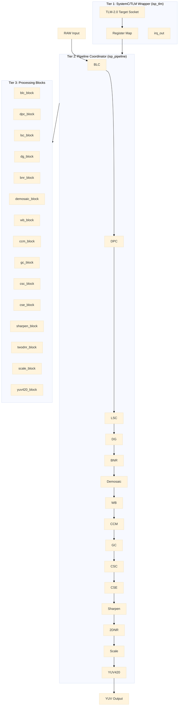

# ISP TLM Component

A 3-tier Transaction-Level Model (TLM) of an Image Signal Processor (ISP) for the CDC-VP virtual platform.

---

## Architecture Overview



---

## Processing Pipeline Order

1. **BLC** - Black Level Correction
2. **DPC** - Defective Pixel Correction
3. **LSC** - Lens Shading Correction
4. **DG** - Digital Gain
5. **BNR** - Bayer Noise Reduction
6. **Demosaic** - CFA to RGB conversion
7. **AWB** - Auto White Balance (computes gains, feeds WB)
8. **WB** - White Balance (on RGB data)
9. **CCM** - Color Correction Matrix
10. **GC** - Gamma Correction
11. **CSC** - RGB to YUV Color Space Conversion
12. **CSE** - Color Saturation Enhancement
13. **Sharpen** - Image Sharpening
14. **2DNR** - 2D Noise Reduction
15. **Scale** - Image Scaling (optional)
16. **YUV420** - YUV420 format conversion (optional)

---

## TLM Register Map

Firmware can access ISP tuning parameters via memory-mapped registers through the TLM-2.0 socket.

### Global Registers

| Address | Name | Description |
|---------|------|-------------|
| 0x000 | `REG_ISP_ENABLE` | Global ISP enable |
| 0x004 | `REG_STATUS` | Status register (bit 0: DONE, bit 1: BUSY) |
| 0x008 | `REG_TRIGGER` | Trigger processing (write 1 to start) |
| 0x00C | `REG_WIDTH` | Image width |
| 0x010 | `REG_HEIGHT` | Image height |
| 0x014 | `REG_BIT_DEPTH` | Bit depth (8, 10, 12, 14) |
| 0x018 | `REG_BAYER_PATTERN` | Bayer pattern (0=RGGB, 1=GRBG, 2=BGGR, 3=GBRG) |

### BLC Registers

| Address | Name | Description |
|---------|------|-------------|
| 0x020 | `REG_BLC_ENABLE` | Enable BLC |
| 0x024 | `REG_BLC_R_OFFSET` | Red channel offset |
| 0x028 | `REG_BLC_GR_OFFSET` | Green-Red channel offset |
| 0x02C | `REG_BLC_GB_OFFSET` | Green-Blue channel offset |
| 0x030 | `REG_BLC_B_OFFSET` | Blue channel offset |

### AWB Registers

| Address | Name | Description |
|---------|------|-------------|
| 0x085 | `REG_AWB_ENABLE` | Enable Auto White Balance |
| 0x086 | `REG_AWB_ALGORITHM` | AWB algorithm selection |
| 0x087 | `REG_AWB_R_GAIN` | Computed red gain (float) |
| 0x088 | `REG_AWB_B_GAIN` | Computed blue gain (float) |

### WB Registers

| Address | Name | Description |
|---------|------|-------------|
| 0x090 | `REG_WB_ENABLE` | Enable White Balance |
| 0x094 | `REG_WB_R_GAIN` | Red channel gain (float) |
| 0x098 | `REG_WB_B_GAIN` | Blue channel gain (float) |

### CCM Registers

| Address | Name | Description |
|---------|------|-------------|
| 0x0A0 | `REG_CCM_ENABLE` | Enable CCM |
| 0x0A4 | `REG_CCM_MATRIX00` | Matrix[0][0] (float) |
| 0x0A8 | `REG_CCM_MATRIX01` | Matrix[0][1] (float) |
| 0x0AC | `REG_CCM_MATRIX02` | Matrix[0][2] (float) |
| 0x0B0 | `REG_CCM_MATRIX10` | Matrix[1][0] (float) |
| 0x0B4 | `REG_CCM_MATRIX11` | Matrix[1][1] (float) |
| 0x0B8 | `REG_CCM_MATRIX12` | Matrix[1][2] (float) |
| 0x0BC | `REG_CCM_MATRIX20` | Matrix[2][0] (float) |
| 0x0C0 | `REG_CCM_MATRIX21` | Matrix[2][1] (float) |
| 0x0C4 | `REG_CCM_MATRIX22` | Matrix[2][2] (float) |

### CSC Registers

| Address | Name | Description |
|---------|------|-------------|
| 0x0E0 | `REG_CSC_STANDARD` | Conversion standard (0=BT.601, 1=BT.709) |

### CSE Registers

| Address | Name | Description |
|---------|------|-------------|
| 0x0F0 | `REG_CSE_ENABLE` | Enable Color Saturation Enhancement |
| 0x0F4 | `REG_CSE_SAT_GAIN` | Saturation gain (float) |

### Sharpen Registers

| Address | Name | Description |
|---------|------|-------------|
| 0x100 | `REG_SHARPEN_ENABLE` | Enable Sharpen |
| 0x104 | `REG_SHARPEN_SIGMA` | Gaussian sigma (uint8) |
| 0x108 | `REG_SHARPEN_STRENGTH` | Sharpen strength (uint16) |

### 2DNR Registers

| Address | Name | Description |
|---------|------|-------------|
| 0x110 | `REG_2DNR_ENABLE` | Enable 2D Noise Reduction |
| 0x114 | `REG_2DNR_WINDOW` | Search window size (uint8) |
| 0x118 | `REG_2DNR_PATCH` | Patch size (uint8) |
| 0x11C | `REG_2DNR_WTS` | Weight parameter (uint16) |

### Scale Registers

| Address | Name | Description |
|---------|------|-------------|
| 0x120 | `REG_SCALE_ENABLE` | Enable Scaling |
| 0x124 | `REG_SCALE_OUT_W` | Output width |
| 0x128 | `REG_SCALE_OUT_H` | Output height |

### YUV420 Registers

| Address | Name | Description |
|---------|------|-------------|
| 0x130 | `REG_YUV420_ENABLE` | Enable YUV420 output |

---

## TLM Tuning Parameters Reference

### RGB Domain Parameters

#### Auto White Balance (AWB) — `awb_config`

| Parameter | Type | Default | Description |
|-----------|------|---------|-------------|
| `is_enable` | `bool` | `false` | Enable/disable auto white balance |
| `algorithm` | `std::uint8_t` | `0` | Algorithm selection (0=Gray World) |
| `underexposed_percentage` | `float` | `0.01` | Threshold for underexposed pixels |
| `overexposed_percentage` | `float` | `0.01` | Threshold for overexposed pixels |
| `percentage` | `float` | `0.5` | Percentage of pixels to use |
| `r_gain_out` | `float` | `1.0` | Computed red gain (output) |
| `b_gain_out` | `float` | `1.0` | Computed blue gain (output) |

**Note:** AWB operates on Bayer RAW data. It analyzes channel averages (per CFA position) and computes gains using the Gray World algorithm: target = average(R, G, B), r_gain = target / avg_R, b_gain = target / avg_B. Gains are clamped to [0.25, 4.0]. AWB output feeds directly into WB gains.

#### White Balance (WB) — `wb_config`

| Parameter | Type | Default | Description |
|-----------|------|---------|-------------|
| `is_enable` | `bool` | `false` | Enable/disable white balance correction |
| `r_gain` | `float` | `1.0f` | Gain multiplier for red channel |
| `b_gain` | `float` | `1.0f` | Gain multiplier for blue channel |

**Note:** WB operates on interleaved RGB data (after demosaic), not Bayer RAW. It multiplies R and B channels by their respective gains while passing G through unchanged. When AWB is enabled, the pipeline multiplies the WB gains with the AWB-computed gains.

#### Color Correction Matrix (CCM) — `ccm_config`

| Parameter | Type | Default | Description |
|-----------|------|---------|-------------|
| `is_enable` | `bool` | `false` | Enable/disable color correction |
| `bit_depth` | `std::uint8_t` | `12` | Bit depth for normalization/requantization |
| `corrected_red[3]` | `float[3]` | `[1,0,0]` | CCM row for red channel |
| `corrected_green[3]` | `float[3]` | `[0,1,0]` | CCM row for green channel |
| `corrected_blue[3]` | `float[3]` | `[0,0,1]` | CCM row for blue channel |

#### Gamma Correction (GC) — `gc_config`

| Parameter | Type | Default | Description |
|-----------|------|---------|-------------|
| `is_enable` | `bool` | `false` | Enable/disable gamma correction |
| `bit_depth` | `std::uint8_t` | `12` | Selects which LUT to use |
| `gamma_lut_8` | `vector<uint16_t>` | empty | 256-entry LUT for 8-bit |
| `gamma_lut_10` | `vector<uint16_t>` | empty | 1024-entry LUT for 10-bit |
| `gamma_lut_12` | `vector<uint16_t>` | empty | 4096-entry LUT for 12-bit |
| `gamma_lut_14` | `vector<uint16_t>` | empty | 16384-entry LUT for 14-bit |

#### RGB to YUV Color Space Conversion (CSC) — `csc_config`

| Parameter | Type | Default | Description |
|-----------|------|---------|-------------|
| `conv_standard` | `std::uint8_t` | `1` | `0`=BT.601, `1`=BT.709 |
| `bit_depth` | `std::uint8_t` | `12` | Input bit depth |

**BT.709 Coefficients:**
- Y = (54 * R + 183 * G + 18 * B) >> 8
- U = (-29 * R - 99 * G + 128 * B) >> 8
- V = (128 * R - 116 * G - 12 * B) >> 8
- Luma_Offset = 0, Chroma_Offset = 128

### YUV Domain Parameters

#### Color Saturation Enhancement (CSE) — `cse_config`

| Parameter | Type | Default | Description |
|-----------|------|---------|-------------|
| `is_enable` | `bool` | `false` | Enable/disable saturation enhancement |
| `saturation_gain` | `float` | `1.0f` | Gain applied to chroma deviation |

#### Sharpen — `sharpen_config`

| Parameter | Type | Default | Description |
|-----------|------|---------|-------------|
| `is_enable` | `bool` | `false` | Enable/disable sharpening |
| `sharpen_sigma` | `std::uint8_t` | `1` | Gaussian kernel sigma |
| `sharpen_strength` | `std::uint16_t` | `1` | Sharpening strength |

**Note:** Gaussian kernel radius = `ceil(3 * sigma)`. U and V pass through unchanged.

#### 2D Noise Reduction (2DNR) — `twodnr_config`

| Parameter | Type | Default | Description |
|-----------|------|---------|-------------|
| `is_enable` | `bool` | `false` | Enable/disable 2DNR |
| `window_size` | `std::uint8_t` | `5` | Search window size (must be ≥3) |
| `patch_size` | `std::uint8_t` | `3` | Patch size (must be ≥3) |
| `wts` | `std::uint16_t` | `10` | Weight parameter |

**Note:** Weight LUT formula: `weight_lut[d] = exp(-d / wts)`. U and V pass through unchanged.

---

## Build and Run

These commands are for the standalone `isp_tlm` SystemC/TLM component testbench. They follow the same component-level flow used across the CDC-VP workspace. No firmware build step is required for this component test.

**Step 1:** Source environments from the CDC-VP repository root:
```bash
cd <YourPath...>/CDC-VP
./tools/third_party/setup_third_party.sh
source ./tools/third_party/setup_env.sh
```

**Step 2:** Configure CMake with Ninja from the repository root:
```bash
cmake -S . -B build/bremen -G Ninja \
  -DCMAKE_C_COMPILER=/usr/bin/gcc \
  -DCMAKE_CXX_COMPILER=/usr/bin/g++ \
  -DCDC_BUILD_TESTS=ON \
  -DSYSTEMC_INCLUDE_DIR=/opt/systemc-2.3.4/include \
  -DSYSTEMC_LIBRARY=/opt/systemc-2.3.4/lib/libsystemc.so
```

**Step 3:** Build the `isp_tlm` SystemC test target:
```bash
cmake --build build/bremen --target test_isp_tlm
```

**Step 4:** Execute the compiled SystemC simulation binary:
```bash
./build/bremen/components/isp_tlm/tests/test_isp_tlm
```

---

## Usage Example

```cpp
#include "isp_tlm.h"
#include "tlm_probe.h"

int sc_main(int argc, char* argv[]) {
    cdc::components::isp_tlm isp("isp");
    cdc::test::tlm_probe probe("probe");
    probe.socket.bind(isp.socket);

    // Configure image dimensions
    std::uint32_t val = 640;
    probe.write(0x00C, &val, 4);  // REG_WIDTH
    val = 480;
    probe.write(0x010, &val, 4);  // REG_HEIGHT

    // Enable ISP and demosaic
    val = 1;
    probe.write(0x000, &val, 4);  // REG_ISP_ENABLE
    probe.write(0x080, &val, 4);  // REG_DEMOSAIC_ENABLE

    // Set white balance gains
    float gain = 1.2f;
    probe.write(0x094, &gain, 4);  // REG_WB_R_GAIN
    probe.write(0x090, &val, 4);   // REG_WB_ENABLE

    // Set CSC to BT.709
    val = 1;
    probe.write(0x0E0, &val, 4);  // REG_CSC_STANDARD

    // Copy input frame to ISP buffer
    std::memcpy(isp.get_raw_buffer(), raw_data, sizeof(raw_data));

    // Trigger processing
    val = 1;
    probe.write(0x008, &val, 4);  // REG_TRIGGER

    // Read output
    std::memcpy(yuv_data, isp.get_yuv_buffer(), sizeof(yuv_data));

    sc_core::sc_stop();
    return 0;
}
```
