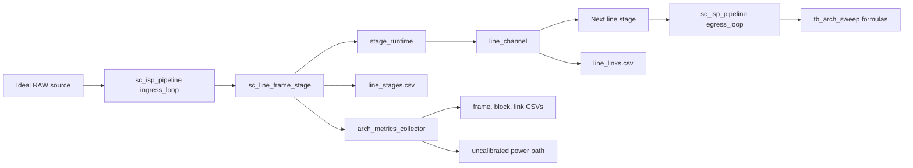
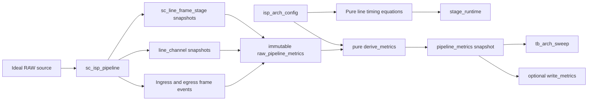
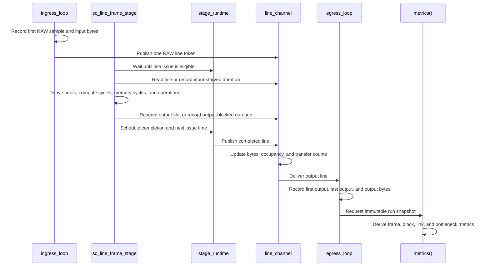

# Internal ISP Metrics Wiring Plan

## Outcome

Replace the current duplicate and partially disconnected metric paths with one event-driven metric model for the line-granular SystemC ISP.
The model will measure only behavior inside the ISP between an ideal RAW source and an ideal YUV sink.
Every retained architecture parameter will affect simulated timing or a clearly labeled modeled metric.
The untimed C++ pipeline in `../pipeline/src/isp_pipeline.cpp` will remain the byte-exact functional oracle.

## Scope

- In scope: first-input to first-output latency, total frame cycles, achieved pixels per cycle, logical input and output bandwidth, transferred bytes, block beats, active cycles, bypass cycles, input-starved cycles, output-blocked cycles, local-memory-wait cycles, utilization, effective initiation interval, modeled operation counts, link occupancy, and bottleneck-candidate evidence.
- In scope: block latency, pixel initiation interval, pixels per cycle, local-memory service assumptions, maximum in-flight lines, internal line-channel depth, and ISP clock frequency.
- In scope: one authoritative in-memory snapshot API and optional CSV or text export.
- In scope: removal of stale metric implementations, obsolete DMA and power experiments, misleading configuration fields, and generated files under `output/`.
- Out of scope: DMA, DRAM, external bus width, external bandwidth limits, bus arbitration, external backpressure, configuration-transfer time, calibrated power, and claims of RTL cycle accuracy.
- Out of scope: changing functional ISP algorithms or final pixel values.

## Current Architecture

The current line pipeline schedules line completions correctly enough to preserve functional flow, but metric derivation happens through incompatible paths.
`sc_line_frame_stage` and `line_channel` expose cumulative line counters while `sc_isp_pipeline` writes `line_stages.csv` and `line_links.csv` directly.
A separate `arch_metrics_collector` reconstructs block cycles from those counters, but it has no link producer, no byte producer, and no memory or operation producer.
`tb_arch_sweep` then recomputes frame throughput and bandwidth independently and attaches an unrelated power estimator.



This graph is grounded in `hw/line_stage.h`, `hw/stage_runtime.h`, `hw/line_channel.h`, `hw/metrics.h`, and `pipeline/sc_isp_pipeline.cpp`.
The direct CSV path and collector path disagree about units and do not share one raw event contract.

## Metric Semantics

A line remains one logical image row represented by one `line_channel` token.
A beat will mean one internal processing group of up to `pixels_per_cycle` logical pixels, not one line and not an external bus transaction.
For a line containing `P` logical pixels, the beat count is `ceil(P / pixels_per_cycle)`.
RGB and YUV channel counts will not multiply the logical pixel count because `line_meta::width_pixels` already identifies image width independently of `valid_samples`.

For each line, the timing model will derive:

```text
processing_beats       = ceil(logical_pixels / pixels_per_cycle)
compute_cycles         = processing_beats * pixel_initiation_interval_cycles
read_cycles            = ceil(reads_per_pixel * logical_pixels / read_ports) * memory_access_cycles
write_cycles           = ceil(writes_per_pixel * logical_pixels / write_ports) * memory_access_cycles
memory_service_cycles  = max(read_cycles, write_cycles)
line_issue_cycles      = max(compute_cycles, memory_service_cycles)
memory_wait_cycles     = max(0, memory_service_cycles - compute_cycles)
completion_time        = issue_time + pipeline_latency_cycles * cycle_period
next_issue_time        = issue_time + line_issue_cycles * cycle_period
```

The memory equation is a documented non-pipelined local-memory service assumption for architecture comparison.
A block that explicitly declares no local memory will report zero local-memory wait.
A missing local-memory or workload profile will make the affected metric unavailable rather than silently zero.
Operation counts will come from an explicit per-block workload profile containing additions, multiplications, comparisons, reads, and writes per logical pixel.
These counts will be labeled modeled rather than measured because the untimed functional kernels do not expose individual arithmetic events.

Frame metrics will use these equations:

```text
first_output_latency_cycles = ceil((first_output_time - first_input_time) / cycle_period)
frame_cycles                = ceil((last_output_time - first_input_time) / cycle_period)
achieved_pixels_per_cycle   = input_raw_pixels / frame_cycles
input_bandwidth_mbps        = input_bytes * 8 / frame_time_us
output_bandwidth_mbps       = output_bytes * 8 / frame_time_us
```

Input bytes will be counted when RAW samples enter `ingress_loop`.
Output bytes will be counted from the valid samples placed by `egress_loop`.
These bandwidth values describe logical ISP boundary traffic produced by the internal pipeline rate, not DMA or bus capacity.

Block metrics will use the following event definitions:

- Active cycles are the sum of `compute_cycles` for enabled work issued during the observation window.
- Bypass cycles are the same service demand recorded separately when the functional block is disabled, while operation counts remain zero.
- Input-starved cycles are time spent waiting for an input token only after the stage is otherwise eligible to accept work.
- Output-blocked cycles are time spent waiting specifically for downstream slot credit after work is eligible to issue or retire.
- Waiting for a scheduled completion is normal pipeline latency and will not be classified as output blocking.
- Utilization is `min(1, active_cycles / stage_observation_cycles)` for enabled blocks and zero for bypassed blocks.
- Effective initiation interval is the observed issue window in cycles divided by the number of processing beats in that window.
- Starved, blocked, active, and memory durations are evidence that may overlap in a pipelined model, so reports will not claim they form a mutually exclusive cycle partition.

## Proposed Architecture

`stage_runtime`, `sc_line_frame_stage`, and `line_channel` will remain the owners of raw event counters.
`sc_isp_pipeline::metrics()` will gather one immutable raw snapshot and pass it to pure derivation functions in `hw/metrics.h`.
Only `write_metrics()` will perform filesystem I/O.
Metrics will always be available in memory, while report generation will be explicit and optional.



The proposed graph keeps event ownership near the event source and keeps formulas testable without file output.
The only filesystem side effect is the optional writer invoked by a testbench or user command.

## Runtime or Data Flow



The sequence separates normal completion latency from actual downstream-credit blocking.
It also makes a beat a derived processing quantity rather than relabeling a line count.

## File and Symbol Map

| Area | Existing location | Planned change | Evidence |
|---|---|---|---|
| Metric contract | `metric_to_measure.txt` | Define every metric, unit, observation window, beat meaning, and measured or modeled provenance. | The current file lists names without equations or units. |
| Architecture configuration | `hw/isp_arch_config.h` | Retain clock frequency, block latency, pixel II, PPC, maximum in-flight lines, local-memory profile, workload profile, and link depth. Remove bus, DMA, clock phase, tracing, metric-enable, lane, link-width, link-latency, and clock-gating fields that have no internal event consumer. | Current consumers are limited to `stage_timing()` and `link_depth()`. |
| Duplicate hardware parameters | `tb_utils/hardware_params.h`, `pipeline/sc_isp_pipeline.{h,cpp}` | Stop using `hw_params` in the line pipeline and use `isp_arch_config` as its single timing source. Retain `hw_params` only for legacy standalone block modules until those modules are independently retired. | `clk_mhz` and FIFO depth currently exist in both configuration types. |
| Stage scheduler | `hw/stage_runtime.h` | Replace `max(ceil(width/PPC), pixel_ii)` with the documented beat, compute, memory, and line-issue equations. Record issue-window counters needed for effective II. | `stage_runtime::issue_interval()` currently makes pixel II mostly irrelevant for normal line widths. |
| Stage events | `hw/line_stage.h` | Count logical pixels and beats, distinguish active from bypass service, separate input-empty wait from output-credit wait, and stop treating completion wait as blocking. | `retire_wait` currently combines completion and credit waits. |
| Link events | `hw/line_channel.h` | Add logical byte totals and completed producer or consumer wait durations to the existing transfer and occupancy snapshot. | Existing snapshots contain line counts and event counts only. |
| Unified derivation | `hw/metrics.h` | Replace the mutable, power-coupled collector with immutable raw and derived metric structs, pure derivation functions, bottleneck-candidate ranking, and one explicit report writer. | The current collector has dead byte, link, memory, operation, and power fields. |
| Pipeline API | `pipeline/sc_isp_pipeline.{h,cpp}` | Replace `set_metrics_request`, direct CSV dumps, `enable_arch_metrics`, manual collection, and mutable collector access with `metrics()` and `write_metrics(path)`. | The current top level exposes two independent metric APIs. |
| Sweeps | `hw/sweep.h`, `pipeline/tb_arch_sweep.cpp` | Consume the unified snapshot, remove power and external-bandwidth parameters, correct units, add PPC, and make every sweep run the real model. | The current sweep recomputes metrics and carries uncalibrated power fields. |
| Focused architecture test | `pipeline/tb_arch_pipeline.cpp` | Pass the real architecture configuration, assert in-memory metric invariants, and compare parameter variants without relying on generated files. | The current test constructs but does not pass `arch_cfg` and never exercises the collector. |
| Primitive tests | `hw/tb_line_primitives.cpp` | Assert beat equations, line issue spacing, latency, true credit blocking, and the absence of false blocking during completion wait. | Existing tests cover scheduling order but not metric semantics. |
| Functional oracle test | `pipeline/tb_pipeline.cpp` | Preserve byte-exact comparison and make all output writing opt-in through an explicit output directory argument. | The current test always writes metric files into the source tree. |
| Build registration | `CMakeLists.txt` | Register `tb_arch_sweep --compare`, remove obsolete metric, DMA, and power targets, and keep CTest runs artifact-free. | CTest currently invokes `tb_arch_sweep` without arguments, which runs no sweep. |
| Standalone block metrics | `tb_utils/sc_block_metrics.h`, `blocks/*/sc_*.{h,cpp}` | Remove the obsolete block-local metric collector and its calls while retaining standalone block functionality and golden tests. | These metrics are not consumed by the line pipeline and generated most stale files under `output/metrics`. |
| Obsolete observers | `tb_utils/sc_metrics_wrapper.h`, `tb_utils/metrics_demo_tb.cpp`, `tb_utils/metrics_summary.py` | Delete the disconnected FIFO observer, demo, and legacy CSV aggregator. | The line pipeline uses `line_channel` directly. |
| External and uncalibrated models | `hw/frame_dma.h`, `hw/timed_stream.h`, `hw/stream_beat.h`, `hw/timed_block.h`, `hw/local_memory.h`, `hw/power.h`, `pipeline/tb_dma_integration.cpp`, `pipeline/tb_power_metrics.cpp` | Delete these unused or out-of-scope paths and remove their CMake, build-script, and verification-script references. | They have no callsite in the current line pipeline, except their dedicated synthetic tests. |
| Hardware umbrella and tracing | `hw/hw.h`, `hw/trace.h` | Reduce the umbrella to active internal-model headers and remove the unused trace path if no external include is found during implementation. | Current references are limited to the umbrella and CMake header list. |
| Documentation | `docs/guide.md`, `docs/MODEL_EVALUATION.md` | Replace the stale three-layer, timed-mode, DMA, and power descriptions with the internal-only event model and metric equations. | The documented clock binding and metric layers do not match current source. |
| Generated outputs | `output/`, testbench output helpers | Delete existing generated files after verification and prevent CTest from recreating source-tree artifacts. | `../.gitignore` already treats `systemc/output/*` as generated. |

## Implementation Steps

1. Lock the contract in `metric_to_measure.txt` and reduce `isp_arch_config` to parameters that the internal model can causally consume.
2. Add pure beat, compute, memory-service, line-issue, frame, utilization, and bandwidth equations with overflow-safe integer arithmetic.
3. Instrument `stage_runtime`, `sc_line_frame_stage`, and `line_channel` at their real event boundaries without adding per-line heap allocation or per-cycle polling.
4. Expose a single immutable `sc_isp_pipeline::metrics()` snapshot and one explicit `write_metrics(path)` side effect.
5. Migrate `tb_arch_sweep` and `tb_arch_pipeline` to the unified API and remove independent formulas, power, DMA, and no-op metric enable paths.
6. Add focused metric invariants and parameter-sensitivity checks before altering any generated-output behavior.
7. Preserve byte-exact verification in `tb_pipeline` and prove that timing variants do not change output bytes.
8. Remove obsolete metric observers, block-local metric instrumentation, external models, targets, build-script entries, and stale documentation.
9. Redirect optional reports to caller-supplied build-tree directories and delete all existing generated files under `output/` only after the new path is verified.

After this plan is approved, implementation will be split into disjoint coding packets for lighter coding agents.
The frontier model will retain the metric contract, integration decisions, review, and final reconciliation.
The first delegated packet will own configuration and primitive timing, the second will own the unified pipeline snapshot after that contract lands, and independent packets will own mechanical legacy cleanup and focused tests.

## Risks and Tradeoffs

- A processing beat based on PPC is intentionally not an AXI or memory-bus beat, because external interconnect is outside the model.
- Local-memory waits will be modeled from an explicit demand and port profile, not observed from the functional C++ kernel, so reports must preserve modeled provenance.
- Operation counts will be deterministic modeled estimates unless the functional kernels later expose counters.
- Stage wait durations can overlap active in-flight work, so adding all cycle fields is not a valid reconstruction of elapsed frame time.
- Removing `hw_params` from the line pipeline is a clean API cutover that requires migrating every constructor callsite.
- Removing old block-local metrics touches many mechanical callsites, but keeping two metric systems would preserve ambiguity and stale output behavior.
- Frequency, PPC, II, memory service, and FIFO-depth sensitivity must be demonstrated independently because one parameter can mask another at a different bottleneck.
- Native verification currently requires a compatible SystemC installation and build directory rather than the stale GNU/Linux binaries present on the Darwin workstation.

## Open Questions

- Should power remain in sweep output? **Recommended default:** Remove it because it is not in `metric_to_measure.txt`, has no calibrated energy model, and currently produces dimensionally invalid values.
- Should internal links retain width, latency, or beats-per-cycle parameters? **Recommended default:** Remove them and define beats from block PPC because line channels model bounded ownership and credit, not a physical transport bus.
- Should local-memory waits remain available? **Recommended default:** Keep them through an explicit non-pipelined access-demand model so memory parameters have a causal timing effect without reintroducing the unused `local_memory` SystemC module.
- Should reports be emitted automatically? **Recommended default:** Keep metrics always available in memory and require an explicit output path for file generation.

## Verification

- Verify the pure equation boundary with widths that are smaller than PPC, equal to PPC, not divisible by PPC, and near integer-overflow limits.
- Verify an 8-pixel line at PPC 4 and pixel II 2 produces 2 beats and 4 compute cycles.
- Verify pipeline latency changes first-output time but does not change sustained issue spacing when in-flight capacity is sufficient.
- Verify increasing pixel II or decreasing PPC increases frame cycles and decreases achieved PPC without changing output bytes.
- Verify reducing internal link depth produces downstream-credit blocking and occupancy pressure without changing output bytes.
- Verify an unconstrained downstream channel reports zero output-blocked cycles even while lines wait for scheduled completion.
- Verify a disabled block reports bypass cycles, zero active cycles, and zero operation counts while preserving bytes.
- Verify constraining modeled local-memory ports increases memory-wait cycles and frame time.
- Verify input and output byte totals match RAW16 and configured YUV444 or YUV420 layouts, including odd dimensions.
- Verify bandwidth uses `bits / microseconds = Mbps` with no extra factor of 1000.
- Verify frequency changes time in microseconds and bandwidth in Mbps while leaving the cycle count unchanged for the same architecture.
- Verify `tb_arch_sweep --compare` is the registered CTest command and executes at least two real architecture candidates.
- Verify `tb_pipeline` remains byte-exact against `isp_pipeline::run()` for all existing supported configurations.
- Verify CTest leaves `components/isp_tlm/systemc/output/` unchanged.
- Run LSP diagnostics on every changed C++ file and run the focused SystemC targets in a compatible build environment.

## Decision Summary

Use one internal, event-driven metric model based on logical pixels, processing beats, stage issue and completion events, channel credit, and explicit architecture assumptions.
Treat the source and sink as ideal boundaries, remove DMA, bus, and uncalibrated power paths, and make every retained parameter observable.
Review should focus on the PPC-based beat definition, the modeled local-memory equation, the removal set, and the single snapshot API before coding begins.
