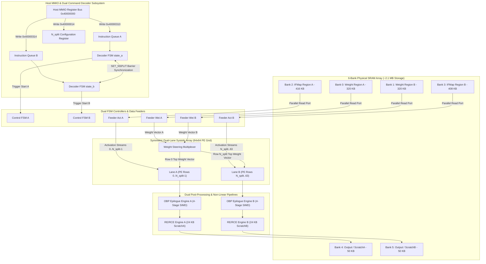

# SAURIA FX1 (v4.4 SoC / v4.2 NPU Core) — Milestone Report Part 2: High-Level NPU Architecture & Subsystem Specification

> **Document Title**: SAURIA FX1 NPU Architecture & Subsystem Specification  
> **Document Identifier**: `SAURIA-DOC-MS4-2026-V4.4-P02`  
> **Document Version**: `4.4.0` (Final Release)  
> **Target Hardware**: SAURIA FX1 NPU Core (Dual-Lane $64 \times 64$ Rev2 Architecture / FX1 SoC Integration)  
> **Implementation**: SystemC 2.3.3 / IEEE 1666-2023 Compliant Cycle-Approximate Virtual Prototype (C++17)  
> **Authoring Body**: VP Team / SAURIA NPU Architecture & Systems Engineering  

---

# 2. High-Level NPU Architecture & Subsystem Specification

The SAURIA FX1 Neural Processing Unit is designed around a high-throughput, spatial compute paradigm optimized for edge vision and transformer inference workloads. The top-level SystemC wrapper module (`NpuTop` in `npu_top.h`) integrates control, storage, computation, post-processing, and non-linear reduction subsystems into a unified, cycle-approximate hardware pipeline.

The hardware architecture is structured to maximize internal data reuse, minimize external DRAM access bandwidth, and eliminate control serialization. By decoupling command decoding, memory prefetching, systolic computation, and post-processing drain execution into concurrent hardware modules, the processor achieves continuous compute utilization across multi-tile deep learning workloads.

---

## 2.1 Top-Level Hardware Interconnect Architecture

The top-level hardware interconnect diagram below illustrates the structural relationships and data flow between the host interface, instruction decoders, physical SRAM banks, data feeders, systolic compute arrays, post-processing epilogue pipelines, and reduction engines:

---

## 2.2 Subsystem Microarchitectural Functional Breakdown

### Subsystem A: Host Control & Dual Instruction Decoder (`control/instruction_decoder.h`, `config_regs.h`)
The host control subsystem manages command ingestion, descriptor parsing, and execution scheduling. The host interface exposes a 32-bit MMIO register bus located at base address `0x40000000`. Command submission is implemented via two hardware FIFOs: **Queue A** (mapped to offset `0x40000310`) and **Queue B** (mapped to offset `0x40000314`).

Inside the instruction decoder (`InstructionDecoder`), two independent state machines (**`state_a`** and **`state_b`**) govern command execution for Lane A and Lane B respectively. Each decoder state machine advances through five sequential states: `IDLE`, `DMA_READ_WAIT`, `COMPUTE_WAIT`, `DMA_WRITE_WAIT`, and `WAIT_BARRIER`. Because Queue A and Queue B operate asynchronously, host software can dispatch matrix multiplication workloads to Lane A while simultaneously queuing LayerNorm or vector operations to Lane B, preventing cross-task head-of-line blocking.

For instructions requiring full-chip synchronization—such as the `SET_NSPLIT` opcode (`0x05`) that alters row partition boundaries—the decoder enters the `WAIT_BARRIER` state. In this state, the decoder monitors the activity flags of both execution controllers (`i_ctrl_active_a` and `i_ctrl_active_b`). The boundary configuration parameter $N_{split}$ is updated only after both lanes deassert active execution flags, ensuring zero data bleed across array partitions.

### Subsystem B: Symmetric Dual-Lane Systolic Array Grids (`systolic_array/sa_array.h`)
The computational backbone of the SAURIA FX1 core is a 2D Systolic Array grid comprising **$64 \text{ rows} \times 64 \text{ columns}$** ($4,096$ Processing Elements). The physical array is divided into two symmetric compute regions driven by the runtime partition parameter $N_{split}$ ($0 \le N_{split} \le 64$):
* **Lane A**: Occupies array rows $0 \le y < N_{split}$. In the default configuration ($N_{split} = 32$), Lane A functions as a $32 \times 64$ PE grid housing $2,048$ MAC units.
* **Lane B**: Occupies array rows $N_{split} \le y < 64$. In the default configuration ($N_{split} = 32$), Lane B functions as a $32 \times 64$ PE grid housing $2,048$ MAC units.

**Dataflow Paradigm**: Output-Stationary (OS) dataflow. Partial sums accumulate inside local 32-bit PE accumulators throughout $K$ reduction iterations. Activations stream horizontally across PE rows from left to right (Feeders A & B), while weights stream vertically down PE columns from top to bottom. Upon completion, partial sums drain sequentially to the OBP epilogue pipeline. Operating at a target frequency of $1.0\text{ GHz}$, the dual-lane array delivers a peak throughput of 8,192 INT8 operations per clock cycle.

### Subsystem C: Data Feeders & On-Chip SRAM Subsystem (`data_feeder/`, `sram/sram_top.h`)
The storage subsystem provides localized, high-bandwidth data access for the systolic array. Total physical SRAM capacity equals **~2.1 MB (2,129,920 Bytes)** partitioned into six dedicated memory banks:
* **Bank 0 (Weight A)**: 320 KB (`0x0005_0000` bytes) assigned to Lane A weight preloading.
* **Bank 1 (Weight B)**: 320 KB (`0x0005_0000` bytes) assigned to Lane B weight preloading.
* **Bank 2 (IFMap A)**: 416 KB (`0x0006_8000` bytes) assigned to Lane A activation streaming.
* **Bank 3 (IFMap B)**: 408 KB (`0x0006_6000` bytes) assigned to Lane B activation streaming and residual skip matrices.
* **Bank 4 (PSums A / ScratchA)**: 50 KB ($26\text{ KB}$ partial sums $+ 24\text{ KB}$ ScratchA) assigned to Lane A writeback and non-linear reduction.
* **Bank 5 (PSums B / ScratchB)**: 50 KB ($26\text{ KB}$ partial sums $+ 24\text{ KB}$ ScratchB) assigned to Lane B writeback and non-linear reduction.

Four specialized Data Feeder modules (`wei_feeder_a`, `wei_feeder_b`, `act_feeder_a`, `act_feeder_b`) read activations and weights from Banks 0–3 over 256-bit parallel buses, streaming operands into the systolic array with single-cycle access latency.

### Subsystem D: Output Post-Processing Block (OBP Epilogue Engine) (`psm/obp_top.h`)
Each execution lane is equipped with a dedicated **Output Post-Processing Block (OBP Epilogue Engine)** (`obp_inst_a` and `obp_inst_b`). Mapped directly into the systolic array column drain path, the OBP engine processes 64 parallel output channels in SIMD fashion through a 4-stage hardware pipeline:
1. **Stage 1 (Bias Addition)**: Reads 32-bit channel bias vectors from SRAM and adds them directly to column partial sum accumulators.
2. **Stage 2 (Requantization)**: Multiplies 32-bit accumulated sums by a 32-bit fixed-point scaling factor (`in_scale * w_scale / out_scale`) and applies arithmetic right-shifting.
3. **Stage 3 (Non-Linear Activation LUT)**: Indexes into a **16 KB SRAM Activation Lookup Table** supporting non-linear activations including ReLU, SiLU ($x \cdot \sigma(x)$), and GELU.
4. **Stage 4 (Residual Skip Addition & Saturation)**: Fuses residual skip connection vectors from SRAM Bank 3 and clamps output values to signed 8-bit integer bounds $[-128, +127]$.

### Subsystem E: Dual Reconfigurable & Reduction Engines (RCE / RE) (`psm/re_rce.h`)
To prevent reduction bottlenecks, non-linear reduction operations are offloaded to dual hardware engines (`RCEA`/`REA` on Lane A and `RCEB`/`REB` on Lane B). Each engine features a dedicated **24 KB Scratch SRAM buffer** (`ScratchA` in Bank 4 and `ScratchB` in Bank 5).

The RCE/RE subsystem includes specialized Piecewise Linear (PWL) mathematical lookup tables (`LUT_exp` for exponentiation, `LUT_recip` for reciprocal division, and `LUT_rsqrt` for inverse square-root normalization). These tables allow the hardware to compute two-pass attention Softmax and two-pass Transformer Layer Normalization entirely on-chip. Additionally, the engine reuses its 64-wide SIMD max-reduction comparator trees to execute 5x5 Spatial Pyramid Pooling Fast (SPPF) max-pooling over feature maps without requiring extra silicon comparator area.

### Subsystem F: Autonomous 4-Channel AXI DMA Controller (`control/sauria_dma.h`)
Data ingestion and writeback are managed by a cycle-approximate 4-Channel AXI DMA Controller (`SauriaDma`). The controller interfaces external system DRAM over a 256-bit wide AXI bus (32 bytes per clock cycle) using 8-beat burst transfers (256 bytes per transaction).

The DMA engine allocates four read channels (`CH0` for Bank 0, `CH1` for Bank 1, `CH2` for Bank 2, `CH3` for Bank 3) and a dedicated AXI Write Master for Banks 4 and 5. Read channels compete on a single AXI Read Address (`AR`) bus using a Round-Robin cycle scheduler. The Write Master operates over a separate AXI Write Address (`AW`) bus, allowing DRAM writebacks to proceed concurrently with memory prefetching without bus arbitration stalls.
