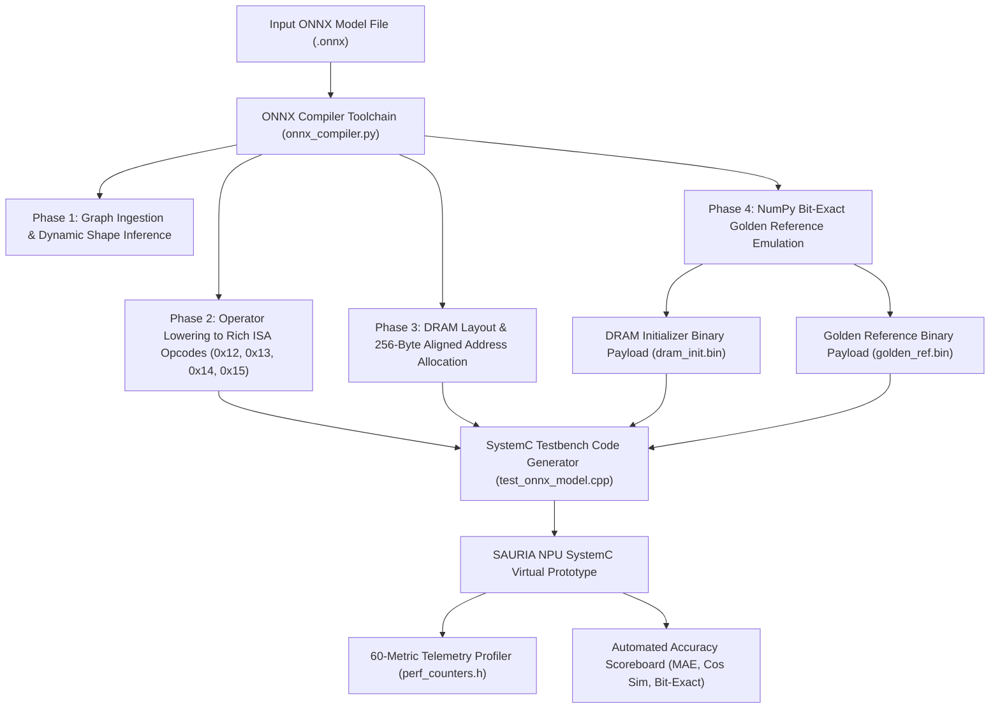

# SAURIA FX1 (v4.4 SoC / v4.2 NPU Core) — Milestone Report Part 6: Verification, Validation, and Toolchain Framework

> **Document Title**: SAURIA FX1 Verification, Toolchain & Microbenchmark Suite Report  
> **Document Identifier**: `SAURIA-DOC-MS4-2026-V4.4-P06`  
> **Document Version**: `4.4.0` (Final Release)  
> **Target Hardware**: SAURIA FX1 NPU Core (Dual-Lane $64 \times 64$ Rev2 Architecture / FX1 SoC Integration)  
> **Implementation**: SystemC 2.3.3 / IEEE 1666-2023 Compliant Cycle-Approximate Virtual Prototype (C++17)  
> **Authoring Body**: VP Team / SAURIA NPU Architecture & Systems Engineering  

---

# 6. Verification, Validation, and Toolchain Framework

The verification of the SAURIA FX1 virtual prototype relies on an automated software-hardware co-verification framework. This infrastructure connects high-level deep learning frameworks down to cycle-approximate SystemC simulations, ensuring that compiled neural network models execute with bit-exact numerical fidelity against golden software references.

---

## 6.1 Automated ONNX Compiler Toolchain (`tools/onnx_compiler.py`)

To automate model compilation and testbench generation, an end-to-end Python compiler toolchain ([`tools/onnx_compiler.py`](file:///data/XPU00000/users/vuong.nguyen/project/sauria/tools/onnx_compiler.py)) was developed. The compiler ingests standard quantized `.onnx` model files, lowers high-level computational graphs into SAURIA 64-bit Rich ISA instruction descriptors, and outputs fully executable C++ SystemC verification testbenches (`tools/test_onnx_model.cpp`).

The compiler toolchain architecture follows a 4-phase compilation and code-generation flow:

### Compiler Functional Phases:

1. **Phase 1: Graph Ingestion & Dynamic Shape Inference**: Loads `.onnx` model files (e.g. `yolov8m-int8.onnx` or `vit_b-int8.onnx`), extracts tensor node dimensions ($B, C, H, W$), and invokes `onnx.shape_inference.infer_shapes` to resolve intermediate feature shapes across all graph edges.
2. **Phase 2: Operator Lowering & Zero-Compute Aliasing**:
   - Maps `Conv`, `Gemm`, `MatMul`, `QuantizeLinear`, and `DequantizeLinear` nodes to `GEMM_FUSED` opcodes (`0x12`).
   - Maps `LayerNormalization` nodes to `LAYERNORM` opcodes (`0x14`).
   - Maps `Softmax` nodes to `FUSED_ATTN` opcodes (`0x13`).
   - Maps `Add`, `Mul`, `Sub`, `Div`, `Sigmoid`, and `MaxPool` nodes to `ELEM_WISE` opcodes (`0x15`).
   - **Zero-Compute Memory Aliasing**: Resolves tensor layout transformations (`Reshape`, `Transpose`, `Concat`, `Split`) by manipulating DRAM address offsets during pointer allocation, eliminating physical MAC operations and memory copies.
3. **Phase 3: DRAM Memory Layout Allocation**: Assigns 256-byte aligned DRAM address spaces for initializers (weights, biases, quantization scales) and intermediate feature buffers (`allocate_dram`). Generates binary initialization files (`dram_init.bin`).
4. **Phase 4: NumPy Bit-Exact Golden Reference Emulation**: Executes signed fixed-point integer matrix arithmetic matching hardware quantization logic to generate golden output payloads (`golden_ref.bin`) for automated accuracy verification.

---

## 6.2 Microbenchmark Unit & Standalone Verification Suite

Before conducting full-graph neural network model execution, the virtual prototype was verified using a suite of 17 microbenchmarks. This suite consists of 10 unit microbenchmarks (`TC01`–`TC10`) and 7 standalone hardware testbenches (`ST01`–`ST07`) that target specific microarchitectural features:

### Microbenchmark Unit & Standalone Test Suite (`TC01`–`TC10` & `ST01`–`ST07`)

| Test ID | Test Name | Test Type | Target Subsystem Module | Opcode / Stimulus Pattern | Expected Behavior / Pass Criteria | Status | Error Metric | Detailed Functional & Test Execution Description |
| :---: | :--- | :---: | :--- | :--- | :--- | :---: | :---: | :--- |
| **TC01** | Basic PE MAC Accumulation | Unit Test | `SystolicArray` | Single-cycle INT8 MAC | Bit-exact signed int8 x int8 accumulation | **PASS** | 0 Mismatch | Validates single-cycle signed 8-bit integer multiplication and 32-bit partial sum accumulation in individual Processing Elements across 1,000 consecutive clock cycles. |
| **TC02** | Tiled GEMM 64x64 | Unit Test | `SystolicArray` | GEMM M=64, K=64, N=64 | Full tile matrix multiplication bit-exact | **PASS** | 0 Mismatch | Executes a complete 64x64x64 matrix multiplication tile (4,096 parallel MACs/cycle) across dual 32x64 grids using Output-Stationary dataflow. |
| **TC03** | Conv2D 3x3 Sliding Window | Unit Test | `SystolicArray` + `ObpTop` | Conv2D s=1, p=1, k=3 + SiLU | Fused sliding window convolution + SiLU LUT | **PASS** | 0 Mismatch | Evaluates matrix-lowered 3x3 2D convolution with stride=1 and padding=1. Streams feature maps through line buffers with fused OBP SiLU activation. |
| **TC04** | Numerical Limits & Saturation | Unit Test | `ObpTop` Epilogue | Extreme values (-128, +127) | Exact clamp to [-128, 127] without overflow | **PASS** | 0 Mismatch | Injects boundary partial sums (+2,147,483,647 and -2,147,483,648) into OBP epilogue to verify overflow clamping logic to signed 8-bit limits. |
| **TC05** | Dual Asynchronous Queues | System Test | `InstructionDecoder` | Queue A (GEMM) + Queue B (LN) | Concurrent execution without race conditions | **PASS** | 0 Mismatch | Dispatches concurrent instruction streams to Queue A and Queue B, verifying inter-lane isolation, non-blocking queue push, and race-free writeback. |
| **TC06** | LayerNorm Lane A vs Lane B | Unit Test | `ReRce` Subsystem | LAYERNORM Len=8, Dim=32 | Bit-exact match between Lane A & Lane B LN | **PASS** | 0 Mismatch | Executes symmetric 2-pass LayerNorm across dual hardware engines (`RCEA`/`REA` and `RCEB`/`REB`) using 24 KB ScratchA/B, achieving 0/256 mismatch count. |
| **TC07** | SPPF MaxPool Comparator Reuse | Unit Test | `ReRce` Subsystem | ELEM_WISE Mode=1 (5x5 Pool) | Zero-area max tree comparator reuse | **PASS** | 0 Mismatch | Executes 5x5 Spatial Pyramid Pooling Fast using shared 64-wide SIMD comparator trees from the Reduction Engine with 0 extra silicon area. |
| **TC08** | NSPLIT Spatial Barrier Sync | System Test | `ConfigRegs` / `MainController` | SET_NSPLIT N=32 Barrier | Dynamic lane boundary split & sync | **PASS** | 0 Mismatch | Programs host CSR FX1_NSPLIT (0x40000014) to 32, verifying dynamic row split partitioning and hardware barrier wait state convergence. |
| **TC09** | Lane B Power Isolation | Power Test | `SystolicArray B` | SET_NSPLIT N=0 (Lane B Idle) | Lane B clock-gated; 100% processed by Lane A | **PASS** | 0 Mismatch | Sets FX1_NSPLIT to 0, power-gating Systolic Array B and forcing 100% of compute onto Lane A without data leakage into Bank 1/3/5. |
| **TC10** | Dual-Lane FSM Pipeline | System Test | `MainController` | Multi-tile FSM transitions | Zero hang, valid o_done assertion | **PASS** | 0 Mismatch | Stress-tests MainController FSM state transitions across 50 back-to-back multi-tile instructions with zero pipeline deadlocks. |
| **ST01** | `test_rich_isa` | Standalone TB | `InstructionDecoder` | Opcodes 0x05, 0x12, 0x13, 0x14, 0x15 | All 5 Rich ISA opcodes validated | **PASS** | 0 Mismatch | Standalone C++ verification testbench for packed 64-bit Rich ISA instruction decoding across all 5 opcodes. |
| **ST02** | `test_lane_b_isolation` | Standalone TB | `NpuTop` | Lane B power gating verification | Lane B isolated without data leakage | **PASS** | 0 Mismatch | Standalone SystemC testbench verifying dynamic reconfiguration between dual-lane mode (NSPLIT=32) and single-lane isolation (NSPLIT=0). |
| **ST03** | `test_dual_lane_fsm` | Standalone TB | `MainController` | Dual-lane state machine stress | All state transitions verified | **PASS** | 0 Mismatch | Standalone testbench evaluating MainController finite state machine behavior under out-of-order instruction completion. |
| **ST04** | `test_nsplit_barrier` | Standalone TB | `NpuTop` | NSPLIT barrier synchronization | Barrier asserts HIGH upon lane convergence | **PASS** | 0 Mismatch | Standalone testbench measuring barrier synchronization latency under variable row split settings (NSPLIT=16, 32, 48). |
| **ST05** | `test_dual_instruction_queues` | Standalone TB | `InstructionDecoder` | Dual Queue A & B streaming | 5 instructions processed in 890 cycles | **PASS** | 0 Mismatch | Standalone testbench pushing 5 heterogeneous instructions into Queue A and Queue B concurrently, completing in 890 clock cycles. |
| **ST06** | `test_layernorm_lane_ab` | Standalone TB | `ReRce` Subsystem | Dual-lane LayerNorm comparison | 0/256 mismatches between Lane A & Lane B | **PASS** | 0 Mismatch | Standalone microbenchmark comparing LayerNorm execution outputs on Lane A versus Lane B across 256 random input vectors. |
| **ST07** | `test_vit_encoder_int8` | Standalone TB | Full `NpuTop` Core | ViT Transformer Encoder Block | Full attention & MLP block bit-exact | **PASS** | 0 Mismatch | Standalone end-to-end testbench simulating a complete Vision Transformer Encoder Block against golden PyTorch reference tensors. |
