# SAURIA FX1 (v4.4 SoC / v4.2 NPU Core) — Milestone Report Part 8: Simulation Results & Execution Timelines

> **Document Title**: SAURIA FX1 Simulation Results & Execution Timelines Report  
> **Document Identifier**: `SAURIA-DOC-MS4-2026-V4.4-P08`  
> **Document Version**: `4.4.0` (Final Release)  
> **Target Hardware**: SAURIA FX1 NPU Core (Dual-Lane $64 \times 64$ Rev2 Architecture / FX1 SoC Integration)  
> **Implementation**: SystemC 2.3.3 / IEEE 1666-2023 Compliant Cycle-Approximate Virtual Prototype (C++17)  
> **Authoring Body**: VP Team / SAURIA NPU Architecture & Systems Engineering  

---

# 8. Simulation Results & Execution Timelines

This section presents the cycle-approximate execution timeline results obtained from SystemC simulation of full neural network models. The SAURIA FX1 microarchitecture overlaps memory prefetching with active matrix computation, optimizing pipeline efficiency across multi-tile workloads.

---

## 8.1 Pipelined Cycle Timeline Trace & Gantt Chart

The hardware pipeline utilizes double-buffered ping-pong SRAM banks (Banks 0–3) to hide AXI DMA memory transfer latency. While Systolic Array Lane A computes tile $T_i$ using weight and activation data in `Buffer 0`, the AXI DMA controller prefetched operands for tile $T_{i+1}$ into `Buffer 1`.

The conceptual timeline trace below illustrates this concurrent dual-lane execution pattern:

```text
Execution Cycle Timeline (Dual-Lane Concurrent Execution)
Lane A: |-- DMA Read Bank 0/2 --|-- PE Compute Tile 0 --|-- OBP Epilogue --|-- DMA Write Bank 4 --|
Lane B:        |-- DMA Read Bank 1/3 --|-- PE Compute Tile 1 --|-- OBP Epilogue --|-- DMA Write Bank 5 --|
```

The Gantt chart below details the exact cycle alignment and overlap between memory prefetching, systolic computation, epilogue post-processing, and DRAM writeback for back-to-back tiles ($T_0$ and $T_1$) across Lane A and Lane B:

```mermaid
gantt
    title Dual-Lane Pipelined Execution Timeline (Tiles T_0 and T_1)
    dateFormat X
    axisFormat %s cyc

    section Lane A Execution
    DMA Read Bank 0/2 (Tile 0)     :active, a1, 0, 100
    Systolic Compute (Tile 0)      :crit, a2, 100, 300
    OBP Epilogue & Drain (Tile 0)  :a3, 300, 350
    DMA Writeback Bank 4 (Tile 0)  :a4, 350, 450
    DMA Read Bank 0/2 (Tile 1)     :a5, 250, 350

    section Lane B Execution
    DMA Read Bank 1/3 (Tile 0)     :active, b1, 20, 120
    Systolic Compute (Tile 0)      :crit, b2, 120, 320
    OBP Epilogue & Drain (Tile 0)  :b3, 320, 370
    DMA Writeback Bank 5 (Tile 0)  :b4, 370, 470
    DMA Read Bank 1/3 (Tile 1)     :b5, 270, 370
```



As demonstrated in the Gantt chart, memory prefetch cycles for tile $T_1$ (`a5` and `b5`) execute concurrently during the compute phase of tile $T_0$ (`a2` and `b2`), reducing DMA stall cycles to zero when compute latency exceeds transfer latency.

---

## 8.2 Model Latency Budgets & Subsystem Cycle Analysis

In cycle-approximate SystemC simulation at a baseline clock frequency of **$1.0\text{ GHz}$** ($1.0\text{ ns}$ cycle period):

* **YOLOv8m INT8 Execution Latency**: **2,059,200 clock cycles** ($2.06\text{ ms}$ total inference latency).
* **ViT-Base INT8 Execution Latency**: **405,700 clock cycles** ($0.41\text{ ms}$ total inference latency).

### Detailed Subsystem Cycle Budget Breakdown

The table below breaks down total execution cycles into active compute phases, DMA transfers, and specific sub-engine active cycles for both benchmark workloads:

| Execution Phase / Engine | YOLOv8m INT8 (261 Ops) | ViT-Base INT8 (497 Ops) | Latency Ratio (YOLO / ViT) | Primary Microarchitectural Function & Cycle Rationale |
| :--- | :---: | :---: | :---: | :--- |
| **Active Compute (`processing_cycles`)** | 1,328,000 cycles | 298,800 cycles | **64.5% / 73.7%** | Active cycles spent executing systolic MAC tiles and OBP epilogue post-processing. |
| **DMA Data Transfers (`transfer_cycles`)** | 731,200 cycles | 106,900 cycles | **35.5% / 26.3%** | AXI DMA cycles spent streaming weights, activations, and residual skip matrices between DRAM and SRAM. |
| **Systolic Array MAC Engine** | 1,120,400 cycles | 210,400 cycles | **54.4% / 51.9%** | Pure matrix contraction cycles across dual $32 \times 64$ PE grids. |
| **OBP Epilogue Activation Engine** | 120,600 cycles | 48,200 cycles | **5.9% / 11.9%** | SIMD 4-stage post-processing cycles (Bias Add, Requant, SiLU / GELU LUT indexing). |
| **SPPF Pooling Engine** | 87,000 cycles | 0 cycles | **4.2% / 0.0%** | 5x5 Spatial Pyramid Pooling Fast cycles using shared 64-wide max-reduction comparator trees. |
| **Reduction Engine (Softmax / LN)** | 0 cycles | 40,200 cycles | **0.0% / 9.9%** | On-chip 2-pass attention Softmax and 2-pass LayerNorm cycles in ScratchA/B. |
| **Reshape / Alias Engine** | 0 cycles | 0 cycles | **0.0% / 0.0%** | Zero-compute cycles achieved via compiler address pointer remapping. |

### Inference Throughput Summary
Operating at $1.0\text{ GHz}$, the SAURIA FX1 core achieves an inference throughput of **1,971.9 inferences/second** on ViT-Base INT8 ($405,700\text{ cycles}$) and **388.5 inferences/second** on YOLOv8m INT8 ($2,059,200\text{ cycles}$), demonstrating real-time processing capabilities for edge vision and transformer workloads.
