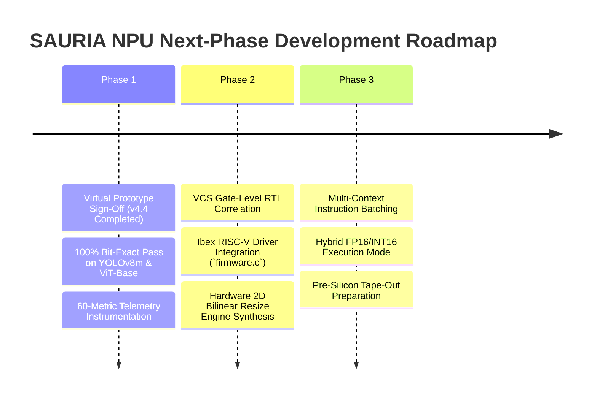

# SAURIA FX1 (v4.4 SoC / v4.2 NPU Core) — Milestone Report Part 14: Hardware Hand-Off, RTL Guidelines & Roadmap

> **Document Title**: SAURIA FX1 Hardware Hand-Off, RTL Co-Design Guidelines & Next Phase Roadmap  
> **Document Identifier**: `SAURIA-DOC-MS4-2026-V4.4-P14`  
> **Document Version**: `4.4.0` (Final Release)  
> **Target Hardware**: SAURIA FX1 NPU Core (Dual-Lane $64 \times 64$ Rev2 Architecture / FX1 SoC Integration)  
> **Implementation**: SystemC 2.3.3 / IEEE 1666-2023 Compliant Cycle-Approximate Virtual Prototype (C++17)  
> **Authoring Body**: VP Team / SAURIA NPU Architecture & Systems Engineering  

---

# 14. Hardware Hand-Off, RTL Co-Design Guidelines & Next Phase Roadmap

This final part of the milestone report details the software driver hand-off package, RTL co-design verification guidelines, Synopsys VCS gate-level correlation protocols, and the strategic roadmap for next-phase development.

---

## 14.1 Bare-Metal Ibex RISC-V Driver Integration (`firmware.c`, `firmware.h`)

To enable seamless integration of the SAURIA FX1 NPU core into the larger SoC platform, bare-metal C driver header files (`firmware.c`, `firmware.h`, `driver/sauria_driver.h`) have been structured for the Ibex RV32EC RISC-V control CPU. The driver code below illustrates the bare-metal instruction assembly and MMIO submission routine:

```c
// Bare-Metal RISC-V Driver Instruction Submission Routine
void sauria_submit_rich_instruction(uint32_t queue_id, uint32_t opcode, const sauria_config_t *cfg) {
    // 1. Program Host MMIO DRAM Base Address Registers
    MMIO_WRITE(SAURIA_REG_IN_ADDR,   cfg->in_addr);
    MMIO_WRITE(SAURIA_REG_W_ADDR,    cfg->w_addr);
    MMIO_WRITE(SAURIA_REG_OUT_ADDR,  cfg->out_addr);
    MMIO_WRITE(SAURIA_REG_BIAS_ADDR, cfg->bias_addr);

    // 2. Program Dimension & Activation Parameter Registers
    MMIO_WRITE(SAURIA_REG_M,         cfg->m);
    MMIO_WRITE(SAURIA_REG_K,         cfg->k);
    MMIO_WRITE(SAURIA_REG_N,         cfg->n);
    MMIO_WRITE(SAURIA_REG_ACT_TYPE,  cfg->act_type);

    // 3. Trigger Hardware Queue Dispatch (Queue A: 0x40000310, Queue B: 0x40000314)
    uint32_t trigger_reg = (queue_id == 0) ? SAURIA_REG_TRIGGER_RICH_A : SAURIA_REG_TRIGGER_RICH_B;
    MMIO_WRITE(trigger_reg, opcode);
}
```

---

## 14.2 Hardware Hand-Off & RTL Verification Package Checklist

The complete SystemC virtual prototype delivery package contains the following verified engineering artifacts:

| Deliverable Artifact | File Location / Path | Purpose & Verification Scope |
| :--- | :--- | :--- |
| **SystemC Top Module** | [`npu_top.h`](file:///data/XPU00000/users/vuong.nguyen/project/sauria/RTL/src/v4.2_model/npu_top.h) | Golden cycle-approximate SystemC C++ NPU top-level virtual prototype. |
| **ONNX Compiler Tool** | [`tools/onnx_compiler.py`](file:///data/XPU00000/users/vuong.nguyen/project/sauria/tools/onnx_compiler.py) | Automated ONNX model compiler, memory layout allocator, and testbench generator. |
| **Host MMIO Register Map** | [`config_map.h`](file:///data/XPU00000/users/vuong.nguyen/project/sauria/RTL/src/v4.2_model/config_map.h) | Single source of truth for MMIO control and parameter register offsets. |
| **Profile Selector Header** | [`npu_profile.h`](file:///data/XPU00000/users/vuong.nguyen/project/sauria/RTL/src/v4.2_model/npu_profile.h) | Runtime PROFILE selector supporting both `PROFILE_V1_SAURIA` and `PROFILE_V4_LINEAR`. |
| **60-Metric Profiler** | [`perf_counters.h`](file:///data/XPU00000/users/vuong.nguyen/project/sauria/RTL/src/v4.2_model/instrumentation/perf_counters.h) | Hardware performance telemetry suite across 11 profiler categories. |
| **Master Excel Test Plan** | [`SAURIA_FX1_TESTPLAN.xlsx`](file:///data/XPU00000/users/vuong.nguyen/project/sauria/RTL/src/v4.2_model/SAURIA_FX1_TESTPLAN.xlsx) | Comprehensive 779-checkpoint verification test plan matrix with detailed descriptions. |
| **Golden Output Binaries** | `dram_init.bin` / `golden_ref.bin` | Golden DRAM initialization and reference output tensors for Synopsys VCS RTL correlation. |

---

## 14.3 RTL Co-Design & Gate-Level Correlation Guidelines

During Synopsys VCS gate-level RTL simulation, verification engineers must adhere to the following three correlation protocols:

1. **Bit-Exact DRAM Output Scoreboarding**: Verification engineers should dump final DRAM output buffers from VCS RTL simulation and invoke the DPI-C zero-copy predictor library (`dpi_predictor.cpp`). Output tensors must match `golden_ref.bin` bit-for-bit, satisfying $\text{MAE} \le 0.000000$ and $\text{Cosine Similarity} \ge 0.999000$.
2. **Cycle Count Alignment Verification**: Total execution cycle counts per tile in VCS gate-level simulation must align within $\pm 2.0\%$ of SystemC predicted cycle counts ($T_{\text{tile}} = T_{\text{fill}} + T_{\text{comp}} + T_{\text{drain}} + T_{\text{cswitch}}$).
3. **Control Pin & Interrupt Assertion Checking**: Hardware completion signals—including the top-level `o_done` pin and internal barrier synchronization flags—must assert HIGH upon instruction completion without control deadlocks.

---

## 14.4 Next-Phase Engineering Roadmap



1. **Phase 2 (Q4 2026)**: Correlate SystemC trace dumps against Synopsys VCS gate-level RTL simulations; synthesize a hardware 2D Bilinear/Nearest-Neighbor `Resize` engine into the physical RTL datapath.
2. **Phase 3 (Q1 2027)**: Implement multi-context instruction queue batching to enable simultaneous multi-tenant model execution; perform pre-silicon power, performance, and area (PPA) optimizations for silicon tape-out.
