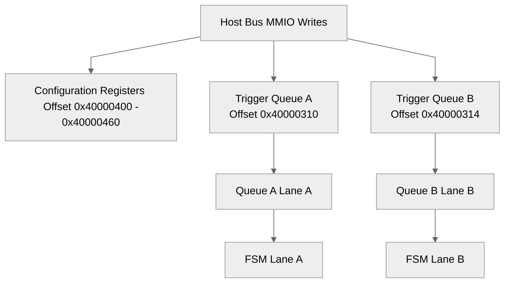
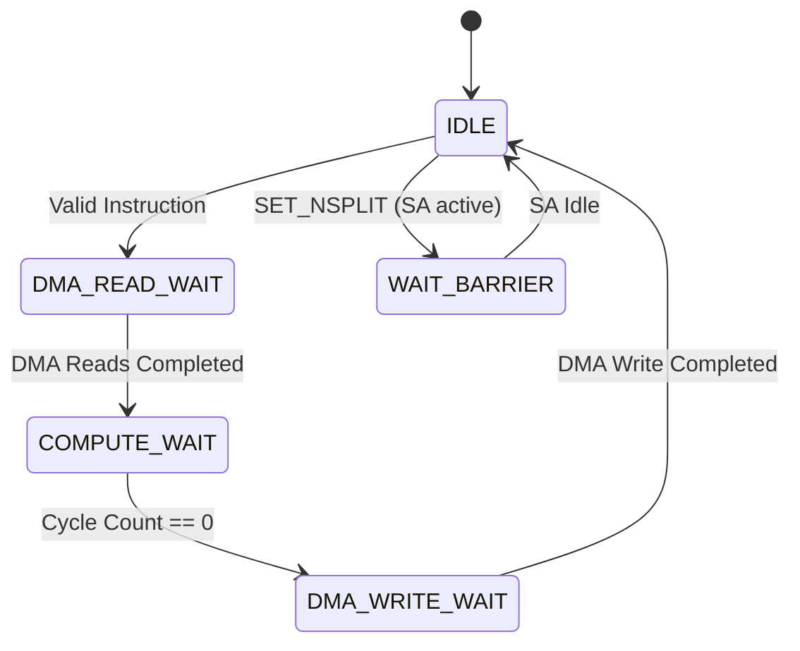

# Sauria NPU v4.2 Subsystem Block & ISA Specification

This document provides the hardware micro-architectural specification of the **Instruction Decoder**, the **4-Channel AXI DMA**, and the **Fused Rich ISA Instruction Set** for the Sauria NPU v4.2.

---

## 1. Instruction Decoder Specification

The **Instruction Decoder** is the central controller block of the NPU. It decodes configuration commands and schedules instruction pipelines independently or in parallel across two symmetric lane queues (Lane A and Lane B).

### 1.1 Host Register Configuration Interface (MMIO Map)

The host (or internal CPU) configures parameters by writing to the following MMIO register map:

| Register Offset | Name | Bit Width | Type | Description |
| :--- | :--- | :--- | :--- | :--- |
| `0x40000300` | `temp_word_a` | 32-bit | WO | Temporary word buffer for legacy 64-bit Lane A instruction. |
| `0x40000304` | `trigger_legacy_a` | 32-bit | WO | High 32-bit word write; triggers legacy Lane A instruction compilation. |
| `0x40000308` | `temp_word_b` | 32-bit | WO | Temporary word buffer for legacy 64-bit Lane B instruction. |
| `0x4000030C` | `trigger_legacy_b` | 32-bit | WO | High 32-bit word write; triggers legacy Lane B instruction compilation. |
| `0x40000310` | `trigger_rich_a` | 32-bit | WO | Write opcode value; assembles and pushes rich instruction to Lane A queue. |
| `0x40000314` | `trigger_rich_b` | 32-bit | WO | Write opcode value; assembles and pushes rich instruction to Lane B queue. |
| `0x40000400` | `r_in_addr` | 32-bit | RW | Input activations DRAM base address offset. |
| `0x40000404` | `r_w_addr` | 32-bit | RW | Weight matrix DRAM base address offset. |
| `0x40000408` | `r_out_addr` | 32-bit | RW | Output destination DRAM base address offset. |
| `0x4000040C` | `r_bias_addr` | 32-bit | RW | Bias vector DRAM base address offset. |
| `0x40000410` | `r_m` | 32-bit | RW | GEMM dimension M (output rows). |
| `0x40000414` | `r_k` | 32-bit | RW | GEMM dimension K (reduction channels). |
| `0x40000418` | `r_n` | 32-bit | RW | GEMM dimension N (output columns). |
| `0x4000041C` | `r_kh` | 32-bit | RW | Convolution kernel height. |
| `0x40000420` | `r_kw` | 32-bit | RW | Convolution kernel width. |
| `0x40000424` | `r_stride` | 32-bit | RW | Downsampling stride (MaxPooling / Convolution). |
| `0x40000428` | `r_pad` | 32-bit | RW | Padding value. |
| `0x4000042C` | `r_act_type` | 32-bit | RW | Activation selection: `0`=None, `1`=ReLU, `2`=SiLU, `3`=GELU. |
| `0x40000430` | `r_has_skip` | 32-bit | RW | Enable residual skip connection: `0`=No, `1`=Yes. |
| `0x40000434` | `r_skip_addr` | 32-bit | RW | Residual skip source matrix DRAM address. |
| `0x40000438` | `r_in_scale` | Float32 | RW | Input scaling factor. |
| `0x4000043C` | `r_w_scale` | Float32 | RW | Weight scaling factor. |
| `0x40000440` | `r_out_scale` | Float32 | RW | Output scaling factor. |
| `0x40000444` | `r_q_addr / r_gamma_addr / r_a_addr` | 32-bit | RW | Multi-purpose operand A (Attention Q / LayerNorm Gamma / Elem-Wise A). |
| `0x40000448` | `r_k_addr / r_b_addr` | 32-bit | RW | Multi-purpose operand B (Attention K / Elem-Wise B). |
| `0x4000044C` | `r_v_addr / r_beta_addr` | 32-bit | RW | Multi-purpose operand C (Attention V / LayerNorm Beta). |
| `0x40000450` | `r_seq_len / r_len` | 32-bit | RW | Attention sequence length / Elementwise vector length. |
| `0x40000454` | `r_num_heads / r_dim / r_mode` | 32-bit | RW | Attention heads / LayerNorm dimension / Elementwise mode. |
| `0x40000458` | `r_head_dim / r_eps_shift / r_scale_a` | 32-bit/F | RW | Attention head dimension / LayerNorm epsilon / Elementwise scale A. |
| `0x4000045C` | `r_attn_scale / r_scale_b` | Float32 | RW | Attention scale multiplier / Elementwise scale B. |
| `0x40000460` | `r_scale_out` | Float32 | RW | Elementwise output scaling multiplier. |

### 1.2 Execution FSM Specifications

The state transition logic is executed on positive clock edges:

* **IDLE State:**
  * Polls queue. On discovery, parses opcode and programs AXI DMA channel inputs.
  * Transitions to `DMA_READ_WAIT`.
* **DMA_READ_WAIT State:**
  * Suspends compute. Polls `is_any_read_active()` from DMA.
  * When reads finish, calculates computation duration (cycles) based on dimensions.
  * Transitions to `COMPUTE_WAIT`.
* **COMPUTE_WAIT State:**
  * Decrements internal cycle counter.
  * At counter `0`, triggers mathematical emulation engine and starts output DMA writeback.
  * Transitions to `DMA_WRITE_WAIT`.
* **DMA_WRITE_WAIT State:**
  * Suspends lane command execution. Polls `is_write_active()` from DMA.
  * When writeback completes, pops current instruction.
  * Transitions to `IDLE`.
* **WAIT_BARRIER State:**
  * Blocks lane pipeline until other lane pipelines and systolic array controllers report inactive (`!i_ctrl_active_a && !i_ctrl_active_b`).
  * Updates configurations safely.
  * Transitions to `IDLE`.

---

## 2. 4-Channel AXI DMA Controller Specification

The **AXI DMA Controller** coordinates independent transfers between physical DRAM segments and localized NPU SRAM Banks.

### 2.1 Channel Partitioning & Allocation

| Channel ID | Type | Target SRAM | Target Width | Arbitration Priority | Description |
| :--- | :--- | :--- | :--- | :--- | :--- |
| **`CH0`** | Read | Bank 0 (Weight A / Q / Gamma) | 256-bit | High | Lane A weight prefetch, Attention Query, or LayerNorm Gamma scaling factor load. |
| **`CH1`** | Read | Bank 1 (Weight B / K / Beta) | 256-bit | High | Lane B weight prefetch, Attention Key, or LayerNorm Beta shifting factor load. |
| **`CH2`** | Read | Bank 2 (IFmap A / V / Elem A) | 256-bit | High | Lane A activations prefetch, Attention Value, or Elementwise vector A. |
| **`CH3`** | Read | Bank 3 (IFmap B / Skip / Elem B) | 256-bit | Medium | Lane B activations prefetch, optional residual skip matrix, or Elementwise vector B. |
| **`Write Master`**| Write | Bank 4 (PSum / Output) | 256-bit | Medium | Direct AXI Write channel for memory output writebacks (bypasses read arbitration). |

### 2.2 Dual-Port AXI Interface Characteristics

* **AXI Data Width:** 256-bit wide bus data paths (32 bytes per cycle).
* **Burst Alignment:** Modeled as 8-transfer (8-beat) bursts. Each AXI transaction transfers exactly 256 bytes per burst over 8 clock cycles.
* **Read Port Arbitration:**
  * Channels `CH0`–`CH3` compete on a single shared AXI Read Address (`AR`) and Read Data (`R`) bus.
  * A **Round-Robin Scheduler** performs time-sliced arbitration. Once a channel gains control, it executes an 8-cycle (256-byte) burst transfer before rotating.
* **Write Port Arbitration:**
  * Uses a dedicated AXI Write Address (`AW`) and Write Data (`W`) port.
  * Prefetching reads on `CH0`–`CH3` and writing computed results back to DRAM occur **concurrently without interface conflicts**, avoiding compute stalls.

---

## 3. Fused ISA Instruction Set Specification

The Fused ISA features 4 primary compute instructions and 1 lane synchronization instruction.

### 3.1 Opcode Index

| Opcode | Name | Description |
| :--- | :--- | :--- |
| **`0x05`** | `SET_NSPLIT` | Synchronizes execution units and configures the active spatial lane boundary (`nsplit`). |
| **`0x12`** | `GEMM_FUSED` | Computes Matrix Multiplication/Convolution with bias, scaling, activation, and skip addition. |
| **`0x13`** | `FUSED_ATTN` | Executes on-chip multi-head query-key-value attention. |
| **`0x14`** | `LAYERNORM` | Computes channel-wise Layer Normalization. |
| **`0x15`** | `ELEM_WISE` | Executes vector addition (ADD) or vector downsampling (MAX_POOL). |

---

### 3.2 Instruction Fields & Layout Specifications

#### Opcode `0x05`: `SET_NSPLIT`
* **Format (Flat 64-bit):**
  * `[63:56]`: Opcode (`0x05`)
  * `[55:7]`: Reserved
  * `[6:0]`: `nsplit` value (dynamic lane partitioning boundary, typically `16`).

#### Opcode `0x12`: `GEMM_FUSED`
* **Format (Flat 64-bit):**
  * `[63:56]`: Opcode (`0x12`)
  * `[55:32]`: Weight address pointer `w_addr` (divided by 256).
  * `[31:16]`: Activation address pointer `in_addr` (divided by 256).
  * `[15:0]`: Output address pointer `out_addr` (divided by 256).
* **Extended Parameters (Rich ISA Mode):**
  * Dimension sizes $M$, $K$, $N$.
  * Activation Selection: `act_type` (`0`=None, `1`=ReLU, `2`=SiLU, `3`=GELU).
  * Residual Bypass Enable: `has_skip` (`1`=active, skip matrix read from `skip_addr`).
  * Floating-point scaling factors: `in_scale`, `w_scale`, `out_scale`.
* **Mathematical Definition:**
  $$\text{Out}_{r,c} = \text{Scale}_{\text{out}} \times \left( \text{Activation}\left( \text{Scale}_{\text{in}} \times \text{Scale}_{\text{w}} \sum_{i=0}^{K-1} (A_{r,i} \times B_{i,c}) + \text{Bias}_c \right) + \text{Skip}_{r,c} \right)$$
  * **SiLU Activation:**
    $$\text{SiLU}(x) = x \times \sigma(x) = \frac{x}{1 + e^{-x}}$$
  * **GELU Activation (Tanh Approximation):**
    $$\text{GELU}(x) = x \times \Phi(x) \approx 0.5x \times \left( 1.0 + \tanh\left( \sqrt{\frac{2}{\pi}} \left( x + 0.044715 x^3 \right) \right) \right)$$

#### Opcode `0x13`: `FUSED_ATTN`
* **Format (Rich ISA Mode):**
  * `q_addr`: Query matrix base address.
  * `k_addr`: Key matrix base address.
  * `v_addr`: Value matrix base address.
  * `num_heads`: Number of attention heads ($h$).
  * `seq_len`: Sequence length ($S$).
  * `head_dim`: Key-query dimension ($d$).
  * `attn_scale`: Scale factor ($\frac{1}{\sqrt{d}}$).
* **Mathematical Definition (per head $h$):**
  $$\text{QK}_{i,j} = \text{Scale}_{\text{attn}} \times \sum_{d=0}^{\text{HeadDim}-1} \left( Q_{i, h, d} \times K_{j, h, d} \right)$$
  $$\text{SoftmaxRow}_{i,j} = \frac{e^{\text{QK}_{i,j} - \max_k(\text{QK}_{i,k})}}{\sum_{k} e^{\text{QK}_{i,k} - \max_m(\text{QK}_{i,m})}}$$
  $$\text{Out}_{i, h, d} = \sum_{j=0}^{\text{SeqLen}-1} \left( \text{SoftmaxRow}_{i,j} \times V_{j, h, d} \right)$$

#### Opcode `0x14`: `LAYERNORM`
* **Format (Rich ISA Mode):**
  * `in_addr`: Input tensor matrix base address.
  * `gamma_addr`: Multiplicative scale parameter $\gamma$ address.
  * `beta_addr`: Additive shift parameter $\beta$ address.
  * `dim`: Features channel size.
  * `seq_len`: Matrix rows (sequence length).
* **Mathematical Definition:**
  $$\mu_i = \frac{1}{\text{Dim}} \sum_{d=0}^{\text{Dim}-1} x_{i,d}$$
  $$\sigma^2_i = \frac{1}{\text{Dim}} \sum_{d=0}^{\text{Dim}-1} (x_{i,d} - \mu_i)^2$$
  $$\text{Out}_{i,d} = \frac{x_{i,d} - \mu_i}{\sqrt{\sigma^2_i + \epsilon}} \times \gamma_d + \beta_d \quad (\text{where } \epsilon = 10^{-5})$$

#### Opcode `0x15`: `ELEM_WISE`
* **Format (Rich ISA Mode):**
  * `a_addr`: Operand vector A address.
  * `b_addr`: Operand vector B address (ADD mode only).
  * `len`: Flat vector size.
  * `mode`: `0` for ADD, `1` for MAX_POOL.
  * `stride`: Scanning window stride (MAX_POOL mode only).
* **Mathematical Definition:**
  * **ADD Mode:**
    $$\text{Out}_i = \text{Scale}_{\text{out}} \times \left( \text{Scale}_A \times A_i + \text{Scale}_B \times B_i \right)$$
  * **MAX_POOL Mode (1D Downsampling):**
    $$\text{Out}_j = \max_{k=0}^{\text{Stride}-1} \left( A_{j \times \text{Stride} + k} \right)$$
