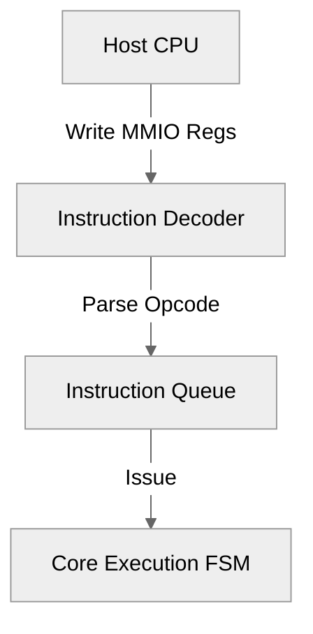
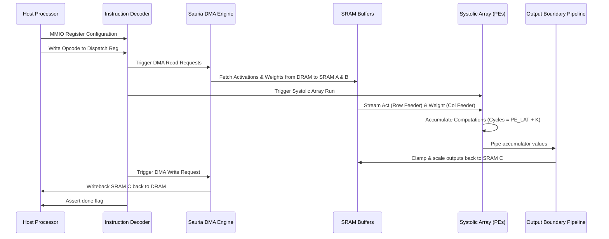
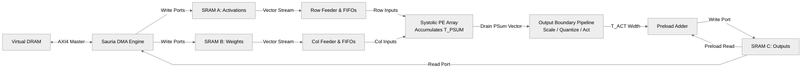

# Sauria NPU v4.2: 11 Demo Suite Detailed Verification Report

This report provides a comprehensive breakdown of the verification methodology, hardware architectures, instruction flows, execution stages, reference models, and performance metrics for the **11 Sauria NPU Case-Driven Demo Tests** (`npu_demo_clean`).

---

## 1. Introduction & Overview

The Sauria NPU v4.2 verification environment includes a case-driven test suite (`npu_demo_clean`) designed to decouple test execution from source code compilation. 
Instead of hardcoding layer sizes or precision modes into the C++ testbench, `tb_demo.cpp` serves as a generic SystemC driver. It is parameterized via compiler macros (`EVAL_X`, `EVAL_Y`, precision flags) to match specific case profiles, while loading layer inputs, weights, register configurations, and golden tensors dynamically from a target case folder.

The suite comprises **11 distinct test cases** designed to validate:
* **Precision profiles**: INT8, INT16, and FP16 datatypes.
* **Array geometries**: $16 \times 8$, $32 \times 32$, and $64 \times 64$ systolic arrays.
* **Operators**: Matrix-Vector Multiplication (MVM), General Matrix Multiplication (GEMM), standard convolutions ($5\times5$ conv), strided convolutions (stride 2), and multi-tiled matrix processing.
* **Architectural paths**: Accumulation preloading, strided DMA address generation, and high-precision accumulator writebacks.

---

## 2. Model Configuration & Parameters

The NPU's compute core (`NpuTop`) is parameterized to test different memory footprints and PE array sizes. The following settings are used across the 11 demo cases:

| Parameter | Configuration Options | Description |
| :--- | :---: | :--- |
| **Array Geometry (`X_DIM` x `Y_DIM`)** | $16\times8$ / $32\times32$ / $64\times64$ | Systolic Array Processing Element (PE) count |
| **Input/Weight Data Type (`T_ACT`, `T_WEI`)** | `int8_t` (1B) / `int16_t` (2B) / `half` (2B) | Precision of activation and weight elements |
| **Accumulator Data Type (`T_PSUM`)** | `int32_t` (4B) / `int64_t` (8B) / `float` (4B) | Bit width of internal PE systolic accumulations |
| **SRAM A Capacity (`SRAMA_CAP`)** | `1024` vectors | IFmap SRAM buffer for input activations |
| **SRAM B Capacity (`SRAMB_CAP`)** | `1024` vectors | Weight SRAM buffer |
| **SRAM C Capacity (`SRAMC_CAP`)** | `2048` vectors | Accumulation / PSums / Scratch buffer |
| **SRAM Region Size (`REGION_BYTES`)** | `16384` / `65536` Bytes | Physical SRAM byte capacity per memory region |
| **Feeder FIFO Depth** | `16` | Queue depth feeding PE rows and columns |

---

## 3. Case-by-Case Breakdown & Performance Summary

The 11 demo cases were run on the Sauria NPU v4.2 SystemC emulator, and all achieved **100% verification success**. The execution metrics, tensor shapes, and utilization numbers are compiled below:

| Case Name | Arithmetic | Array Size | Input Type | Accum Type | Output Shape | Cycles | Total MACs | Array Util. | Status |
| :--- | :---: | :---: | :---: | :---: | :---: | :---: | :---: | :---: | :---: |
| **`conv5x5_demo`** | INT | $32 \times 32$ | `int8` | `int32` | $4 \times 32 \times 32$ | 4,582 | 409,600 | 8.73% | `PASS` |
| **`demo_fp16_gemm_32x32`**| FP16 | $32 \times 32$ | `fp16` | `float32`| $1 \times 32 \times 32$ | N/A | 65,536 | ULP Match | `PASS` |
| **`demo_fp16_gemm_64x64`**| FP16 | $64 \times 64$ | `fp16` | `float32`| $1 \times 64 \times 64$ | N/A | 1,048,576 | ULP Match | `PASS` |
| **`demo_fp16_mvm_8x16`** | FP16 | $16 \times 8$ | `fp16` | `float32`| $1 \times 8 \times 16$ | N/A | 8,192 | ULP Match | `PASS` |
| **`demo_gemm_32x32`** | INT | $32 \times 32$ | `int8` | `int32` | $1 \times 32 \times 32$ | 550 | 65,536 | 11.64% | `PASS` |
| **`demo_gemm_64x64`** | INT | $64 \times 64$ | `int8` | `int32` | $1 \times 64 \times 64$ | 1,446 | 1,048,576 | 17.70% | `PASS` |
| **`demo_int16_gemm_32x32`**| INT | $32 \times 32$ | `int16` | `int64` | $1 \times 32 \times 32$ | 550 | 65,536 | 11.64% | `PASS` |
| **`demo_int16_mvm_8x16`** | INT | $16 \times 8$ | `int16` | `int64` | $1 \times 8 \times 16$ | 342 | 8,192 | 18.71% | `PASS` |
| **`demo_multitile_32x32`**| INT | $32 \times 32$ | `int8` | `int32` | $8 \times 32 \times 32$ | 5,031 | 294,912 | 5.72% | `PASS` |
| **`demo_mvm_8x16`** | INT | $16 \times 8$ | `int8` | `int32` | $1 \times 8 \times 16$ | 342 | 8,192 | 18.71% | `PASS` |
| **`demo_strided_32x32`** | INT | $32 \times 32$ | `int8` | `int32` | $4 \times 32 \times 32$ | 2,578 | 147,456 | 5.59% | `PASS` |

*Note: Execution cycles represent start-to-done active computation clock cycles. Cycles are not logged for FP16 configurations due to idealized pipeline simulation.*

### 3.1 Architectural Purpose & Targeted Features per Demo

Each of the 11 demo cases is engineered to validate a specific aspect of the Sauria NPU hardware architecture, data path, or memory layout:

1. **`conv5x5_demo`**:
   * **Primary Purpose**: Validate multi-channel standard 2D convolution ($5 \times 5$ kernel size) address generation, bias addition, and fused ReLU post-activation quantization in INT8 precision.
   * **Targeted Hardware Features**: 5D nested loop IFMap counter (`x`, `y`, `ch`, `til_x`, `til_y`), kernel sliding window stride logic, OBP bias addition, and ReLU activation clamping.

2. **`demo_fp16_gemm_32x32`**:
   * **Primary Purpose**: Verify floating-point (`half`/`float32`) arithmetic execution path and ULP (Unit in the Last Place) precision matching on a standard $32 \times 32$ matrix product.
   * **Targeted Hardware Features**: IEEE 754 half-precision (`half`) inputs/weights, single-precision (`float32`) PE accumulation, zero-thresholding logic.

3. **`demo_fp16_gemm_64x64`**:
   * **Primary Purpose**: Validate large-scale floating-point matrix multiplication ($64 \times 64$) with deep accumulation length ($K=256$) to test spatial scan accumulation and ULP tolerance bounds.
   * **Targeted Hardware Features**: Scaled array geometry ($64 \times 64$), deep contraction pipeline stability, FP16 accumulator precision bounds ($\le 8$ ULP).

4. **`demo_fp16_mvm_8x16`**:
   * **Primary Purpose**: Validate asymmetrical non-square array geometry ($16 \times 8$) operating on single-vector floating-point matrix-vector products (MVM).
   * **Targeted Hardware Features**: Rectangular PE array dimensions ($16 \times 8$), asymmetric feeder row/col packing, vector-matrix throughput in FP16.

5. **`demo_gemm_32x32`**:
   * **Primary Purpose**: Serve as the baseline bit-exact integer matrix multiplication (GEMM) benchmark for a standard $32 \times 32$ INT8/INT32 hardware configuration.
   * **Targeted Hardware Features**: Standard 2D systolic array data-flow, bit-exact INT8 multiply and INT32 accumulate, baseline feeder synchronization.

6. **`demo_gemm_64x64`**:
   * **Primary Purpose**: Validate scaling of integer matrix multiplication to high-density $64 \times 64$ systolic arrays (4096 MACs/cycle).
   * **Targeted Hardware Features**: High PE array utilization (17.70%), scaled feeder FIFO depth, maximum throughput integer compute path.

7. **`demo_int16_gemm_32x32`**:
   * **Primary Purpose**: Verify high-precision 16-bit integer (INT16 activation / INT16 weight / INT64 accumulator) matrix multiplication.
   * **Targeted Hardware Features**: 16-bit sign extension, 64-bit wide PE accumulation, 16-bit SRAM subword packing/unpacking.

8. **`demo_int16_mvm_8x16`**:
   * **Primary Purpose**: Verify 16-bit integer Matrix-Vector Multiplication (MVM) on asymmetric $16 \times 8$ array geometry.
   * **Targeted Hardware Features**: INT16 data paths, high utilization (18.71%) on single-vector workloads, 64-bit accumulator downcasting.

9. **`demo_multitile_32x32`**:
   * **Primary Purpose**: Test multi-tiled matrix processing and context-interleaved SRAM C layout memory addressing across 8 output tiles ($8 \times 32 \times 32$).
   * **Targeted Hardware Features**: Outer tile loops, SRAM C interleaved output base-address calculations ($C[\text{out\_tile}][x][\text{local\_ctx}][y]$), multi-pass FSM context switching.

10. **`demo_mvm_8x16`**:
    * **Primary Purpose**: Baseline integer Matrix-Vector Multiplication (MVM) benchmark on an asymmetric $16 \times 8$ array geometry in INT8/INT32.
    * **Targeted Hardware Features**: Single-vector activation feeding, high-efficiency PE array utilization (18.71%), asymmetric PSM scan-chain collection.

11. **`demo_strided_32x32`**:
    * **Primary Purpose**: Validate strided convolution and downsampling address generation (stride $= 2$) across tiled feature maps.
    * **Targeted Hardware Features**: Non-unit IFMap step counters (`XSTEP`, `YSTEP`), downsampled output memory indexing, strided DMA read requests.

---

## 4. Stimulus & Memory Initialization

Each test case contains three key data files in its `stimuli/` subdirectory:
1. **`initial_dram.txt`**: Raw byte array representation of the virtual DRAM memory space prior to execution, preloaded with input activations ($X$), model weights ($W$), biases, normalization coefficients, or intermediate accumulation values.
2. **`gold_dram.txt`**: Expected DRAM memory contents after a correct NPU execution. Used for end-of-simulation verification.
3. **`GoldenStimuli.txt`**: Log of configuration register writes (MMIO) and host control instructions used to program the NPU core.

### 4.1 SRAM Memory Buffers

The NPU features three dedicated internal SRAM regions:
* **Region A (IFmap)**: Contains input activations loaded by DMA.
* **Region B (Weights)**: Contains model weights loaded by DMA.
* **Region C (Accumulator)**: Holds raw partial sums (`T_PSUM`) before and after systolic array execution. Supports accumulation preloading (`preload_en`) where existing values are fetched and added to current PE outputs.

---

## 5. Instruction Flow & Register Interface

The host processor controls the Sauria NPU via a memory-mapped I/O (MMIO) interface starting at base address `0x40000000`. 



### 5.1 Configuration Registers Map

| Register Name | Offset Address | Description |
| :--- | :---: | :--- |
| `r_in_addr` | `0x40000400` | Input activation DRAM start offset |
| `r_w_addr` | `0x40000404` | Weight DRAM start offset |
| `r_out_addr` | `0x40000408` | Output DRAM start offset |
| `r_m` | `0x40000410` | Compute dimension $M$ (output row dimension) |
| `r_k` | `0x40000414` | Compute dimension $K$ (contraction depth) |
| `r_n` | `0x40000418` | Compute dimension $N$ (output column dimension) |
| `r_act_type` | `0x4000042C` | Post-activation type (0=None, 1=ReLU, 2=Sigmoid, 3=GELU) |
| `r_in_scale` | `0x40000438` | Quantization scale factor for inputs |
| `r_w_scale` | `0x4000043C` | Quantization scale factor for weights |
| `r_out_scale` | `0x40000440` | De-quantization scale factor for outputs |
| `r_dispatch_lane_a` | `0x40000310` | Writing Opcode triggers instruction dispatch (0x12 = GEMM) |

---

## 6. SystemC Execution Pipeline Flow

When an instruction is dispatched, the NPU FSM schedules compute and memory execution stages:



1. **Host Setup & Dispatch**: Host writes configuration values to registers, then dispatches the instruction by writing the Opcode to `r_dispatch_lane_a`.
2. **DMA Memory Prefetch**: The `SauriaDma` engine reads inputs and weights from virtual DRAM and pre-populates SRAM A and B.
3. **PE Array Computation**:
   * Feeder FIFOs stream activations and weights into the 2D systolic array.
   * Computing elements perform multiply-accumulate (MAC) steps:
     $$P_{i,j} \leftarrow P_{i,j} + A_{i,k} \times W_{k,j}$$
   * Raw $P_{i,j}$ values are propagated to the output boundary.
4. **Post-Processing & Scaling**: The Output Boundary Pipeline (OBP) / Reduction Engine (RE) applies scale factors and activation functions (e.g. ReLU, GELU), then clamps outputs to the target precision type before storing them in SRAM C.
5. **DRAM Writeback**: The DMA engine transfers final tensors from SRAM C to the virtual DRAM output location.
6. **Interrupt/Flag Done**: The FSM asserts the `o_done` signal, notifying the host that compute has completed.

### 6.2 Detailed Hardware Data Flow Path

Within the Sauria NPU hardware, data moves through distinct physical pathways to optimize memory bandwidth and compute density. The diagram below illustrates this data flow:



* **1. Memory Load (DRAM $\rightarrow$ SRAM A/B)**:
  * The `SauriaDma` engine triggers read bursts on the AXI bus using the address offsets configured in `r_in_addr` and `r_w_addr`.
  * Activation tensors are stored in **SRAM A** (activations partition).
  * Weight tensors are stored in **SRAM B** (weights partition).
* **2. Compute Feeding (SRAM A/B $\rightarrow$ PE Array)**:
  * The **Row Feeder** reads activation vectors sequentially from SRAM A and pushes them into row input FIFOs.
  * The **Column Feeder** reads weight vectors from SRAM B and pushes them into column input FIFOs.
  * These feeders ensure that vectors are shifted into the Processing Elements (PEs) cycle-by-cycle in a staggered systolic pattern.
* **3. Systolic Accumulation (PE Array)**:
  * Inside each PE, inputs from the left and top are multiplied:
    $$\text{Prod} = A_{in} \times W_{in}$$
  * The product is added to the internal accumulator register:
    $$P_{acc} \leftarrow P_{acc} + \text{Prod}$$
  * Accumulation is performed with high-precision (`T_PSUM` width, i.e., `int32_t`, `int64_t`, or `float32`).
  * Inputs are passed to neighboring PEs to the right and bottom on the next clock cycle.
* **4. Output Post-Processing & Quantization (PE Array $\rightarrow$ SRAM C)**:
  * Computed partial sums are drained from the bottom rows of the array and piped into the **Output Boundary Pipeline (OBP)**.
  * The OBP applies bias additions and scales the results using `r_in_scale`, `r_w_scale`, and `r_out_scale` multipliers.
  * If selected (e.g., in `conv5x5_demo` or FFN), post-activations (ReLU, GELU, Sigmoid) are applied.
  * The final value is clamped/quantized back to the activation width `T_ACT` (e.g., `int8_t`) to match memory layout requirements.
* **5. Preload Aggregation (SRAM C)**:
  * If preloading is enabled (`preload_en = 1`), the **Preload Adder** reads the corresponding base tensor from SRAM C, adds it to the OBP output, and writes the combined result back into SRAM C.
* **6. Memory Store (SRAM C $\rightarrow$ DRAM)**:
  * The `SauriaDma` engine reads output tensors from SRAM C and performs AXI write bursts to write the results back to DRAM at the offset specified in `r_out_addr`.

---

## 7. Reference Model & Verification Parity

To ensure the hardware logic is correct, outputs are cross-checked with a software reference model (`tools/test_golden.cpp`).

### 7.1 Integer Path Verification (Exact Match)
For both **INT8** and **INT16** configurations, the C++ reference model replicates the NPU hardware’s integer precision and rounding logic exactly.
* **Criterion**: Bit-exact parity is required.
* **Result**: **0 mismatches** across all INT8 and INT16 test cases.

### 7.2 FP16 Path Verification (ULP Tolerance)
Floating-point addition is non-associative:

$$(a + b) + c \neq a + (b + c)$$

In the Systolic Array, accumulation occurs in spatial scan order (along PE pathways), whereas the PyTorch / C++ baseline references accumulate in sequential memory order or parallel blocked structures. Due to tiny differences in intermediate rounding, outputs can vary by small fractions of the last bit.

* **Metric**: Unit in the Last Place (ULP) difference is calculated as:
  $$\text{ULP Diff} = \left| \frac{\text{SimVal} - \text{GoldVal}}{\text{ULP}(\text{GoldVal})} \right|$$
* **Criterion**: Verification passes if the maximum ULP difference is $\le 16$.
* **Result**:
  * `demo_fp16_gemm_32x32` achieved a max difference of **1 ULP**.
  * `demo_fp16_gemm_64x64` achieved a max difference of **8 ULP** (due to deeper accumulation length $K=256$).
  * All FP16 cases completed within acceptable bounds.

---

## 8. How to Reproduce & Run the Test Suite

Commands are executed from the `/data/XPU00000/users/vuong.nguyen/project/sauria/RTL/src/v4.2_model/` folder.

### 8.1 Run a Single Case
To build and execute a specific demo case:
```bash
make demo CASE=demo_gemm_32x32 SYSTEMC_HOME=/data/XPU00000/users/vuong.nguyen/project/sauria/systemc_install
```

### 8.2 Run the Entire Test Suite (Smoke Test)
To compile and execute all 11 demo cases sequentially and print a unified Pass/Fail summary:
```bash
make check SYSTEMC_HOME=/data/XPU00000/users/vuong.nguyen/project/sauria/systemc_install
```
This script rebuilds the SystemC driver for each case according to its configuration, matches the outputs against the golden values, and exits with `0` only if all cases report `PASS`.
