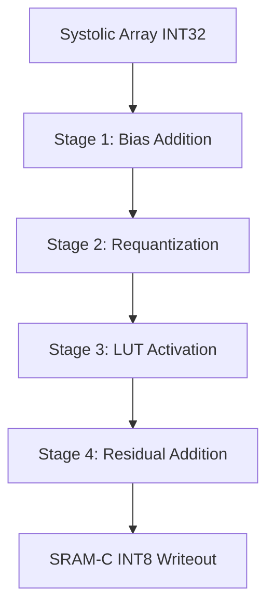

# SAURIA NPU v4.2: OBP & RE Subsystems Verification Report

This report summarizes the functional verification of the **Output Boundary Pipeline (OBP)** and the **Reduction Engine (RE) / Reconfigurable Compute Engine (RCE)** hardware simulation models in the SAURIA v4.2 design space.

---

## 1. Executive Summary

Standalone cycle-accurate verification testbenches have been constructed and executed for both the OBP and RE/RCE blocks.

* **Output Boundary Pipeline (OBP)**: Verified 8 out of 8 checks covering reset/bypass, bias programming/addition, scalar/vector requantization, LUT activation mapping, residual skip addition, and full pipeline fusion.

- **Reduction / Reconfigurable Engine (RE/RCE)**: Verified 10 out of 10 checks covering host programming, EXP lookup mapping, Softmax Pass 1 & 2, LayerNorm Pass 1 & 2, MaxPool broadcasting, and Residual Addition.

* **Results**: Both standalone test suites passed functionally without warnings, confirming mathematical bit-exact parity with spec definitions.

---

## 2. Output Boundary Pipeline (OBP) Verification

### 2.1 Specification & Pipeline Stages

The OBP receives `INT32` partial sums flushed from the Systolic Array and processes them through a strictly ordered 4-stage pipeline before writing back to SRAM-C as `INT8`:



1. **Stage 1 (Bias Addition)**: Adds channel-specific `INT32` bias to avoid clipping high-accumulator outputs.
2. **Stage 2 (Requantization)**: Clamps and scales values to `INT8` using scale parameters and bit shifts ($val = (val \times scale) \gg shift$). Supports fallback to global scalar ports if channel-RAMs are unprogrammed.
3. **Stage 3 (LUT Activation)**: Performs non-linear activation using a custom programmable lookup table.
4. **Stage 4 (Residual Add)**: Element-wise adds the skip connection activation, followed by saturation clamping to $[-128, 127]$.

### 2.2 Stimulus, Dataflow, and Test Cases

* **Test Case 1: Reset & Bypass**: Verifies that when OBP stages are disabled, `INT32` input vector data passes directly through the pipeline unchanged.
* **Test Case 2: Bias Addition**: Programs the `Bias RAM` via the host interface with specific offsets. Feeds input vectors and verifies that $Input + Bias$ matches expectations.
* **Test Case 3: Requantization**: Configures per-channel scale & shift variables. Tests both per-channel scaling and the default fallback logic.
* **Test Case 4: LUT Activation**: Programs an absolute value mapping ($f(x) = |x|$) into the LUT. Feeds negative values (e.g., `-25`) and checks that the output is positive (`25`).
* **Test Case 5: Residual Skip Add**: Merges the pipeline output with a secondary skip input vector.
* **Test Case 6: Full Pipeline Fusion**: Combines all stages simultaneously (Bias $\to$ Requant $\to$ ReLU LUT $\to$ Residual Add).

### 2.3 Result Analysis & Debugging Log

* **Pipeline Latency Offset**: Initially, testbench reads failed due to reading values a cycle early. The pipeline logic requires a **4-cycle wait state** from input valid to output read. Aligning the testbench wait cycles resolved the failure.
* **Host Interface Data Packing**: The OBP's host interface programs 4 entries at once. We corrected the host write/read helper sub-word byte masking to correctly pack/unpack individual `int8` entries within the 32-bit registers.

---

## 3. Reduction Engine (RE) & Reconfigurable Compute Engine (RCE) Verification

### 3.1 Specification & Modes

The Reduction Engine processes non-linear vector reductions (Softmax/LayerNorm) and element-wise calculations. It works alongside the RCE which manages the underlying LUT memories.

* **Reconfigurable Engine (RCE) LUTs**:
  * **EXP LUT**: 256 entries mapping input $x \in (-8, 0]$ via index $\text{round}((x+8) \times 31.875)$ to EXP output.
  * **RECIP LUT**: 512 entries mapping input $x$ to $1/x$.
  * **RSQRT LUT**: 1024 16-bit entries mapping input $x$ to $1/\sqrt{x}$.
* **Reduction Engine (RE) Modes**:
  * **Softmax Pass 1**: Finds the row max ($\max(x)$) using a tree structure.
  * **Softmax Pass 2**: Computes $\exp(x_i - \max)$ and divides by the sum of exponents using reciprocal lookup.
  * **LayerNorm Pass 1**: Calculates the row mean ($\mu$).
  * **LayerNorm Pass 2**: Calculates variance ($\sigma^2$), fetches reciprocal square root, and normalizes output.
  * **MaxPool**: Broadcasts the maximum value across the vector lanes.
  * **Residual Add**: Merges inputs and skip connections using programmable scaling factors.

### 3.2 Stimulus, Dataflow, and Test Cases

* **Case 1: Host Programming**: Writes custom validation words to RCE's EXP, RECIP, and RSQRT spaces and reads them back to verify host-decoder mapping.
* **Case 2: RCE Functional Lookup**: Tests the interpolation and index mapping equations for floating-point lookups.
* **Case 3 & 4: Softmax**: Feeds a vector of linear values. Case 3 finds the row max. Case 4 evaluates the normalized softmax exponents.
* **Case 5 & 6: LayerNorm**: Computes the mean and normalizes the input vector based on dynamic variance.
* **Case 7: MaxPool**: Broadcasts the maximum value in a vector with high negative/positive extremes.
* **Case 8: Residual Skip**: Checks element-wise addition scaled by arbitrary fractional multiplier/shift factors.

### 3.3 Result Analysis & Debugging Log

* **SystemC Multi-Driver Avoidance**: Initially, binding RCE inputs directly to RE outputs and driving them from the testbench caused a multiple-driver exception (`E115`). We resolved this by binding the RE's lookup outputs to dummy signals and dedicating independent test signals to drive the RCE directly.

---

## 4. How to Run the Tests

### 4.1 Prerequisites

Ensure that the `SYSTEMC_HOME` path is set to the valid Accellera SystemC installation library.

### 4.2 Commands

```bash
# Navigate to the v4.2 model workspace directory
cd /data/XPU00000/users/vuong.nguyen/project/sauria/RTL/src/v4.2_model/

# Run the Standalone OBP testbench
make obptest SYSTEMC_HOME=/data/XPU00000/users/vuong.nguyen/project/sauria/systemc_install

# Run the Standalone RE/RCE testbench
make retest SYSTEMC_HOME=/data/XPU00000/users/vuong.nguyen/project/sauria/systemc_install

# Build all model test targets simultaneously
make all SYSTEMC_HOME=/data/XPU00000/users/vuong.nguyen/project/sauria/systemc_install
```
