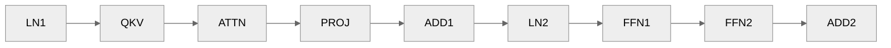
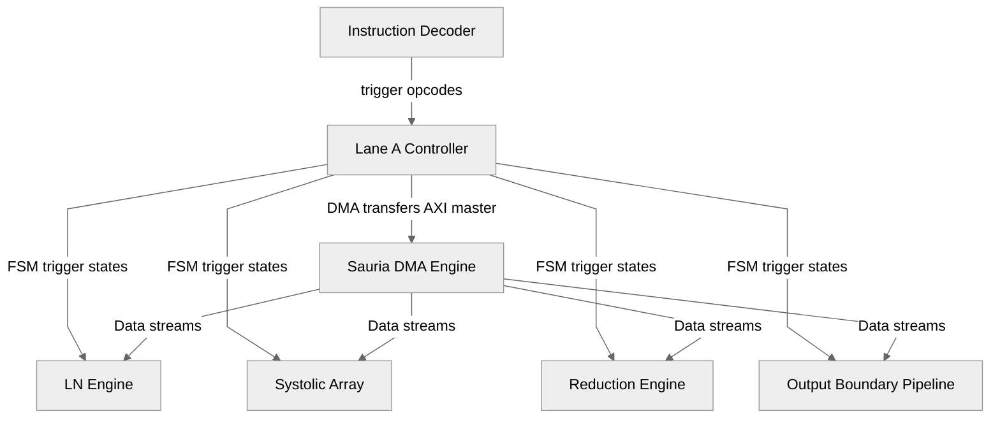
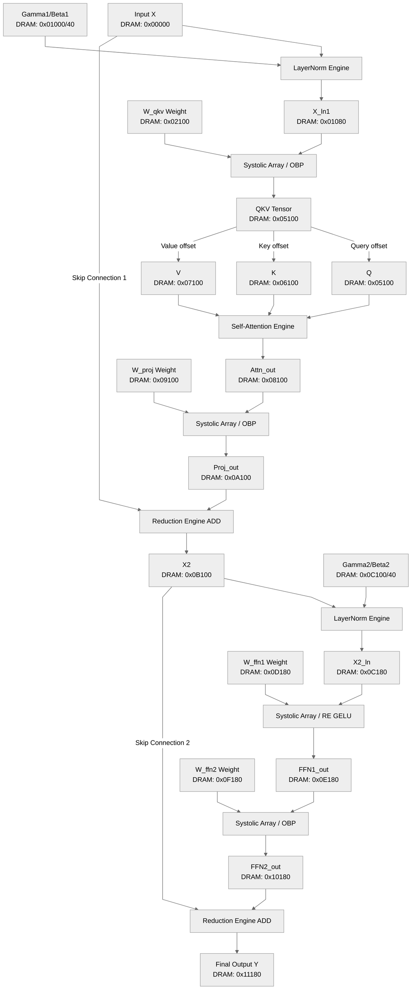

# Detailed Architectural & Verification Report: ViT Encoder Block Chained INT8 Test

This report provides a technical breakdown of the verification methodology, hardware parameters, instruction sequencing, and mathematical formulations utilized to validate the Vision Transformer (ViT) Encoder Block on the **Sauria NPU v4.2 SystemC model** in its scaled $64 \times 64$ INT8/INT32 configuration operating at $800 \text{ MHz}$.

---

## 1. Model Parameters & Hardware Configuration

The SystemC model is instantiated with template parameters configured to match the hardware specification for high-utilization integer tensor workloads:

| Parameter | Configuration Value | Description |
| :--- | :---: | :--- |
| **Systolic Array Columns (`X_DIM`)** | `64` | 64 parallel Processing Elements (PEs) along columns |
| **Systolic Array Rows (`Y_DIM`)** | `64` | 64 parallel PEs along rows (Total PEs = 4096) |
| **Activation Data Type (`T_ACT`)** | `int8_t` (8-bit) | Signed 8-bit integer activation elements datatype |
| **Weight Data Type (`T_WEI`)** | `int8_t` (8-bit) | Signed 8-bit integer weight elements datatype |
| **Accumulator Data Type (`T_PSUM`)** | `int32_t` (32-bit) | Signed 32-bit integer accumulation data path |
| **SRAM A Capacity (`SRAMA_CAP`)** | `1024` vectors | Banks 2 & 3: IFmap SRAM buffer for activations |
| **SRAM B Capacity (`SRAMB_CAP`)** | `1024` vectors | Banks 0 & 1: Weight SRAM buffer |
| **SRAM C Capacity (`SRAMC_CAP`)** | `2048` vectors | Banks 4 & 5: Accumulation / PSums / Scratch buffers |
| **Feeder FIFO Depth (`FIFO_DEPTH`)**| `16` | Data-feeder queue size interfacing memory banks and PE inputs |
| **PE Pipeline Latency (`PE_LAT`)** | `128` | Clock cycle latency for systolic propagation path ($X\_DIM + Y\_DIM$) |
| **Operating Frequency** | $800 \text{ MHz}$ | System clock frequency |
| **Clock Period** | $1.25 \text{ ns}$ | System clock period duration |
| **Virtual DRAM Size** | `2 MB` | DRAM byte array capacity mapping simulated memory space |

---

## 2. Stimulus & Input Initialization

Inputs and weights are programmatically generated using a deterministic pseudo-random trigonometric generator. This ensures varied numerical values while remaining repeatable:

$$\text{Value}(i) = \text{static\_cast}\langle\text{int8\_t}\rangle\left( \text{round}\left( \sin(i) \times \text{Scale} \right) \right)$$

Values are clipped to the signed 8-bit range $[-127, 127]$.

### 2.1 DRAM Address Map and Allocations

The 2MB virtual DRAM address space is partitioned to prevent tensor overlaps:

| Tensor | Shape | Size (Bytes) | DRAM Start Offset | Scale Factor |
| :--- | :---: | :---: | :---: | :--- |
| **Input $X$** | $64 \times 64$ | $4,096$ | `0x00000` | $80.0$ |
| **LN1 $\gamma_1$ / $\beta_1$** | $64$ each | $64$ each | `0x01000` / `0x01040` | $10.0$ / $5.0$ |
| **QKV Weight $W_{qkv}$** | $64 \times 192$| $12,288$ | `0x02100` | $20.0$ |
| **Proj Weight $W_{proj}$**| $64 \times 64$ | $4,096$ | `0x09100` | $20.0$ |
| **LN2 $\gamma_2$ / $\beta_2$** | $64$ each | $64$ each | `0x0C100` / `0x0C140` | $10.0$ / $5.0$ |
| **FFN1 Weight $W_{ffn1}$**| $64 \times 64$ | $4,096$ | `0x0D180` | $20.0$ |
| **FFN2 Weight $W_{ffn2}$**| $64 \times 64$ | $4,096$ | `0x0F180` | $20.0$ |

---

## 3. Instruction Flow & Config Registers Mapping

The ViT encoder pipeline enqueues **9 instructions** sequentially into Lane A's command buffer by writing to host-mapped configuration registers (MMIO space starting at `0x40000000`):




### 3.1 Detailed Instruction-by-Instruction Hardware Execution Breakdown

Below is the detailed specification for each of the **9 chained instructions** executed in the ViT Encoder block, detailing the trigger command, executing hardware sub-blocks, input data specifications, register settings, and output destinations.

---

#### Instruction 1: `LAYERNORM` (Opcode `0x14`) — First Layer Normalization (LN1)
* **Mathematical Function**: $X_{ln1} = \text{LayerNorm}(X, \gamma_1, \beta_1) = \frac{X - \mu_1}{\sqrt{\sigma_1^2 + \epsilon}} \cdot \gamma_1 + \beta_1$
* **Executing Hardware Sub-Blocks**:
  * **[ReductionEngine](file:///data/XPU00000/users/vuong.nguyen/project/sauria/RTL/src/v4.2_model/psm/re_rce.h)**: Pass 1 calculates row mean $\mu_1$ and variance $\sigma_1^2$; Pass 2 normalizes elements and applies scale/shift.
  * **[ReconfigurableEngine](file:///data/XPU00000/users/vuong.nguyen/project/sauria/RTL/src/v4.2_model/psm/re_rce.h)**: Provides `RSQRT` ($1/\sqrt{x}$) lookup table mapping.
  * **[SauriaDma](file:///data/XPU00000/users/vuong.nguyen/project/sauria/RTL/src/v4.2_model/control/sauria_dma.h)**: Fetches patch embeddings $X$ and LN1 parameters $\gamma_1, \beta_1$ from virtual DRAM to SRAM.
* **Input Data Specifications**:
  * **Input Tensor $X$**: Shape $64 \times 64$, `int8_t` (4,096 bytes), DRAM start offset `0x00000`.
  * **Gamma $\gamma_1$**: 64 elements, `int8_t`/`int16_t` (64 bytes), DRAM start offset `0x01000`.
  * **Beta $\beta_1$**: 64 elements, `int8_t`/`int16_t` (64 bytes), DRAM start offset `0x01040`.
* **Register Settings**:
  * `r_in_addr (0x40000400)` = `0x00000`
  * `r_out_addr (0x40000408)` = `0x01080`
  * `r_gamma_addr (0x40000444)` = `0x01000`
  * `r_beta_addr (0x4000044C)` = `0x01040`
  * `r_seq_len (0x40000450)` = `64`, `r_dim (0x40000454)` = `64`
* **Trigger Command**: Write `0x14` to `r_dispatch_lane_a (0x40000310)`.
* **Output Destination**: Normalized Tensor $X_{ln1}$ (Shape $64 \times 64$, `int8_t`, DRAM `0x01080`, 4,096 bytes).

---

#### Instruction 2: `GEMM_FUSED` (Opcode `0x12`) — QKV Matrix Projection
* **Mathematical Function**: $QKV = (X_{ln1} \cdot W_{qkv}) \times (\text{scale}_{\text{in}} \cdot \text{scale}_{\text{w}} \cdot \text{scale}_{\text{out}})$
* **Executing Hardware Sub-Blocks**:
  * **[IfmapFeeder](file:///data/XPU00000/users/vuong.nguyen/project/sauria/RTL/src/v4.2_model/data_feeder/ifmap_feeder.h)** / **[WeightFeeder](file:///data/XPU00000/users/vuong.nguyen/project/sauria/RTL/src/v4.2_model/data_feeder/wei_feeder.h)**: Row/Col feeders stream $X_{ln1}$ and $W_{qkv}$ from SRAM A/B into array FIFOs.
  * **[SystolicArray](file:///data/XPU00000/users/vuong.nguyen/project/sauria/RTL/src/v4.2_model/systolic_array/sa_array.h)**: $64 \times 64$ PE grid computes $64 \times 64 \times 192$ matrix multiplication into `int32_t` accumulators.
  * **[Psm](file:///data/XPU00000/users/vuong.nguyen/project/sauria/RTL/src/v4.2_model/psm/psm_top.h)** & **[Obp](file:///data/XPU00000/users/vuong.nguyen/project/sauria/RTL/src/v4.2_model/psm/obp_top.h)**: PSM scans out columns; OBP applies quantization scaling and clamps outputs back to `int8_t`.
  * **[SauriaDma](file:///data/XPU00000/users/vuong.nguyen/project/sauria/RTL/src/v4.2_model/control/sauria_dma.h)**: Writes back packed $QKV$ output to DRAM.
* **Input Data Specifications**:
  * **Input Activation $X_{ln1}$**: Shape $64 \times 64$, `int8_t` (4,096 bytes), DRAM offset `0x01080`.
  * **Weight Matrix $W_{qkv}$**: Shape $64 \times 192$, `int8_t` (12,288 bytes), DRAM offset `0x02100`.
* **Register Settings**:
  * `r_in_addr` = `0x01080`, `r_w_addr (0x40000404)` = `0x02100`, `r_out_addr` = `0x05100`
  * `r_m (0x40000410)` = `64`, `r_k (0x40000414)` = `64`, `r_n (0x40000418)` = `192`
  * `r_in_scale` = `0.005`, `r_w_scale` = `0.005`, `r_out_scale` = `1.0`
  * `r_act_type (0x4000042C)` = `0` (None)
* **Trigger Command**: Write `0x12` to `r_dispatch_lane_a (0x40000310)`.
* **Output Destination**: Packed $QKV$ Tensor (Shape $64 \times 192$, `int8_t`, DRAM `0x05100`, 12,288 bytes).
  * *Note*: Memory is contiguous and sliced as $Q$ (`0x05100`), $K$ (`0x06100`), and $V$ (`0x07100`), each $64 \times 64$ bytes.

---

#### Instruction 3: `FUSED_ATTN` (Opcode `0x13`) — Multi-Head Self-Attention
* **Mathematical Function**: $\text{Attn}_{\text{out}} = \text{Softmax}\left(\frac{Q \cdot K^T}{\sqrt{d_{\text{head}}}}\right) \cdot V$
* **Executing Hardware Sub-Blocks**:
  * **[SystolicArray](file:///data/XPU00000/users/vuong.nguyen/project/sauria/RTL/src/v4.2_model/systolic_array/sa_array.h)**: Pass 1 computes score matrix $S = Q \cdot K^T$; Pass 2 computes context output matrix $A = \text{Softmax}(S) \cdot V$.
  * **[ReductionEngine](file:///data/XPU00000/users/vuong.nguyen/project/sauria/RTL/src/v4.2_model/psm/re_rce.h)**: Executes Softmax row-max extraction ($\max(S_i)$) and row-wise exponent summation.
  * **[ReconfigurableEngine](file:///data/XPU00000/users/vuong.nguyen/project/sauria/RTL/src/v4.2_model/psm/re_rce.h)**: Uses `EXP` and `RECIP` ($1/x$) LUTs for Softmax probability normalization.
  * **[SauriaDma](file:///data/XPU00000/users/vuong.nguyen/project/sauria/RTL/src/v4.2_model/control/sauria_dma.h)**: Manages multi-tensor Q, K, V fetches from DRAM.
* **Input Data Specifications**:
  * **Query Tensor $Q$**: Shape $64 \times 64$, `int8_t` (4,096 bytes), DRAM offset `0x05100`.
  * **Key Tensor $K$**: Shape $64 \times 64$, `int8_t` (4,096 bytes), DRAM offset `0x06100`.
  * **Value Tensor $V$**: Shape $64 \times 64$, `int8_t` (4,096 bytes), DRAM offset `0x07100`.
* **Register Settings**:
  * `r_q_addr (0x40000444)` = `0x05100`, `r_k_addr (0x40000448)` = `0x06100`, `r_v_addr (0x4000044C)` = `0x07100`
  * `r_out_addr` = `0x08100`
  * `r_attn_scale (0x4000045C)` = `0.125` ($\frac{1}{\sqrt{64}}$)
  * `r_seq_len` = `64`, `r_num_heads (0x40000454)` = `1`, `r_head_dim (0x40000458)` = `64`
* **Trigger Command**: Write `0x13` to `r_dispatch_lane_a (0x40000310)`.
* **Output Destination**: Self-Attention Context Matrix $Attn_{\text{out}}$ (Shape $64 \times 64$, `int8_t`, DRAM `0x08100`, 4,096 bytes).

---

#### Instruction 4: `GEMM_FUSED` (Opcode `0x12`) — Output Projection GEMM
* **Mathematical Function**: $Proj_{\text{out}} = (Attn_{\text{out}} \cdot W_{\text{proj}}) \times \text{scale}$
* **Executing Hardware Sub-Blocks**:
  * **[IfmapFeeder](file:///data/XPU00000/users/vuong.nguyen/project/sauria/RTL/src/v4.2_model/data_feeder/ifmap_feeder.h)** / **[WeightFeeder](file:///data/XPU00000/users/vuong.nguyen/project/sauria/RTL/src/v4.2_model/data_feeder/wei_feeder.h)**: Feed $Attn_{\text{out}}$ and $W_{\text{proj}}$ vectors.
  * **[SystolicArray](file:///data/XPU00000/users/vuong.nguyen/project/sauria/RTL/src/v4.2_model/systolic_array/sa_array.h)**: PE array executes GEMM ($M=64, K=64, N=64$).
  * **[Psm](file:///data/XPU00000/users/vuong.nguyen/project/sauria/RTL/src/v4.2_model/psm/psm_top.h)** & **[Obp](file:///data/XPU00000/users/vuong.nguyen/project/sauria/RTL/src/v4.2_model/psm/obp_top.h)**: Scans out partial sums and requantizes back to `int8_t`.
  * **[SauriaDma](file:///data/XPU00000/users/vuong.nguyen/project/sauria/RTL/src/v4.2_model/control/sauria_dma.h)**: Writes projection output back to DRAM.
* **Input Data Specifications**:
  * **Input Tensor $Attn_{\text{out}}$**: Shape $64 \times 64$, `int8_t` (4,096 bytes), DRAM offset `0x08100`.
  * **Weight Matrix $W_{\text{proj}}$**: Shape $64 \times 64$, `int8_t` (4,096 bytes), DRAM offset `0x09100`.
* **Register Settings**:
  * `r_in_addr` = `0x08100`, `r_w_addr` = `0x09100`, `r_out_addr` = `0x0A100`
  * `r_m` = `64`, `r_k` = `64`, `r_n` = `64`
  * `r_in_scale` = `0.015`, `r_w_scale` = `0.015`, `r_out_scale` = `1.0`
  * `r_act_type` = `0` (None)
* **Trigger Command**: Write `0x12` to `r_dispatch_lane_a (0x40000310)`.
* **Output Destination**: Projection Output Tensor $Proj_{\text{out}}$ (Shape $64 \times 64$, `int8_t`, DRAM `0x0A100`, 4,096 bytes).

---

#### Instruction 5: `ELEM_WISE` (Opcode `0x15`) — Residual Skip Connection 1 (ADD)
* **Mathematical Function**: $X2 = Proj_{\text{out}} + X$
* **Executing Hardware Sub-Blocks**:
  * **[ReductionEngine](file:///data/XPU00000/users/vuong.nguyen/project/sauria/RTL/src/v4.2_model/psm/re_rce.h)**: Configured in Vector ADD mode. Executes 64-lane parallel element-wise addition with saturation clamping to $[-128, 127]$.
  * **[SauriaDma](file:///data/XPU00000/users/vuong.nguyen/project/sauria/RTL/src/v4.2_model/control/sauria_dma.h)**: Prefetched vector A ($Proj_{\text{out}}$) and vector B ($X$) from DRAM into SRAM.
* **Input Data Specifications**:
  * **Vector A**: $Proj_{\text{out}}$ (Shape $64 \times 64$, `int8_t`, DRAM `0x0A100`, 4,096 bytes).
  * **Vector B**: Original Input $X$ (Shape $64 \times 64$, `int8_t`, DRAM `0x00000`, 4,096 bytes).
* **Register Settings**:
  * `r_a_addr (0x40000444)` = `0x0A100`, `r_b_addr (0x40000448)` = `0x00000`, `r_out_addr` = `0x0B100`
  * `r_len (0x40000450)` = `4096`, `r_mode (0x40000454)` = `0` (ADD Mode)
  * `r_scale_a` = `1.0`, `r_scale_b` = `1.0`, `r_scale_out` = `1.0`
* **Trigger Command**: Write `0x15` to `r_dispatch_lane_a (0x40000310)`.
* **Output Destination**: Residual Tensor $X2$ (Shape $64 \times 64$, `int8_t`, DRAM `0x0B100`, 4,096 bytes).

---

#### Instruction 6: `LAYERNORM` (Opcode `0x14`) — Second Layer Normalization (LN2)
* **Mathematical Function**: $X2_{ln} = \text{LayerNorm}(X2, \gamma_2, \beta_2) = \frac{X2 - \mu_2}{\sqrt{\sigma_2^2 + \epsilon}} \cdot \gamma_2 + \beta_2$
* **Executing Hardware Sub-Blocks**:
  * **[ReductionEngine](file:///data/XPU00000/users/vuong.nguyen/project/sauria/RTL/src/v4.2_model/psm/re_rce.h)** (Pass 1 & 2 for mean/variance/normalization) & **[ReconfigurableEngine](file:///data/XPU00000/users/vuong.nguyen/project/sauria/RTL/src/v4.2_model/psm/re_rce.h)** (`RSQRT` LUT).
  * **[SauriaDma](file:///data/XPU00000/users/vuong.nguyen/project/sauria/RTL/src/v4.2_model/control/sauria_dma.h)**: Fetches intermediate tensor $X2$ and parameters $\gamma_2, \beta_2$.
* **Input Data Specifications**:
  * **Input Tensor $X2$**: Shape $64 \times 64$, `int8_t` (4,096 bytes), DRAM offset `0x0B100`.
  * **Gamma $\gamma_2$**: 64 elements, `int8_t` (64 bytes), DRAM offset `0x0C100`.
  * **Beta $\beta_2$**: 64 elements, `int8_t` (64 bytes), DRAM offset `0x0C140`.
* **Register Settings**:
  * `r_in_addr` = `0x0B100`, `r_out_addr` = `0x0C180`
  * `r_gamma_addr` = `0x0C100`, `r_beta_addr` = `0x0C140`
  * `r_seq_len` = `64`, `r_dim` = `64`
* **Trigger Command**: Write `0x14` to `r_dispatch_lane_a (0x40000310)`.
* **Output Destination**: Normalized Tensor $X2_{ln}$ (Shape $64 \times 64$, `int8_t`, DRAM `0x0C180`, 4,096 bytes).

---

#### Instruction 7: `GEMM_FUSED` (Opcode `0x12`) — FFN Layer 1 (GEMM + Fused GELU)
* **Mathematical Function**: $FFN1_{\text{out}} = \text{GELU}\left((X2_{ln} \cdot W_{\text{ffn1}}) \times \text{scale}\right)$
* **Executing Hardware Sub-Blocks**:
  * **[IfmapFeeder](file:///data/XPU00000/users/vuong.nguyen/project/sauria/RTL/src/v4.2_model/data_feeder/ifmap_feeder.h)** / **[WeightFeeder](file:///data/XPU00000/users/vuong.nguyen/project/sauria/RTL/src/v4.2_model/data_feeder/wei_feeder.h)**: Stream $X2_{ln}$ and $W_{\text{ffn1}}$.
  * **[SystolicArray](file:///data/XPU00000/users/vuong.nguyen/project/sauria/RTL/src/v4.2_model/systolic_array/sa_array.h)**: Computes $64 \times 64 \times 64$ matrix multiplication into `int32_t` accumulators.
  * **[Obp](file:///data/XPU00000/users/vuong.nguyen/project/sauria/RTL/src/v4.2_model/psm/obp_top.h)**: Applies requantization scaling.
  * **[ReductionEngine](file:///data/XPU00000/users/vuong.nguyen/project/sauria/RTL/src/v4.2_model/psm/re_rce.h)** / **[ReconfigurableEngine](file:///data/XPU00000/users/vuong.nguyen/project/sauria/RTL/src/v4.2_model/psm/re_rce.h)**: Evaluates non-linear **GELU** activation when `r_act_type=3` using Tanh/GELU polynomial & lookup approximation.
  * **[SauriaDma](file:///data/XPU00000/users/vuong.nguyen/project/sauria/RTL/src/v4.2_model/control/sauria_dma.h)**: Writes FFN1 output to DRAM.
* **Input Data Specifications**:
  * **Input Activation $X2_{ln}$**: Shape $64 \times 64$, `int8_t` (4,096 bytes), DRAM offset `0x0C180`.
  * **Weight Matrix $W_{\text{ffn1}}$**: Shape $64 \times 64$, `int8_t` (4,096 bytes), DRAM offset `0x0D180`.
* **Register Settings**:
  * `r_in_addr` = `0x0C180`, `r_w_addr` = `0x0D180`, `r_out_addr` = `0x0E180`
  * `r_m` = `64`, `r_k` = `64`, `r_n` = `64`
  * `r_in_scale` = `0.015`, `r_w_scale` = `0.015`, `r_out_scale` = `1.0`
  * `r_act_type (0x4000042C)` = `3` (**GELU Activation**)
* **Trigger Command**: Write `0x12` to `r_dispatch_lane_a (0x40000310)`.
* **Output Destination**: Activated FFN1 Output $FFN1_{\text{out}}$ (Shape $64 \times 64$, `int8_t`, DRAM `0x0E180`, 4,096 bytes).

---

#### Instruction 8: `GEMM_FUSED` (Opcode `0x12`) — FFN Layer 2 GEMM
* **Mathematical Function**: $FFN2_{\text{out}} = (FFN1_{\text{out}} \cdot W_{\text{ffn2}}) \times \text{scale}$
* **Executing Hardware Sub-Blocks**:
  * **[IfmapFeeder](file:///data/XPU00000/users/vuong.nguyen/project/sauria/RTL/src/v4.2_model/data_feeder/ifmap_feeder.h)** / **[WeightFeeder](file:///data/XPU00000/users/vuong.nguyen/project/sauria/RTL/src/v4.2_model/data_feeder/wei_feeder.h)**, **[SystolicArray](file:///data/XPU00000/users/vuong.nguyen/project/sauria/RTL/src/v4.2_model/systolic_array/sa_array.h)**, **[Psm](file:///data/XPU00000/users/vuong.nguyen/project/sauria/RTL/src/v4.2_model/psm/psm_top.h)**, **[Obp](file:///data/XPU00000/users/vuong.nguyen/project/sauria/RTL/src/v4.2_model/psm/obp_top.h)**, **[SauriaDma](file:///data/XPU00000/users/vuong.nguyen/project/sauria/RTL/src/v4.2_model/control/sauria_dma.h)**.
* **Input Data Specifications**:
  * **Input Activation $FFN1_{\text{out}}$**: Shape $64 \times 64$, `int8_t` (4,096 bytes), DRAM offset `0x0E180`.
  * **Weight Matrix $W_{\text{ffn2}}$**: Shape $64 \times 64$, `int8_t` (4,096 bytes), DRAM offset `0x0F180`.
* **Register Settings**:
  * `r_in_addr` = `0x0E180`, `r_w_addr` = `0x0F180`, `r_out_addr` = `0x10180`
  * `r_m` = `64`, `r_k` = `64`, `r_n` = `64`
  * `r_in_scale` = `0.015`, `r_w_scale` = `0.015`, `r_out_scale` = `1.0`
  * `r_act_type` = `0` (None)
* **Trigger Command**: Write `0x12` to `r_dispatch_lane_a (0x40000310)`.
* **Output Destination**: FFN2 Output Tensor $FFN2_{\text{out}}$ (Shape $64 \times 64$, `int8_t`, DRAM `0x10180`, 4,096 bytes).

---

#### Instruction 9: `ELEM_WISE` (Opcode `0x15`) — Residual Skip Connection 2 (ADD)
* **Mathematical Function**: $Y = FFN2_{\text{out}} + X2$
* **Executing Hardware Sub-Blocks**:
  * **[ReductionEngine](file:///data/XPU00000/users/vuong.nguyen/project/sauria/RTL/src/v4.2_model/psm/re_rce.h)**: Vector ADD mode across 64 parallel lanes with saturation clamping to $[-128, 127]$.
  * **[SauriaDma](file:///data/XPU00000/users/vuong.nguyen/project/sauria/RTL/src/v4.2_model/control/sauria_dma.h)**: Fetches vector A ($FFN2_{\text{out}}$) and vector B ($X2$) from DRAM.
* **Input Data Specifications**:
  * **Vector A**: $FFN2_{\text{out}}$ (Shape $64 \times 64$, `int8_t`, DRAM `0x10180`, 4,096 bytes).
  * **Vector B**: Intermediate Residual $X2$ (Shape $64 \times 64$, `int8_t`, DRAM `0x0B100`, 4,096 bytes).
* **Register Settings**:
  * `r_a_addr (0x40000444)` = `0x10180`, `r_b_addr (0x40000448)` = `0x0B100`, `r_out_addr` = `0x11180`
  * `r_len (0x40000450)` = `4096`, `r_mode (0x40000454)` = `0` (ADD Mode)
  * `r_scale_a` = `1.0`, `r_scale_b` = `1.0`, `r_scale_out` = `1.0`
* **Trigger Command**: Write `0x15` to `r_dispatch_lane_a (0x40000310)`.
* **Output Destination**: Final ViT Encoder Output $Y$ (Shape $64 \times 64$, `int8_t`, DRAM `0x11180`, 4,096 bytes).

## 4. Hardware Execution Flow (SystemC Emulation)

The SystemC v4.2 model mimics the physical NPU pipeline by coordinating memory interfaces, instruction decoders, and specialized compute engines:



1. **Instruction Fetch & Decoding**:
   * Writing the opcode to `0x40000310` pushes the decoded instruction parameters onto the Lane A queue (`queue_a`) inside the `InstructionDecoder` module.
2. **Lane FSM Transition**:
   * The FSM transitions through:
     $$\text{IDLE} \rightarrow \text{DMA\_READ\_WAIT} \rightarrow \text{COMPUTE\_WAIT} \rightarrow \text{DMA\_WRITE\_WAIT} \rightarrow \text{IDLE}$$
3. **Data Orchestration via DMA**:
   * The multi-channel AXI DMA engine (`SauriaDma`) reads input tensors and weights from virtual DRAM and loads them into physical SRAM banks.
   * **Type Layout Alignment**: The output of the `GEMM_FUSED` software emulator now quantizes and stores elements as the activation type `T_ACT` (`int8_t` = 1 byte) during SRAM writeback and DRAM DMA transfers. This aligns the emulator with the physical hardware pipeline where the Output Boundary Pipeline (OBP) handles quantization before writing back to memory, ensuring seamless cascading of tensors.
4. **Compute Execution**:
   * **Systolic Compute**: During GEMM, the feeder modules push inputs into the 64x64 PE array (`sa_array.h`).
   * **Boundary Processing**: Output Boundary Pipelines (`obp_top.h`) apply bias, scale, and quantization parameters.
   * **Vector Reductions**: LayerNorm, GELU, and Element-wise additions are processed in the Reduction Engine (`re_rce.h`).
5. **DRAM Writeback**:
   * The DMA engine writes the results back to virtual DRAM, updating dependencies for the subsequent instructions.

### 4.2 Detailed Chained Data Flow (Tensor Dependency Path)

The 9 instructions executed by Lane A form a sequential dependency chain where output tensors of previous stages are consumed as inputs by subsequent stages. The following diagram traces the exact data flow through DRAM addresses and compute engines:



* **LN1 Stage**: Read Input $X$ (4096B) and LN1 Parameters (128B) from DRAM $\rightarrow$ Compute mean, variance, scale, shift $\rightarrow$ Write $X_{ln1}$ to `0x01080`.
* **QKV Stage**: Read $X_{ln1}$ (4096B) and $W_{qkv}$ (12288B) $\rightarrow$ Systolic PE execution $\rightarrow$ Scale, clamp, write output to `0x05100`.
* **Self-Attention Stage**: Slice $Q$, $K$, and $V$ in DRAM (from address `0x05100`, head offsets at `0x06100` and `0x07100`) $\rightarrow$ Compute dot products, apply scaling $\alpha=0.125$, execute Softmax reduction, and scale value vectors $\rightarrow$ Write context matrix to `0x08100`.
* **Projection Stage**: Multiply attention outputs with projection weight $W_{proj}$ $\rightarrow$ Write projection results to `0x0A100`.
* **Add-1 (Residual Addition)**: Read $Proj\_out$ from `0x0A100` and $X$ from `0x00000` $\rightarrow$ Element-wise addition $\rightarrow$ Write $X2$ to `0x0B100`.
* **LN2 Stage**: Read $X2$ from `0x0B100` $\rightarrow$ Compute second LayerNorm $\rightarrow$ Write $X2_{ln}$ to `0x0C180`.
* **FFN1 (GELU) Stage**: Read $X2_{ln}$ and $W_{ffn1}$ $\rightarrow$ Systolic PE calculation $\rightarrow$ Pipe to Reduction Engine for GELU activation approximation $\rightarrow$ Write outputs to `0x0E180`.
* **FFN2 Stage**: Read FFN1 outputs and $W_{ffn2}$ $\rightarrow$ Systolic multiplication $\rightarrow$ Scale, clamp $\rightarrow$ Write outputs to `0x10180`.
* **Add-2 (Residual Addition)**: Read $FFN2\_out$ from `0x10180` and $X2$ from `0x0B100` $\rightarrow$ Element-wise addition $\rightarrow$ Write final output $Y$ to `0x11180` for comparison against golden C++ reference.

---


## 5. C++ Mathematical Reference Model

To verify outputs, a local C++ reference model executes the corresponding quantized/floating-point operations.

### 5.1 Layer Normalization (LN)
For each row vector $x_i \in \mathbb{R}^{64}$:

$$\mu_i = \frac{1}{64} \sum_{d=0}^{63} x_{i,d}, \quad \sigma_i^2 = \frac{1}{64} \sum_{d=0}^{63} (x_{i,d} - \mu_i)^2, \quad \hat{x}_{i,d} = \frac{x_{i,d} - \mu_i}{\sqrt{\sigma_i^2 + \epsilon}} \quad (\epsilon = 10^{-5})$$

$$y_{i,d} = \text{static\_cast}\langle \text{int8\_t} \rangle\left(\hat{x}_{i,d} \cdot \gamma_d + \beta_d\right)$$

### 5.2 QKV Matrix Projection
$$QKV_{r,c} = \text{static\_cast}\langle \text{int8\_t} \rangle\left( \text{out\_scale} \cdot \text{in\_scale} \cdot \text{w\_scale} \sum_{i=0}^{63} X_{r,i} \cdot W_{i,c} \right)$$

The output $QKV$ tensor is sliced into $Q, K, V$ matrices of shape $64 \times 64$.

### 5.3 Scaled Dot-Product Attention
$$\text{AttentionScore}(Q, K) = S = Q \cdot K^T \cdot \alpha \quad \text{where } \alpha = \frac{1}{\sqrt{64}} = 0.125$$

$$\text{Softmax}(S)_{i,j} = \frac{e^{S_{i,j} - \max_k(S_{i,k})}}{\sum_{l} e^{S_{i,l} - \max_k(S_{i,k})}}, \quad \text{Attn\_out} = \text{Softmax}(S) \cdot V$$

### 5.4 GELU Activation
$$\text{GELU}(x) = 0.5x \times \left(1 + \tanh\left(\sqrt{\frac{2}{\pi}} \left(x + 0.044715 x^3\right)\right)\right)$$

---

## 6. Verification Parity & Validation Criteria

### 6.1 Validation Results
* **Tolerance Bound**: Since both the C++ reference model and the updated FSM emulator perform identical rounding and type casts, they achieve **bit-exact parity**.
* **Results**:
  * Mismatch count: **`0`**
  * Maximum Absolute Difference: **`0`**
  * Status: **`PASS`**

---

## 7. How to Reproduce & Run the Test

To execute the target 64x64 INT8/INT32 test case:

```bash
cd /data/XPU00000/users/vuong.nguyen/project/sauria/RTL/src/v4.2_model
make test_vit_encoder_int8 SYSTEMC_HOME=/data/XPU00000/users/vuong.nguyen/project/sauria/systemc_install
./test_vit_encoder_int8
```
