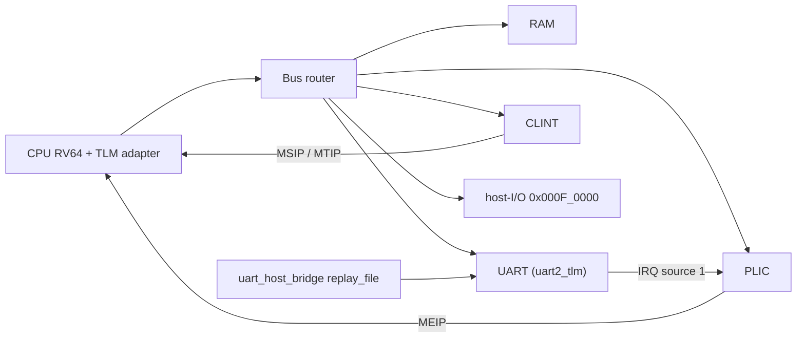

# Kế hoạch CPU RV64 SystemC/TLM cho firmware, driver và FreeRTOS

**File đích:** `cpu_models/cpu_rv64/plan/RV64_VP_IMPLEMENTATION_PLAN.md`

**Trạng thái:** Bản sửa sau review. Backend ISS chưa khóa; P0 là bước đánh giá để khóa. Chưa triển khai implementation.

**Lịch sử:** Bản trước có tên `CVA6_RV64_TLM_IMPLEMENTATION_PLAN.md` dưới `cpu_models/cpu_cva6/`. Đổi tên vì model là một functional RV64 ISS, không phải microarchitecture CVA6 — xem §1.2.

## 1. Mục tiêu và cấu hình đã chốt

### 1.1. Mục tiêu

Xây dựng CPU RV64 dạng SystemC/TLM để người dùng:

- Build firmware bằng GCC hoặc Clang.
- Thay ELF mà không build lại simulator.
- Phát triển và kiểm thử driver qua MMIO, timer và interrupt.
- Chạy FreeRTOS RV64, kiểm chứng chuyển task và giao tiếp với IP.
- Tái sử dụng CPU model khi mở rộng thành platform SoC hoàn chỉnh.

| Hạng mục | Quyết định v1 |
|---|---|
| Execution engine | **Chưa khóa.** Ứng viên: `riscv-vp-plusplus` rv64 (ưu tiên), `riscv-vp` rv64 (dự phòng). P0 quyết định |
| CPU | Một hart, `hart_id = 0`, little-endian |
| ISA cho firmware | `rv64imac_zicsr_zifencei` |
| ABI | `lp64`, soft-float |
| Privilege | M-mode |
| Memory | Physical addressing, không dịch địa chỉ |
| CPU–IP | TLM-2.0 blocking transport, không DMI |
| Firmware | ELF64 RISC-V, static executable |
| RTOS | FreeRTOS, port GCC/RISC-V nhánh RV64 |
| Timing | Functional timing theo SystemC |
| Host | AlmaLinux 9, `/usr/bin/gcc`, C++17, SystemC 2.3.4 |

Ngoài phạm vi v1: Linux, S/U-mode, MMU/PMP enforcement, F/D, RVV, multicore, DMA coherence, cache/pipeline timing, AXI cycle accuracy, JTAG và GDB server, boot ROM, DMI.

**Thay firmware nghĩa là chạy lại cùng simulator với ELF khác.** Hot reload ELF trong một simulation đang chạy không thuộc v1.

### 1.2. Về tên gọi và quan hệ với CVA6

Model này là một **functional RV64 ISS**. Nó không mô hình pipeline, cache hay timing của CVA6, và không được dùng để kết luận CPI, hiệu năng hay tương thích RTL.

Tên module vì vậy là `cpu_rv64`, platform là `rv64_vp`. Không dùng chữ `cva6` trong đường dẫn, tên target hay tên class.

Nếu sau này cần đối chiếu với một cấu hình CVA6 RTL cụ thể, đó là một hạng mục riêng và tối thiểu phải làm thêm:

- Chọn commit và config CVA6 cụ thể, ghi lại.
- Đối chiếu `misa`, `mvendorid`, `marchid`, `mimpid`, tập CSR implemented và giá trị reset.
- Đối chiếu hành vi PMP, counter và trap priority.
- Xác định lại phạm vi: functional equivalence hay cycle-approximate.

Nền tảng v1 được thiết kế để không cản trở việc đó, nhưng v1 **không** thực hiện nó.

## 2. Cơ sở hiện có

### 2.1. Thành phần tái sử dụng

Repo đã có `cpu_base`, `bus_router`, ROM/RAM TLM, UART, CLINT và PLIC. Wrapper CPU đang dùng trong các platform thông thường là RV32.

| Dependency | Revision | Ghi chú |
|---|---|---|
| `riscv-vp` (Bremen) | `48b2f5877b2368cc466fb0da155db349e676c0b0` | có `core/rv64`, chưa được build bao giờ |
| `riscv-vp-plusplus` | pin ghi tại `components/TPU_V3/docs/TPU_V3_PHASE2_AUDIT.md §1` | có `core/rv64`, chưa được build bao giờ. **Checkout này thuộc về track RV32; `cpu_rv64` không được patch vào đó** — xem §5.2 |
| FreeRTOS-Kernel | `0adc196d4bd52a2d91102b525b0aafc1e14a2386` | port GCC/RISC-V có RV64 (`portmacro.h:50`) và `RISCV_MTIME_CLINT_no_extensions` |
| `riscv-isa-sim` (Spike) | đã build tại `third_party/riscv-isa-sim/build/spike` | default ISA `rv64imafdc_zicntr_zihpm` |
| riscv-tests | **chưa có, phải fetch và pin revision** | P3, xem §5.10 |

Toolchain:

- Host GCC `/usr/bin/gcc` 11.5.0 (bắt buộc dùng đường dẫn tuyệt đối; `g++` trên PATH mặc định là wrapper Synopsys hỏng).
- Host Clang `/usr/bin/clang` 21.1.8.
- RISC-V GCC: xPack 15.2.0 tại `/opt/toolchains/xpack-riscv-none-elf-gcc-15.2.0-1`, có multilib `rv64imac_zaamo_zalrsc/lp64`.
- SystemC tại `/opt/systemc-2.3.4`.

### 2.2. Phát hiện đã verify trên source

Áp dụng cho Bremen `riscv-vp` rv64 trừ khi ghi khác.

| Phát hiện | Vị trí | Xử lý |
|---|---|---|
| `misa` hard-code `I\|M\|A\|F\|D\|C\|N\|U\|S`, `mxl=2` | `rv64/csr.h:66` | Trim về IMAC. VP++ init `extensions = 0` rồi set theo `RV_ISA_Config` — thuận lợi hơn hẳn |
| `ISS::init()` chỉ nối interface, đặt SP và PC | `rv64/iss.cpp:1500` | Bổ sung architectural reset |
| Loop đăng ký `pmpcfg` chạy `i < 4` trên `array<csr_pmpcfg, 2>` | `rv64/csr.h:581,639` | OOB thật. Còn sai kiến trúc: RV64 chỉ có `pmpcfg0/pmpcfg2`. Sửa; profile v1 không expose PMP |
| Lỗi TLM chuyển thành page fault | `rv64/mem.h:70-75` | Phải là access fault chọn theo access origin. VP++ đã có patch tương đương cho rv32: `0003-d13-bus-error-is-an-access-fault.patch`. **Đã quan sát trực tiếp ở P0**: instruction fetch vào địa chỉ chưa map cho `take trap 13` (load page fault) thay vì trap 1 (instruction access fault) |
| `DirectCoreRunner::run()` gọi `sc_stop()` | `rv64/iss.h:341` | Viết runner riêng; platform chịu trách nhiệm kết thúc simulation |
| `CombinedMemoryInterface` bắt buộc có `MMU&`, mọi truy cập đi qua `v2p()` | `rv64/mem.h:45-50` | Viết adapter physical-addressing riêng |
| `load_instr()` luôn đọc 4 byte | `rv64/mem_if.h:9` | Xử lý compressed instruction ở cuối vùng executable |
| Counter retirement tăng cả sau exception | `rv64/iss.cpp` | Sửa: instruction gây synchronous exception không được tính retired |
| **WFI ngủ mà không commit local time.** Bremen `rv64/iss.cpp:1260` và VP++ `rv64/iss_ctemplate.cpp:6822` đều `wait(wfi_event)` thẳng, không `commit_cycles()`/`quantum_keeper.sync()` trước | cả hai backend | Patch item. Hart ngủ trong khi ôm local time chưa commit, còn CLINT lên lịch MTIP theo global time — vi phạm chính quy tắc §5.5. Bremen còn dùng `if` thay vì `while`, nên một lần wake giả là thoát WFI |
| **DBBcache đọc cycle count chưa khởi tạo.** `core/common/dbbcache.h`, `curEntryIdx = 0` trỏ vào entry chưa init của dummy block | cả hai backend (file dùng chung) | Patch item, **đã có sẵn** trong repo: `cpu_models/riscv_vp_plusplus/patches/0001-b710fa7b-...`. Không phải lỗi tiềm ẩn: P0 đo được với `MALLOC_PERTURB_` thì 4/5 giá trị cho `instret=0`, PC kẹt ở entry. Phải có patch này **trước** khi tin bất kỳ số đo nào |
| **CSR mức U bị cấm từ M-mode khi `misa.U = 0`.** `rv64/iss_ctemplate.cpp:6925`, `u_invalid` | VP++ | Patch item. Bit [9:8] của địa chỉ CSR là mức đặc quyền **thấp nhất** được phép, `prv < csr_prv` đã là toàn bộ phép kiểm tra. Hệ quả đo được: profile M-mode IMAC làm `csrr t0, time` trap illegal, phá yêu cầu timebase §5.5 |
| **PMP CSR vẫn đọc được** dù profile v1 tuyên bố không expose | VP++ | Chờ quyết định, xem §5.4 |
| ELF loader chung chưa validate đủ | `cpu_models/include/cdc/cpu/elf_loader.h` | Dùng parser tách từ `platforms/riscv_vpp_compiler_vp/src/elf_image.cpp`, mở rộng ELF64 |

### 2.3. Kết quả khảo sát CLINT

`components/clint_tlm` được **15 platform** dùng: `noc_soc`, `riscv_custom_soc`, `VP_FX1_Full_SoC`, và 12 platform trong `platforms/tests/`.

Firmware dùng CLINT: `fw/clint_timer_riscv`, `fw/soc_irq_riscv` (ghi `mtimecmp = mtime + 100µs` bằng hai store 32-bit), `fw/freertos_fx1`, `fw/freertos_noc_soc` (qua port FreeRTOS, `port.c:151`, store 64-bit).

Kết luận khảo sát:

- **Không firmware nào ghi `mtimecmp = 0` để tắt timer.** Đổi semantics `0 = off` sang `0 = đã đến hạn` là an toàn với firmware hiện có.
- **Timebase 1 MHz đã thống nhất sẵn**: `configCPU_CLOCK_HZ = 1000000`, `configTICK_RATE_HZ = 1000`; `freertos_noc_soc` hard-code `NOC_TICK_PERIOD_US = 1000000 / configTICK_RATE_HZ`. Đơn vị µs hiện tại của `clint_tlm` khớp đúng, không cần đổi.
- **Overflow là bug tiềm ẩn, chưa phát tác.** `sc_time::from_value(mtimecmp_ * kScaler)` (`clint_tlm.cpp:100`) chỉ tràn khi `mtimecmp` lớn; giá trị µs của các sim hiện tại còn nhỏ. Nó phát tác **đúng lúc** khởi tạo `mtimecmp = UINT64_MAX`.
- **`kScaler = 1000000` giả định time resolution = 1 ps.** Đúng với mặc định SystemC, sai ngay khi có platform đổi resolution.
- **Test hiện có quá mỏng.** `test_clint_tlm.cpp` chỉ cover: arm ở 100µs, MTIP fire, `mtime >= mtimecmp`, msip. Không có compare = 0, quá hạn, dời sang tương lai, `UINT64_MAX`, hay ghi nửa 32-bit.
- **Regression cấp firmware bắt được lỗi**: `noc_soc_freertos_regression`, `noc_soc_freertos_baseline`, `noc_soc_freertos_negative_controls`, và test FreeRTOS của FX1.

Xử lý: xem §6.

## 3. Quyết định đã chốt

| # | Hạng mục | Quyết định |
|---|---|---|
| 1 | Mục tiêu | Software dev platform. Không cam kết khớp CVA6 RTL |
| 2 | Tên | `cpu_models/cpu_rv64`, `platforms/rv64_vp`, `fw/rv64_vp`, target `cdc::cpu::rv64`, executable `rv64_vp`, option `CDC_BUILD_RV64_VP`, ctest label `rv64` |
| 3 | Backend | Chưa khóa; P0 quyết định. VP++ ưu tiên, Bremen dự phòng. Một backend chạy platform, Spike làm oracle |
| 4 | Patch policy | Checkout ISS **riêng** cho `cpu_rv64`, revision + manifest độc lập với track RV32. `patches/*.patch` + fetch script apply + CMake verify checksum từng file |
| 5 | CLINT | Sửa shared `components/clint_tlm` trong một change riêng có regression |
| 6 | Tái sử dụng | Tách ELF parser dùng chung; policy ISA/ABI/map thuộc từng platform; tái dùng validate tham số + watchdog; chạy lại CLI + packaging regression trước khi dùng phần chung |
| 7 | Exit contract | Dùng lại cửa sổ host-I/O `0x000F_0000` |
| 8 | Memory map | Không có ROM. RAM `0x8000_0000` + CLINT + PLIC + UART + host-I/O |
| 9 | FW build | Theo pattern `compiler_vp`: Makefile là source of truth, CMake copy vào build dir rồi `make -C` |
| 10 | Clang | Là gate của v1. E7 đo tính khả thi và chi phí; hạ Clang khỏi gate cần một quyết định đổi phạm vi riêng |
| 11 | ISA test | riscv-tests chính thức, tập đã chọn theo profile (§5.10). Giao thức kết thúc chọn tường minh bằng `--exit-protocol`, mặc định `host-io` |
| 12 | Reset | Tối thiểu ở v1, ghi nợ rõ + test negative |
| 13 | DMI | Tắt ở v1; đo runtime ở P0 rồi tính |
| 14 | Debug | Trap log + `--trace`. GDB là hạng mục riêng sau |
| 15 | CLI | Convention chung với `compiler_vp`, thêm `--reset-pc` và `--quantum` |
| 16 | BSP | Riêng trong `fw/rv64_vp`; đánh giá gộp lên `fw/common` sau |
| 17 | Report | `cpu_models/cpu_rv64/docs/` giữ bản chốt theo mốc + artifact sinh trong build dir |
| 18 | Lộ trình | Không deadline. Tuần tự P0→P7, mỗi phase đạt gate mới đi tiếp |
| 19 | Worktree | Eval spike trên worktree ngoài repo, branch `spike/rv64-backend-eval` tách từ `dev`. Không commit/push tự động |

Giá trị mặc định chốt kèm: `mvendorid = marchid = mimpid = 0`; `mhartid = 0`; `misa = I\|M\|A\|C`, `mxl = 2`; timebase 1 MHz dùng chung cho CSR `time` và CLINT `mtime`; quantum mặc định 1 µs; cycle base 10 ns; RAM 16 MiB, cấu hình được qua `--ram-size`; PLIC một context M-mode, UART ở source 1.

## 4. P0 — Đánh giá để khóa backend

P0 chạy trên worktree `spike/rv64-backend-eval`, **không** merge vào `dev` cho tới khi có kết luận. Mục tiêu là lấy dữ liệu thật, không phải sản phẩm.

**Trước mọi lệnh build hoặc run trong P0, chạy khối export ở §8.0.** Bỏ qua nó là treo máy, không phải lỗi biên dịch — đã xảy ra đúng một lần ở E1.

Ba việc phải làm khi dựng worktree, vì bỏ sót thì P0 chạy trên nền sai:

1. **Copy bản plan này sang worktree bằng tay.** `cpu_models/cpu_rv64/` hiện còn untracked, nên `git worktree add` từ HEAD sẽ **không** mang nó theo.
2. **Ghi lại SHA xuất phát** trong `P0_BACKEND_EVAL.md`, để số đo E8 và kết luận backend gắn được với một điểm cụ thể trong lịch sử.
3. **Dùng checkout ISS riêng theo §5.2** ngay từ P0, không patch vào checkout đang phục vụ track RV32 — kể cả khi đang ở worktree tách biệt, vì `third_party/` là cùng một cây trên đĩa.

### 4.1. Bài đánh giá

Chạy cho `riscv-vp-plusplus` rv64 trước; chỉ chạy Bremen rv64 nếu VP++ trượt.

| # | Bài | Đạt khi |
|---|---|---|
| E1 | Build core rv64 thành một static library, không kéo GUI/platform upstream | Compile và archive thành công với `/usr/bin/gcc`, C++17. **Chỉ vậy thôi**: `ar` không resolve symbol, nên một `.a` tạo được chưa chứng minh gì về link |
| E2 | Link một executable tối thiểu quanh library đó, rồi nạp và chạy một ELF64 `rv64imac/lp64` tới điểm dừng | **Link sạch, không undefined symbol** — đây mới là chỗ chứng minh tập source đã đủ. Sau đó: PC tiến đúng, dữ liệu 64-bit không bị truncate |
| E3 | Giới hạn ISA về IMAC | Opcode F/D và CSR ngoài profile trap illegal-instruction **khi thực thi**, không chỉ ở `misa` |
| E4 | Timer interrupt qua CLINT | MTIP assert/deassert đúng, `time` và `mtime` cùng đơn vị |
| E5 | WFI và cold reset | CPU ngủ ở WFI và dậy đúng bởi interrupt; **`time` đọc sau khi dậy khớp `mtime` của CLINT**, tức local time đã được commit trước khi ngủ (§2.2). Cold reset trước instruction đầu tiên đưa PC/GPR/CSR về giá trị reset. **Không** đánh giá runtime reset — §5.4 loại nó khỏi v1 |
| E6 | Bus error | Lỗi TLM ra access fault đúng loại, không phải page fault |
| E7 | Clang | Build một hello RV64 bằng `/usr/bin/clang --target=riscv64-unknown-elf`, link bằng GCC driver của xPack, chạy được trên E2. Đầu ra là **chi phí**, không phải quyền bỏ Clang khỏi gate |
| E8 | Runtime | Đo thời gian chạy một workload đại diện không DMI, **trên đúng đường thực thi §5.3 chọn cho backend đó**. Đo `run_step()` với debug_mode bật trên VP++ cho một con số vô nghĩa |

### 4.2. Đầu ra P0

Một báo cáo trong `cpu_models/cpu_rv64/docs/P0_BACKEND_EVAL.md` ghi:

- Kết quả từng bài E1–E8 cho backend đã thử, kèm lệnh tái lập.
- Backend được chọn và lý do.
- Danh sách patch cần thiết cho backend đó, mỗi patch một dòng mô tả vấn đề.
- Chi phí thật của đường Clang: cái gì chạy được, cái gì vướng, ước lượng công để đóng khoảng cách.
- Số đo runtime, và khuyến nghị có cần mở DMI trong v1 không.

**Gate P0:** backend được khóa bằng bằng chứng E1–E6.

E7 và E8 không chặn P0, nhưng cũng không phải là cửa để lặng lẽ thu hẹp phạm vi. E7 trả về **chi phí**, không phải quyền bỏ Clang: Clang là gate của v1 (§5.8), và nếu E7 cho thấy chi phí không chấp nhận được thì đó là một quyết định đổi phạm vi phải nêu tường minh và được chấp thuận, không phải hệ quả tự động của một con số. E8 tương tự với DMI.

## 5. Thiết kế

### 5.1. Tổ chức module và build

- `cpu_models/cpu_rv64`: CPU wrapper, memory adapter, patch series, unit test, plan và docs.
- `platforms/rv64_vp`: platform tối thiểu, CLI và integration test.
- `fw/rv64_vp`: BSP, bare-metal examples và FreeRTOS demo.

Thêm option `CDC_BUILD_RV64_VP`, mặc định `OFF`. Thêm target CPU `cdc::cpu::rv64` và executable `rv64_vp`. Platform mới chọn trực tiếp target này; không thay `CDC_CPU_BACKEND` của các platform hiện có.

CMake phải:

- Cho phép build RV64 khi các platform RV32, NoC và TPU đều tắt.
- Chỉ build tập source ISS cần thiết.
- Dùng tên target dependency riêng để tránh trùng SoftFloat/core library đang có.
- Verify base revision và checksum từng file bị patch, theo đúng cách `cpu_models/riscv_vp_plusplus/CMakeLists.txt` đang làm. **CMake verify, không patch.** Việc apply thuộc fetch script.
- Ghi firmware, generated source và report vào build directory.

### 5.2. Checkout ISS riêng và patch series

**`cpu_rv64` dùng checkout ISS riêng, không patch vào checkout đang phục vụ track RV32.**

Lý do là cơ chế verify hiện có, không phải sở thích tổ chức. `cpu_models/riscv_vp_plusplus/CMakeLists.txt:178-198` chạy `git status --porcelain` trên **toàn bộ** checkout và `FATAL_ERROR` với bất kỳ file nào khác base revision mà không nằm trong manifest của series RV32. Một patch vào `core/rv64/*` vì vậy sẽ **chặn build RV32** của TPU_V3 và `riscv_vpp_compiler_vp`, dù không file RV32 nào bị đụng. Giả định của bản plan trước — "chỉ sửa `core/rv64/*` là đủ tránh ảnh hưởng RV32" — sai ở đúng chỗ này.

Cách làm:

- Checkout riêng tại `third_party/riscv-vp-rv64` (tên theo backend được P0 chọn), có `fetch_*.sh`, base revision và patch manifest **độc lập** với track RV32.
- `cpu_models/cpu_rv64/patches/`: đánh số, mỗi patch một vấn đề, kèm dòng mô tả trong CMake ghi rõ loại (`upstream-backport` hay `downstream-conformance`), nguồn và lý do — theo đúng định dạng `RISCV_VP_PLUSPLUS_PATCH_SERIES` đang dùng.
- CMake của `cpu_rv64` verify checkout của **chính nó**; không đụng biến hay manifest của track RV32.

Nếu một fix bắt buộc phải sửa `core/common/*`, patch đó vẫn chỉ nằm trong checkout riêng nên không ảnh hưởng RV32. Nhưng vẫn phải ghi rõ trong mô tả patch là fix này cũng áp dụng được cho track RV32, để lần sau có người port sang.

**Test cấu hình bắt buộc (P1):** một CTest case configure repo với `CDC_BUILD_RV64_VP=ON` **cùng lúc** với một platform RV32 (`CDC_BUILD_RISCV_VPP_COMPILER_VP=ON` hoặc `CDC_BUILD_TPU_V3_SOC=ON`) và kiểm tra configure thành công. Đây là thứ duy nhất bắt được hồi quy "patch RV64 làm chết build RV32", và nó phải tồn tại trước khi có patch đầu tiên.

Không copy source vào build directory rồi patch ở đó: source đang chạy phải nằm trong cây nguồn để debug, review diff và IDE index được.

**Không dùng `platform/` của upstream.** P0 đã đo chi phí: `platform/common/bus.h` kéo theo `NetTrace` ngay cả khi debug bus là `nullptr`, và `elf_loader.h` kéo theo `boost::iostreams::mapped_file_source` — một thư viện Boost phải link, không header-only. Đây đúng là lý do `cpu_models/riscv_vp/CMakeLists.txt` ghi *"Deliberately avoids gdb-mc / platforms / boost iostreams"*. `cpu_rv64` chỉ lấy `core/rv64` + tập `core/common` cần thiết + softfloat vendored, còn loader và bus dùng của repo (§5.7).

### 5.3. CPU wrapper và execution

Wrapper kế thừa `cpu_base`:

- `instr_bus()` và `data_bus()` trả cùng một initiator socket; `has_unified_bus()` trả `true`.
- `load_elf()` ghi nhận image để nạp sau khi socket đã bind.
- `set_irq()` hỗ trợ level của cause 3, 7 và 11.
- `get_pc()` và `get_instret()` trả giá trị 64-bit.
- `reset_cpu()` chỉ hợp lệ như cold reset trước khi thực thi; gọi sau đó thì throw (§5.4).

Cấu hình mặc định là XLEN 64; **throw từ constructor** nếu được yêu cầu RV32, SMP hay MMU — theo decision record D5 đã ghi trong `cpu_base.h`. CPU model không tự gọi `sc_stop()`.

**Runner: API phụ thuộc backend, không mặc định `run_step()`.**

Bản plan trước chọn `run_step()` cho mọi backend. Điều đó chỉ đúng với Bremen: `rv64/iss.cpp:1883` chỉ kiểm tra breakpoint khi `debug_mode` bật, nên `run_step()` dùng được ở chế độ thường. Với VP++ thì **không**: `rv64/iss_ctemplate.cpp:7584` ném `std::runtime_error` nếu `debug_mode` chưa bật, mà `enable_debug()` (`:7212`) còn gọi `force_slow_path()` — tức là bật debug để dùng được `run_step()` sẽ khóa ISS vĩnh viễn trên slow path. Slow path **vẫn dùng** dbbcache (`iss_ctemplate.cpp:203,214` gọi `dbbcache.fetch_decode()`); cái mất là fast path (`:219`, `fetch_decode_fast`). Hệ quả đúng là **số đo không đại diện cấu hình chạy thường**, không phải "cache bị vô hiệu hóa".

Quy tắc:

- **VP++:** theo đúng precedent đã có ở `cpu_models/riscv_vp_plusplus/src/riscv_vp_plusplus_wrapper.cpp:128-160` — `core.run()` trong một `SC_THREAD` của wrapper, cố ý không dùng `DirectCoreRunner` upstream (nó gọi `sc_stop()`), và quan sát `CoreExecStatus::Terminated` để kết thúc.
- **Bremen:** `run_step()` chấp nhận được, nhưng vẫn phải là runner của wrapper, không phải `DirectCoreRunner`.

**WFI: giữ blocking bên trong ISS, không kéo ra wrapper.**

Bản plan trước ghi "tắt cơ chế chờ WFI bên trong ISS để wrapper chờ chung". Với VP++ điều đó không thực hiện được: tại `iss_ctemplate.cpp:6822`, `WFI` chỉ `sc_core::wait(wfi_event)` khi `ignore_wfi == false`; đặt `ignore_wfi = true` biến WFI thành NOP và `run()` **chạy tiếp**, không trả điều khiển về wrapper. Tức là tắt WFI trong ISS không tạo ra điểm chờ cho wrapper, nó chỉ biến CPU thành busy-loop.

Cách đúng, và đã có precedent chạy thật cho rv32:

- Giữ `ignore_wfi = false`; WFI block bên trong ISS.
- **Đồng bộ thời gian trước khi ngủ, theo đúng thứ tự này:** commit cycle tích lũy vào quantum keeper (`commit_cycles()`) → `quantum_keeper.sync()` để SystemC **thật sự tiến thời gian toàn cục** → kiểm tra lại interrupt pending → mới `wait()`. Chỉ cập nhật quantum keeper mà không `sync()` thì global time chưa nhúc nhích, và hart sẽ ngủ trong khi vẫn ôm local time chưa trả. Bước kiểm tra lại sau `sync()` là bắt buộc: trong lúc `sync()` chờ, một IRQ hoàn toàn có thể đã tới, và ngủ tiếp sau đó là bỏ lỡ nó.
- Vòng chờ phải là `while (!pending) wait(...)`, không phải `if`.
- Đánh thức bằng đường IRQ sẵn có: `trigger_timer_interrupt()` và `trigger_software_interrupt()` (`iss_ctemplate.cpp:7353,7366`) đều gọi `maybe_interrupt_pending()`, hàm này `notify(wfi_event)` và `force_slow_path()` (`iss_ctemplate.h:163-166`). `set_irq()` của wrapper vì vậy đánh thức được hart mà không phải tự quản lý event.
- `riscv_vp_plusplus_wrapper.cpp:654-659` ghi lại đúng cơ chế này cho rv32, kèm lưu ý là `maybe_interrupt_pending()` đánh thức **mà không** bịa ra một interrupt.

Nếu sau này muốn wrapper quản lý WFI thì đó là một thiết kế riêng, cần hook/yield tường minh trong ISS — không phải một cờ. v1 không cần: đã bỏ runtime reset nên không có nhu cầu chờ chung interrupt/reset event.

Trong cả hai trường hợp: runner quản lý trạng thái dừng và cold reset; WFI thuộc về ISS.

**E8 phải đo trên đúng đường thực thi sẽ dùng thật.** Đo `run_step()` trên VP++ với debug_mode bật sẽ cho một con số không liên quan gì tới cấu hình sản phẩm.

### 5.4. ISA, CSR và reset

- `misa` phản ánh đúng RV64 IMAC.
- Implement CSR cần cho M-mode, trap, interrupt và counter diagnostics.
- `mtvec` v1 hỗ trợ Direct mode.
- Opcode F/D/V và CSR ngoài profile đi qua illegal-instruction trap. Việc giới hạn phải tác động tới **execution**, không chỉ `misa`. P0 đã chứng minh `RV_ISA_Config` của VP++ làm được điều này, có đối chứng hai chiều.

**Hai điểm còn mở về CSR profile, cần quyết định trước khi khóa E3:**

1. **`time`/`cycle`/`instret` và Zicntr.** Chuỗi ISA đã chốt là `rv64imac_zicsr_zifencei`, **không có Zicntr**, nên nghiêm ngặt thì ba CSR này không bắt buộc phải tồn tại. Nhưng §5.5 lại yêu cầu `time` dùng chung timebase 1 MHz với CLINT `mtime`, và danh sách test §7 có bài "`time` và `mtime` cùng đơn vị, đơn điệu". Hai chỗ này mâu thuẫn nhau. Phải chọn: thêm `_zicntr` vào chuỗi ISA, hay bỏ yêu cầu `time` và chỉ đọc `mtime` qua MMIO của CLINT.

2. **PMP.** §5.4 nói "profile v1 không expose PMP", nhưng P0 đo được `pmpcfg0` và `pmpaddr0` vẫn đọc được. Phải chọn: patch cho chúng trap illegal (đúng chữ của plan, và đúng spec cho CSR không implement), hay sửa plan thành "PMP CSR có mặt, WARL-zero, không enforce" và ghi rõ giới hạn.
- `ecall` và `ebreak` tạo architectural exception; không intercept thành host syscall.

**Reset v1: chỉ cold reset, trước khi thực thi. Runtime reset bị từ chối tường minh.**

Bản plan trước cho phép reset trong lúc CPU chạy nhưng đồng thời bỏ ngỏ reservation và mức interrupt bên ngoài qua reset. Đó là một hợp đồng reset có lỗ hổng: nó khai báo một đường đi được hỗ trợ mà hành vi của đường đó không được định nghĩa. v1 vì vậy thu hẹp thêm một bậc.

Cold reset (chạy ở `start_of_simulation()`, trước instruction đầu tiên):

- CPU về M-mode, interrupt enable được xóa.
- PC về ELF entry, hoặc `--reset-pc` nếu được chỉ định.
- GPR khởi tạo xác định; startup firmware tự thiết lập SP/GP.
- CSR và counter về giá trị reset đúng profile.
- Giữ identity/configuration và các kết nối TLM.
- Không xóa RAM, không reset IP.

`reset_cpu()` gọi sau khi simulation đã bắt đầu **throw** với thông báo nêu rõ v1 chỉ hỗ trợ cold reset. Đây là ứng xử theo đúng decision record D5 đã ghi trong `cpu_base.h`: từ chối cái không honour được, không im lặng làm một nửa.

**Ghi nợ rõ — v1 KHÔNG hỗ trợ**, phải có test negative chứng minh giới hạn thay vì để người đọc tưởng là đã support:

- Runtime reset dưới mọi dạng (đang chạy, đang WFI).
- Giữ và áp dụng lại mức interrupt bên ngoài đang được controller assert qua reset.
- Reservation (LR/SC) release theo reset.

Hệ quả phạm vi: `rv64_vp` không dùng được với watchdog-reset flow kiểu `platforms/tests/wdt_platform`. Đó là platform duy nhất ngoài TPU_V3 gọi `reset_cpu()` tại runtime, và nó là platform RV32 — không có xung đột ở v1. Khi nào cần runtime reset thì đó là một thay đổi riêng, và phải định nghĩa đủ cả ba mục ghi nợ trên trước khi mở.

### 5.5. Memory adapter và thời gian

Adapter implement interface fetch/load/store/atomic mà ISS RV64 yêu cầu:

- Mọi địa chỉ CPU–bus dùng `uint64_t`.
- RAM hỗ trợ truy cập 1/2/4/8 byte.
- MMIO giữ nguyên access width của firmware; CPU 64-bit không buộc IP phải có thanh ghi 64-bit.
- TLM payload có command, address, data length, streaming width và response status hợp lệ.
- Lỗi bus chuyển thành access fault đúng loại truy cập.
- **Không DMI trong v1.** Nếu E8 cho thấy runtime không chấp nhận được thì mở lại quyết định này bằng một thay đổi riêng, không lồng vào v1.
- Không dùng adapter MMU upstream.

Instruction fetch phải xử lý đúng compressed instruction 16-bit, kể cả instruction ở cuối vùng executable; không đọc vượt vùng chỉ vì luôn fetch 4 byte.

Atomic:

- Hỗ trợ LR/SC và AMO `.W`/`.D` trên RAM.
- Atomic vào MMIO bị từ chối bằng access fault.
- Cam kết v1 giới hạn ở một hart, không có DMA ghi đồng thời.

Timing:

- Cycle base 10 ns; quantum mặc định 1 µs, giá trị khác phải dương và là bội số 10 ns.
- Đồng bộ local time trước side effect của MMIO, trước đọc `time` và trước ngủ WFI.
- Delay của target được tính đúng một lần.
- `time` và CLINT `mtime` dùng chung timebase 1 MHz.
- `mcycle` là counter theo mô hình timing, không đại diện cycle thực của phần cứng nào.

### 5.6. Platform và BSP



Memory map v1:

| Vùng | Base | Size / ghi chú |
|---|---:|---|
| host-I/O | `0x000F_0000` | Cửa sổ dùng chung với `compiler_vp` và TPU_V3; simulator-only |
| CLINT | `0x0200_0000` | 64 KiB |
| PLIC | `0x0C00_0000` | 4 MiB, một M-mode context |
| UART | `0x1000_0000` | 4 KiB, `uart2_tlm` (PL011-like) |
| RAM | `0x8000_0000` | 16 MiB mặc định, `--ram-size` |

Không có boot ROM trong v1: platform khởi chạy trực tiếp tại ELF entry hoặc `--reset-pc`. Khi nào cần boot flow thật thì thêm sau, thành một thay đổi riêng.

UART RX deterministic dùng `uart_host_bridge::replay_file(path, start_delay)` — đã có sẵn trong `components/uart_host_tlm`, không cần viết mới.

BSP trong `fw/rv64_vp`, tự chứa, không đụng `fw/common` (RV32):

- Startup RV64, khởi tạo SP/GP, `.data`, `.bss` và trap vector.
- Stack alignment 16 byte.
- Trap handler lưu/khôi phục thanh ghi 64-bit.
- Accessor MMIO dùng `uintptr_t`, dữ liệu theo width của thanh ghi.
- UART polling và interrupt; PLIC claim/complete; CLINT timer/software interrupt.
- Shim host-I/O dùng chung header của cửa sổ `0x000F_0000`.
- Runtime C tối thiểu cho demo, assert và báo kết quả.

Sau khi v1 chạy ổn thì đánh giá xem phần nào đáng đưa lên `fw/common` theo `__riscv_xlen`.

### 5.7. ELF, host-I/O và CLI

**ELF parser dùng chung.** Tách phần parse/validate từ `platforms/riscv_vpp_compiler_vp/src/elf_image.cpp` thành một thành phần dùng chung hỗ trợ cả ELF32 và ELF64. Ranh giới: parser lo cấu trúc file (magic, class, endian, machine, `ET_EXEC`, bounds, overflow, `filesz <= memsz`, segment overlap, entry alignment, zero-fill `memsz - filesz`); **policy ISA/ABI và memory map thuộc từng platform** (vùng nào được nạp, MMIO nào bị cấm, ABI nào chấp nhận).

ELF attributes, nếu có, được kiểm tra theo tập ISA hỗ trợ, tính cả tên extension con tương đương do toolchain mới phát ra. ELF thiếu attributes vẫn chịu kiểm tra header/ABI và illegal-instruction trap lúc chạy.

P0 đã đo chuỗi thật: với `-march=rv64imac_zicsr_zifencei -mabi=lp64`, **cả GCC 15.2.0 lẫn Clang 21.1.8 đều phát ra cùng một chuỗi**

```
Tag_RISCV_arch: "rv64i2p1_m2p0_a2p1_c2p0_zicsr2p0_zifencei2p0_zmmul1p0_zaamo1p0_zalrsc1p0_zca1p0"
```

Bộ validate phải chấp nhận đúng dạng khai triển này (`zmmul`, `zaamo`, `zalrsc`, `zca`), không phải chuỗi viết tay `rv64imac_zicsr_zifencei`. Hai compiler đồng ý với nhau nên không cần bảng tương đương riêng cho từng compiler.

**Hai đường báo kết quả, chọn tường minh bằng cờ — không auto-detect.**

Sự hiện diện của symbol `tohost` trong ELF không nói lên firmware muốn dùng giao thức nào; một image hoàn toàn có thể mang symbol đó mà vẫn báo kết quả qua host-I/O. Vì vậy:

```text
--exit-protocol=host-io|tohost      (mặc định: host-io)
```

1. **`host-io`** — cửa sổ `0x000F_0000`, dùng cho firmware của repo. Giữ nguyên 4 word đầu và trigger rule của contract hiện có; phần mở rộng RV64 phải không phá image RV32 đang chạy.
2. **`tohost`** — dùng cho riscv-tests. Platform phải kiểm tra symbol tồn tại và địa chỉ nằm trong vùng RAM đã map, báo lỗi cấu hình nếu không; và chỉ hỗ trợ đúng giao thức kết thúc của ISA test, không mở rộng thành host syscall.

   Mã hóa `tohost` theo macro upstream (`RVTEST_PASS` ghi 1; `RVTEST_FAIL` ghi `sll TESTNUM,1` rồi `or 1`). **Cả PASS lẫn FAIL đều có bit 0 = 1**, nên bit 0 là bit "đã kết thúc", không phải bit pass/fail:

   | Giá trị `tohost` | Ý nghĩa |
   |---|---|
   | `0` | Chưa kết thúc |
   | `1` | PASS |
   | `(test_id << 1) \| 1`, với `test_id > 0` | FAIL ở test số `test_id` |
   | Giá trị chẵn khác 0 | Ngoài giao thức được hỗ trợ (HTIF syscall) — **báo lỗi giao thức**, không đoán |

   Bắt buộc có negative test ghi `tohost = 3`: simulator phải báo FAIL (test 1), tuyệt đối không PASS. Đây là cách duy nhất chứng minh không ai cài nhầm "bit 0 = pass".

**Mở rộng host-I/O cho RV64.** Contract hiện tại có trường 32-bit cho `mcause` và `mepc`. Trên RV64, `mcause` có interrupt bit ở **bit 63** và `mepc` là 64-bit. Plan phải chốt offset cho nửa cao của cả hai **trước khi** viết shim BSP, và ghi vào chính header dùng chung. Một image RV32 đang chạy không được thấy khác biệt gì.

Lưu ý khi chọn offset: vùng từ `0x400` **không còn trống**. `host_io_map.h` đã dùng console ở `0x400`/`0x404`, khối identity ở `0x420`–`0x44C`, và observation register ở `0x460`/`0x464`. Phải chọn ô thật sự trống (ví dụ `0x408`–`0x41C`, `0x450`–`0x45C`, hoặc `0x468` trở lên) chứ không coi cả vùng là chưa dùng.

**CLI** theo convention `compiler_vp`, cộng cờ riêng:

```text
rv64_vp --elf <image.elf>
        [--config <path>]
        [--exit-protocol host-io|tohost]
        [--reset-pc <address>]
        [--quantum <time>]
        [--ram-size <size>]
        [--timeout <time>]
        [--wall-timeout <seconds>]
        [--trace [limit]]
        [--dump-signature <path>]
        [--print-config]
```

`--dump-signature` giữ nguyên cơ chế đã có (`platforms/riscv_vpp_compiler_vp/src/main.cpp:237-253`): đọc `begin_signature`/`end_signature` từ symbol table và dump vùng giữa. Đây là thứ cả riscv-tests lẫn đối chiếu Spike cần, nên không được bỏ khỏi CLI.

Tái dùng logic validate tham số và watchdog đã có. Exit code giữ nguyên bảng của `compiler_vp` để một CI job không phải học hai quy ước.

**`--wall-timeout` là bắt buộc, không phải tiện nghi.** P0 gặp trường hợp `mtvec = 0`: trap lặp vô hạn, mỗi vòng không cộng cycle nào, nên thời gian mô phỏng đứng yên ở `160 ns` và `sc_start(5 ms)` **không bao giờ trả về**. Một watchdog theo simulation time không cứu được tình huống này; chỉ wall-clock mới cắt được.

Kèm theo: bật `error_on_zero_traphandler` của ISS. Mặc định nó chỉ in warning rồi để livelock; bật lên thì trap với `mtvec = 0` thành lỗi rõ ràng ngay tại chỗ.

**Trap log và timeout log là một cơ chế riêng, không phải `--trace`.** `--trace` hiện có là trace **giao dịch TLM** (`platforms/riscv_vpp_compiler_vp/src/platform_top.cpp:335-362`), hữu ích cho lỗi bus nhưng không trả lời được "firmware chết ở đâu". `rv64_vp` phải in, khi có trap không mong đợi và khi hết timeout:

- `pc` và `mepc`, đủ 64-bit, in hex không cắt bớt.
- `mcause` đủ 64-bit, tách rõ interrupt bit 63 và exception code.
- `mtval`, `mstatus`, `mie`, `mip`, đủ 64-bit.
- Instruction tại `mepc`, nếu đọc được.

Đây là toàn bộ debug story của v1 (quyết định #14); nó phải đủ dùng một mình, vì không có GDB.

**Điều kiện bắt buộc trước khi đưa phần dùng chung vào sử dụng:** chạy lại toàn bộ CLI test và packaging regression của `riscv_vpp_compiler_vp`. Platform đó có packaging gate kiểm tra nội dung package; một lần tách file mà không chạy lại gate là cách chắc chắn để phá nó.

### 5.8. Compiler

Hai đường compiler dùng chung source, BSP và linker script:

```text
-march=rv64imac_zicsr_zifencei
-mabi=lp64
-mcmodel=medany
-ffreestanding
```

- **GCC:** compiler và GNU linker/runtime của xPack.
- **Clang:** `--no-default-config --target=riscv64-unknown-elf`, compile C/assembly; dùng GNU GCC driver để link với đúng RV64/LP64 runtime. Target triple và đường dẫn thư viện target phải được chỉ rõ.
- Tách output theo compiler và theo optimization level.
- Không lấy host header/library cho firmware.
- V1 không yêu cầu LLVM linker hoặc compiler-rt riêng.

Build firmware theo pattern `compiler_vp` (`platforms/riscv_vpp_compiler_vp/CMakeLists.txt:133-148`): `fw/rv64_vp/Makefile` là source of truth, CMake copy vào build dir rồi gọi `make -C` một lần cho mỗi tổ hợp compiler × optimization level. Không có `.elf` nào được commit — mọi ELF là artifact build.

### 5.9. FreeRTOS

Tái sử dụng port `GCC/RISC-V` và chip extension `RISCV_MTIME_CLINT_no_extensions`.

- Một hart, M-mode, preemptive scheduling.
- Timer frequency 1 MHz; tick rate 1 kHz. Khớp `configCPU_CLOCK_HZ`/`configTICK_RATE_HZ` mà `freertos_fx1` và `freertos_noc_soc` đang dùng.
- `heap_4`, heap 64 KiB.
- Bật stack-overflow hook và malloc-failure hook.
- Không dùng FPU context. Idle dùng WFI.
- ISR UART thông báo cho task bằng API `FromISR`.

Demo có hai task xử lý dữ liệu và một task nhận sự kiện UART. Testbench cấp UART RX theo simulation time qua `replay_file` để kết quả lặp lại được.

### 5.10. riscv-tests

**Chưa fetch, nên mọi con số dưới đây phải được xác nhận lại ở P3 trước khi coi là đúng.**

Cảnh báo chính: gate "chạy nguyên bản, tất cả đều đạt" như bản plan trước viết là **không tương thích với profile đã chọn**. Makefile của riscv-tests build test bằng flags riêng của nó, không phải flags của platform; các nhóm `rv64u*` xây trên một base ISA rộng hơn IMAC và một ABI có floating-point. Chạy nguyên xi một binary `lp64d` trên một hart IMAC/LP64 thì illegal-instruction trap là kết quả đúng, không phải lỗi model.

Việc phải làm ở P3, theo thứ tự:

1. **Fetch và pin revision.** Ghi vào bảng §2.1 như mọi dependency khác.
2. **Xác nhận flags upstream thật sự là gì** ở revision đã pin — đọc `isa/Makefile` và các `*/Makefrag`, không suy từ trí nhớ hay từ tài liệu phiên bản khác.
3. **Chọn danh sách test phù hợp profile.** Ứng viên: `rv64ui`, `rv64um`, `rv64ua`, `rv64uc` ở biến thể `-p` (machine mode, không virtual memory). Test nào đòi F/D, S/U-mode, MMU hay Zicsr ngoài profile thì loại, và **ghi tên từng cái bị loại kèm lý do** — một danh sách loại trừ không giải thích sẽ mục trong vài tháng.
4. **Build lại bằng flags của platform**: `-march=rv64imac_zicsr_zifencei -mabi=lp64 -mcmodel=medany`. Giữ nguyên **nội dung kiểm thử** của upstream; chỉ đổi flags, linker script và startup/environment cho khớp memory map §5.6.
5. **Kiểm tra môi trường M-mode**: `riscv_test.h` và environment `-p` giả định một số thứ về `mtvec`, trap delegation và cách kết thúc. Xác minh từng giả định chạy được trên `rv64_vp` với `--exit-protocol=tohost`.
6. **Ghi lại mọi điều chỉnh.** Báo cáo P3 phải liệt kê: test nào chạy, test nào bị loại và vì sao, và chính xác những gì đã đổi so với upstream. Một suite đã bị sửa mà không ghi lại thì không còn là đối chiếu độc lập.

Gate P3 là "tập test đã chọn ở bước 3 đều đạt", không phải "toàn bộ riscv-tests đạt". Hai câu đó khác nhau, và chỉ câu đầu là thứ profile IMAC/LP64 có thể hứa.

## 6. CLINT — thay đổi riêng

Đây **không** phải một phần của `rv64_vp`. Nó là một thay đổi độc lập lên `components/clint_tlm`, có regression riêng, và nên được review riêng vì chạm 15 platform.

Nội dung sửa:

- Dùng `sc_time` thay vì giả định số tick/ps. Bỏ `kScaler` hard-code; lấy đơn vị từ `sc_get_time_resolution()`.
- Khởi tạo `mtimecmp = UINT64_MAX`.
- **Deadline vượt miền biểu diễn của `sc_time` phải có hành vi xác định, không phải nhân rồi tràn.** Quy định: nếu `mtimecmp` quy đổi ra vượt `sc_max_time()`, CLINT **không lên lịch event nào** và giữ MTIP deassert — đúng nghĩa "không bao giờ đến hạn", vốn là ý định của firmware khi ghi một giá trị như vậy. Phát hiện tràn **trước** khi nhân, bằng phép chia hoặc kiểu rộng hơn, không dựa vào wrap-around.
- Ghi compare bằng 0 hoặc giá trị đã quá hạn phải assert MTIP; ghi compare tương lai phải deassert rồi lên lịch lại.

Test bắt buộc thêm vào `test_clint_tlm.cpp`:

- compare = 0.
- compare đã quá hạn.
- compare dời sang tương lai (phải deassert).
- compare = `UINT64_MAX`.
- Ghi `mtimecmp` bằng hai nửa 32-bit, cả hai thứ tự.
- `mtime` đơn điệu và đúng đơn vị µs.
- **Chạy lại toàn bộ các case trên với time resolution khác mặc định** (ví dụ `sc_set_time_resolution(1, SC_NS)`), vì đây chính là giả định mà `kScaler` đang ngầm mang.

Regression phải chạy lại: test component `clint_tlm` và `timer_tlm`; `noc_soc_freertos_regression`, `noc_soc_freertos_baseline`, `noc_soc_freertos_negative_controls`; test FreeRTOS của FX1; smoke test của các platform trong `platforms/tests/` có CLINT.

## 7. Lộ trình và nghiệm thu

Triển khai tuần tự; mỗi phase phải đạt gate trước khi mở rộng phase tiếp theo. Không có deadline; thứ tự không được đảo.

| Phase | Công việc | Gate |
|---|---|---|
| P0 — Backend eval | E1–E8 trên worktree riêng | Backend khóa bằng bằng chứng E1–E6; báo cáo `P0_BACKEND_EVAL.md` |
| P1 — Foundation | Target/option, patch series + fetch script + CMake verify, firmware build GCC | Configure/build riêng được; output tách biệt; checksum verify chạy |
| P2 — CPU và ELF | RV64 wrapper, adapter RAM, ELF parser dùng chung, startup, host-I/O | ELF64 chạy đến PASS; dữ liệu 64-bit không truncate; CLI + packaging regression của `compiler_vp` vẫn xanh |
| P3 — Architectural behavior | Profile ISA/CSR, trap, atomic, counters, cold reset, riscv-tests (§5.10) | Directed test đạt; tập riscv-tests đã chọn ở §5.10 đạt với **flags của platform**; opcode ngoài profile trap đúng |
| P4 — Driver integration | UART, CLINT, PLIC, timebase thống nhất | Polling, timer, software IRQ và UART external IRQ đạt |
| P5 — Compiler qualification | Build cùng test suite bằng GCC/Clang | **Cả hai** compiler đạt ở `-O0`, `-O2`, `-Os`. Clang trượt là P5 trượt |
| P6 — FreeRTOS | Task switching, tick, idle WFI, UART ISR-to-task | Chạy đủ 1.000 tick và kết thúc PASS |
| P7 — Regression và bàn giao | Chạy baseline liên quan, đóng gói hướng dẫn và evidence | Không regression; người dùng chạy được ELF khác bằng cùng executable |

CLINT (§6) là track song song, không nằm trong chuỗi gate trên, nhưng phải xong trước P4.

### Test bắt buộc

**CPU và RV64**

- Tập riscv-tests đã chọn ở §5.10, build bằng flags của platform, chạy với `--exit-protocol=tohost`.
- Negative control giao thức `tohost`: image ghi `tohost = 3` phải cho FAIL; image ghi giá trị chẵn khác 0 phải báo lỗi giao thức. Cả hai tuyệt đối không được ra PASS.
- `--exit-protocol=tohost` trên ELF không có symbol `tohost`, và trên ELF có `tohost` nằm ngoài RAM đã map: cả hai phải là lỗi cấu hình.
- Arithmetic, sign/zero extension, instruction `.W`, `LD/SD`, multiply/divide corner cases.
- Truy cập RAM bằng con trỏ 64-bit; testbench riêng map RAM trên 4 GiB.
- Compressed instruction ở địa chỉ halfword và cuối vùng memory.
- CSR access, illegal instruction, `ecall`, `ebreak`, `mret`.
- `mcause` interrupt bit ở bit 63.
- Instruction/load/store access fault và misaligned access.
- AMO.W/D, LR/SC success/failure.
- Counter retirement không tính instruction gây synchronous exception.

**Reset**

- Cold reset đưa GPR/CSR/counter về đúng giá trị reset, với `--reset-pc` và không có `--reset-pc`.
- CPU không giữ local time cũ sau cold reset.
- `reset_cpu()` gọi sau khi simulation đã bắt đầu phải **throw**, thông báo nêu rõ chỉ hỗ trợ cold reset.
- Test negative cho cả ba mục ghi nợ ở §5.4, để giới hạn là thứ đo được chứ không phải câu ghi chú.

**Firmware và driver**

- ELF32, ELF sai endian/machine/ABI, segment lỗi hoặc load vào MMIO bị từ chối.
- `.data` và `.bss` đúng; SP/GP và stack alignment đúng.
- UART TX đúng dữ liệu; UART RX phát interrupt qua PLIC.
- Claim/complete không mất IRQ hoặc gây IRQ storm.
- CLINT compare quá hạn, bằng 0, chuyển sang tương lai, `UINT64_MAX`.
- `time` và `mtime` cùng đơn vị, đơn điệu.
- Busy-loop hoặc WFI không có event phải kết thúc bằng timeout, không PASS giả.
- WFI rồi dậy bởi timer: `time` và `mtime` đọc sau khi dậy phải khớp nhau, chứng minh local time đã commit trước khi ngủ.

**Compiler và FreeRTOS**

- Cùng expected signature cho GCC/Clang ở ba optimization level.
- FreeRTOS giữ đúng phần 32 bit cao của register qua context switch.
- Hai task tiến triển, queue/notification đúng nội dung.
- UART ISR đánh thức task; tick tiếp tục hoạt động.
- Chạy tối thiểu 1.000 tick, không stack overflow, không assert.
- Negative control: bỏ UART IRQ hoặc timer IRQ phải làm test tương ứng thất bại.
- **Missing compiler/firmware là thiếu điều kiện nghiệm thu; không được skip rồi báo toàn bộ gate PASS.**

Spike là đối chiếu độc lập cho tập test arithmetic/CSR/atomic có signature xác định, chạy như child process theo đúng cách `cpu_models/riscv_vp_plusplus/oracle/test_spike_differential.cpp` đang làm, kể cả bảng XFAIL/XPASS. Không so cycle, thời điểm interrupt hay toàn bộ platform MMIO giữa hai simulator.

Đăng ký test với CTest label `rv64`.

## 8. Build, bàn giao và tiêu chí hoàn thành

### 8.0. BẮT BUỘC trước mọi lệnh build hoặc run

**Chạy khối này trước mỗi lần build hay run, nếu không máy sẽ treo.**

```bash
export CC=/usr/bin/gcc
export CXX=/usr/bin/g++
export PATH=/usr/bin:/bin:$PATH
# sanity
$CC -dumpfullversion
$CXX --version | head
```

Điều này áp dụng cho **mọi** lệnh: `cmake` configure, `ninja`/`make`, chạy
`rv64_vp`, và cả những lần compile thử vứt đi. Shell state không giữ giữa các
lần gọi, nên phải export lại mỗi lần chứ không phải một lần cho cả phiên.

**Vì sao.** PATH lúc đăng nhập đặt wrapper của Synopsys VP trước toolchain hệ
thống. Hai kiểu hỏng khác nhau:

1. `g++` trần là `/opt/synopsys/VP/.../bin/g++`, chết với
   `/gnu//bin/g++: No such file or directory`. Ồn ào nhưng vô hại.
2. `as` trần là `/opt/synopsys/VP/.../SLS/linux/common/bin/as`, một shell script
   **đệ quy vô hạn**:

   ```bash
   if [ -f ${SNPS_VP_HOME}/gnu/${COWARE_CXX_COMPILER}/bin/as ]; then
     ${SNPS_VP_HOME}/gnu/${COWARE_CXX_COMPILER}/bin/as "$@"
   else
     as "$@"          # `as` trần -> tra PATH -> gặp lại chính nó
   fi
   ```

   `SNPS_VP_HOME` và `COWARE_CXX_COMPILER` đều rỗng trong env đăng nhập bình
   thường (chỉ `SYNOPSYS_VP_HOME` được đặt), nên nhánh `-f` luôn trượt và rơi
   vào `else`. Đây là fork bomb, không phải lỗi biên dịch.

**Đã xảy ra thật, 2026-09-19, ngay ở E1 của P0:** một lệnh `cmake -G Ninja`
configure sinh ra **40.777 tiến trình `as`**, load lên 7,6, RAM 14 Gi. Lệnh
`ninja` build ngay sau đó lại sạch — chỉ bước probe `CMakeCXXCompilerId` dính.

**Thêm một lớp chặn nữa, vì PATH chưa đủ.** `/usr/bin/g++ -print-prog-name=as`
trả về `as` **trần**, tức GCC host tra assembler qua PATH lúc chạy, và CMake
chạy probe compiler-ID trong môi trường riêng của nó. Bịt bằng `-B`, phạm vi
gói gọn trong lệnh compile host:

```bash
cmake ... -DCMAKE_C_FLAGS=-B/usr/bin -DCMAKE_CXX_FLAGS=-B/usr/bin
```

**Đừng export `COMPILER_PATH=/usr/bin` cho cả shell.** Nó có tác dụng với build
host, nhưng **phá cross build**: đã kiểm chứng 2026-09-19, với `COMPILER_PATH`
đặt như vậy thì `riscv-none-elf-gcc -print-prog-name=as` trả về `/usr/bin/as`
(assembler x86) và firmware chết ngay với
`Fatal error: invalid -march= option: rv64imac_zicsr_zifencei`.

Cross toolchain **không** cần bịt gì cả: bỏ `COMPILER_PATH` ra thì
`riscv-none-elf-gcc -print-prog-name=as` trả về đường dẫn tuyệt đối
`.../riscv-none-elf/bin/as` trong chính prefix cài đặt của nó, nên nó miễn
nhiễm với wrapper Synopsys trên PATH ngay từ đầu.

**Nếu đã lỡ treo:** giết **gốc trước**, nếu không tiến trình con mọc lại. Đừng
dùng `pkill -f synopsys`: tiến trình con đã re-exec thành `as` trần, trong argv
không còn chuỗi `synopsys` nào để khớp.

```bash
# 1. tim goc
ps -eo pid,ppid,etimes,comm -u $USER | awk '$4 ~ /^(cmake|g\+\+|gcc|cc1plus|ninja)$/'
kill -9 <cmake_pid> <g++_pid>
# 2. roi moi quet assembler, theo ten chinh xac va theo owner
pkill -9 -u $USER -x as
```

Đếm lại bằng `ps -eo user,comm --no-headers | awk '$1 ~ /^<user>/ && $2=="as"' | wc -l`
và lặp tới khi ra 0 hai lần liên tiếp. Số tăng giữa hai lần quét nghĩa là gốc
vẫn còn sống.

### 8.1. Interface build

Interface build dự kiến sau implementation, chưa tồn tại ở thời điểm lập plan:

```bash
cd /home/duyptt_HW/Desktop/VP_INTER/upgit/CDC-VP

cmake -S . -B build-rv64 -G Ninja \
  -DCMAKE_BUILD_TYPE=Release \
  -DCMAKE_C_COMPILER=/usr/bin/gcc \
  -DCMAKE_CXX_COMPILER=/usr/bin/g++ \
  -DSYSTEMC_HOME=/opt/systemc-2.3.4 \
  -DCDC_BUILD_RV64_VP=ON \
  -DCDC_BUILD_MINI_TLM=OFF \
  -DCDC_BUILD_CPU_EVAL=OFF \
  -DCDC_BUILD_CUSTOM_SOC=OFF \
  -DCDC_BUILD_NOC_SOC=OFF \
  -DCDC_BUILD_TPU_V3_SOC=OFF \
  -DCDC_BUILD_RISCV_VPP_COMPILER_VP=OFF \
  -DCDC_BUILD_TESTS=ON \
  -DRV64_GCC_TOOLCHAIN_ROOT=/opt/toolchains/xpack-riscv-none-elf-gcc-15.2.0-1 \
  -DRV64_CLANG=/usr/bin/clang

cmake --build build-rv64 --target rv64_vp rv64_firmware rv64_tests

ctest --test-dir build-rv64 -L rv64 --output-on-failure
```

Ví dụ thay firmware:

```bash
./build-rv64/platforms/rv64_vp/rv64_vp \
  --elf build-rv64/firmware/gcc/O2/hello.elf

./build-rv64/platforms/rv64_vp/rv64_vp \
  --elf build-rv64/firmware/clang/O2/freertos_demo.elf \
  --timeout 5s
```

Bàn giao gồm:

- CPU library và executable platform.
- BSP RV64, linker script, driver và FreeRTOS demo.
- Hai cấu hình compiler, ELF mẫu và test tự động.
- README hướng dẫn build, đổi ELF, thêm driver/IP và đọc trap log.
- Bảng ISA/CSR hỗ trợ cùng giới hạn model, kể cả danh sách ghi nợ ở §5.4.
- Report ghi revision, patch checksum, compiler version, flags và kết quả từng gate: bản chốt theo mốc trong `cpu_models/cpu_rv64/docs/`, bản tươi sinh trong build directory mỗi lần chạy.

V1 hoàn thành khi cùng executable chạy được firmware **cả GCC lẫn Clang**, tập riscv-tests §5.10 đạt, driver MMIO/interrupt hoạt động, FreeRTOS vượt gate, và các regression liên quan đạt. Clang chưa đạt nghĩa là v1 chưa đạt — không phải một mục ghi chú.

Không dùng kết quả này để tuyên bố tương thích CVA6 RTL hoặc đánh giá hiệu năng silicon. Phần mở rộng sau v1 triển khai riêng khi có nhu cầu: đối chiếu CVA6 (§1.2), F/D–LP64D, GDB, DMI, MMU/Linux, DMA hoặc multicore.
